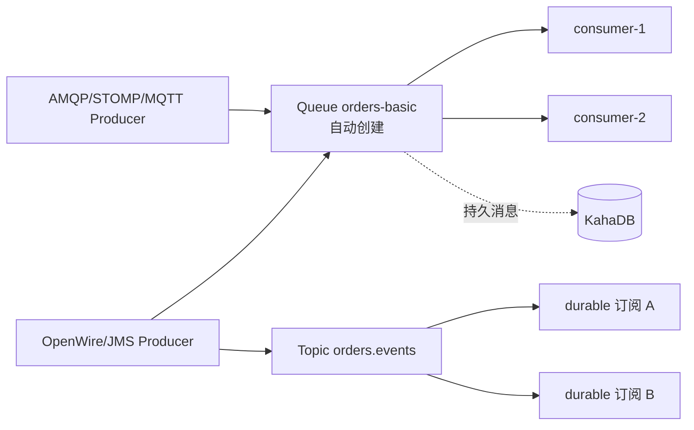

# ActiveMQ Classic 总览

<VersionBadge product="ActiveMQ Classic" broker="6.2.0" client="activemq-client 6.2.0" image="tag+digest@.env.versions" />

> 本页结论：ActiveMQ Classic 是 JMS 原生的传统 Broker：消息进入 Queue/Topic 目的地，持久消息默认写 KahaDB，消费确认后删除；重投策略由客户端 redeliveryPolicy 声明、Broker 端强制执行，毒消息耗尽后自动进默认共享死信 ActiveMQ.DLQ。它面向 Java 生态的任务分发与 JMS 兼容，而不是 Kafka 式的保留日志。

## 定位与适用场景

ActiveMQ Classic 是 Java 生态历史最悠久的开源消息 Broker 之一（6.x 为当前主线，OpenWire 13 协议世代），在消息系统光谱中的位置：

- **队列语义**：消息进入 Queue、被一个消费者取走、确认后删除——与 RabbitMQ/Artemis 同类，与 Kafka/Redis Streams 的保留日志相反。
- **JMS 正统**：OpenWire + JMS API 是原生路径，存量 JMS 应用最小改造即可接入；多协议 connector 同 Broker 并存（镜像默认 transportConnectors：OpenWire 61616、AMQP 5672、STOMP 61613、MQTT 1883、WebSocket 61614）。
- **开箱的可靠性默认值**：redeliveryPolicy 经连接 URL 声明、Broker 强制执行；重投耗尽后**无需任何 broker 配置**即自动进默认死信 ActiveMQ.DLQ（本仓库[实测](/brokers/activemq-classic/reliability)）。
- **运维入口传统**：统一 CLI `bin/activemq`（task 制）+ Web 控制台（8161，默认 admin/admin）+ JMX。
- **不太适合**：需要按时间任意回放的日志型场景（确认即删除）、单队列超大规模吞吐（无分区拆分）、多租户平台（无内建租户模型，见 [存储与高可用](/brokers/activemq-classic/storage-ha)）。

> 边界提示：Classic 与 [ActiveMQ Artemis](/brokers/artemis/) 是 Apache 同门下的两套代码库（Artemis 是下一代技术路线），配置格式、默认值与调优经验不通用；本分卷只讨论 Classic。

## 架构速览



核心实体与关系（详见 [核心概念映射](/brokers/activemq-classic/concepts)）：

| 实体 | 职责 |
| :--- | :--- |
| Queue | 点对点目的地；首次生产/消费时自动创建，承载竞争消费 |
| Topic | 发布订阅目的地；durable subscription 各留一份 |
| destinationPolicy（policyEntry） | 按目的地通配匹配的策略：死信策略、内存限额、慢消费者保护 |
| KahaDB | 默认持久化适配器：文件式追加存储（`${activemq.data}/kahadb`） |
| redeliveryPolicy | 客户端声明（连接 URL `jms.redeliveryPolicy.*`）、Broker 强制执行的重投策略 |

## 能力摘要

| 维度 | ActiveMQ Classic（本仓库覆盖范围） |
| :--- | :--- |
| 投递语义 | at-least-once（SESSION_TRANSACTED）；配合幂等落库达成业务级恰好一次 |
| 顺序 | 单队列 + 单消费者 FIFO；多消费者竞争时全局顺序不保证，可用 JMSXGroupID 同组粘连 |
| 重试/DLQ | 客户端 redeliveryPolicy（maximumRedeliveries 计"重投次数"，默认 6）+ 默认共享死信 ActiveMQ.DLQ |
| 延迟消息 | `AMQ_SCHEDULED_DELAY` 定时投递（需 broker `schedulerSupport=true`） |
| 高可用 | master/slave（共享文件系统或 JDBC 锁）；Networks of Brokers 做多节点分布 |
| 回放 | 不适用（确认即删除） |

## 学习路径

1. [快速开始](/brokers/activemq-classic/quick-start)：最短闭环。
2. [核心概念映射](/brokers/activemq-classic/concepts)：用 Classic 术语回答统一知识模型。
3. [路由与分发](/brokers/activemq-classic/routing)：Queue/Topic、selector、JMSXGroupID 与 VirtualTopics。
4. [可靠性](/brokers/activemq-classic/reliability)：确认后删除、崩溃窗口、重投计数口径与死信。
5. [存储与高可用](/brokers/activemq-classic/storage-ha)：KahaDB、systemUsage 背压、master/slave 与 Networks of Brokers。
6. [运维与观测](/brokers/activemq-classic/operations)、[陷阱与检查表](/brokers/activemq-classic/pitfalls)。

## 动手实验

本仓库提供三个可重复实验（验证快照均已入库，输出见各页 `<LabOutput>`）：

- `activemq-classic basic`（L1）：persistent 发送确认 + 业务提交后才 session.commit() + 幂等落库，验证「commit 即删除、队列深度归零」。
- `activemq-classic retry-dlq`（L2）：毒消息 rollback 后按 redeliveryPolicy 重投（共 3 次投递、固定 1s 间隔），耗尽后自动进默认死信 ActiveMQ.DLQ。
- `activemq-classic cli-tools`：纯镜像自带统一入口 `bin/activemq` 完成收发闭环（producer/consumer/status，快照已采集，见 [运维与观测](/brokers/activemq-classic/operations)）。

```bash
bash demos/activemq-classic/basic/run.sh
bash demos/activemq-classic/retry-dlq/run.sh
bash demos/activemq-classic/cli-tools/run.sh
```

## 版本基线

- Broker：ActiveMQ Classic 6.2.0（镜像 tag+digest 双锁定，见 `demos/.env.versions`），ACTIVEMQ_HOME=`/opt/apache-activemq`。
- Java 客户端：`org.apache.activemq:activemq-client:6.2.0`（OpenWire）。
- 官方文档：<https://activemq.apache.org/components/classic/documentation/>（checkedAt: 2026-08-20）。
