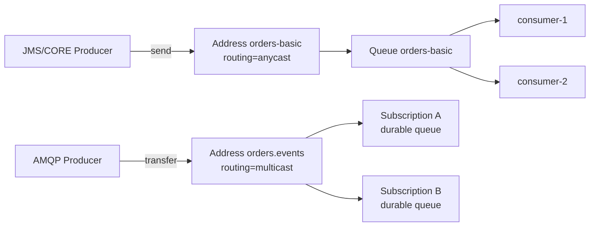

# ActiveMQ Artemis 总览

<VersionBadge product="ActiveMQ Artemis" broker="2.44.0" client="artemis-jakarta-client-all 2.44.0" image="tag+digest@.env.versions" />

> 本页结论：ActiveMQ Artemis 是「传统 Broker + 队列」模型的多协议实现（JMS/Jakarta JMS、AMQP 1.0、OpenWire、STOMP、MQTT、CORE）：消息写入 Address，按 anycast（竞争消费）或 multicast（发布订阅）路由到 Queue，确认即删除。它像 RabbitMQ 一样面向任务分发，而不是 Kafka 式的保留日志。

## 定位与适用场景

Artemis 源自 HornetQ（后被 Apache 收编，ActiveMQ Classic 的下一代技术路线；Red Hat AMQ Broker 是其商业支持版本），在消息系统光谱中的位置：

- **队列语义**：消息进入 Queue、被一个消费者取走、确认后删除——与 RabbitMQ 同类，与 Kafka/Redis Streams 的保留日志相反。
- **JMS 正统**：Jakarta JMS 2.0 的参考级实现，传统 Java EE/Jakarta EE 应用迁移 JMS 负载时的首选落点。
- **多协议接入**：同一 Broker 同时服务 AMQP 1.0（跨语言/跨平台互通）、STOMP（轻量脚本）、MQTT（IoT 遥测）与 CORE（Java 高性能路径）。
- **服务端可靠性策略**：重试次数、重投间隔、死信地址、过期地址都是服务端 address-setting，不依赖客户端自觉（见 [可靠性](/brokers/artemis/reliability)）。
- **不太适合**：需要按时间任意回放的日志型场景（确认即删除，无保留回放）、超大规模分区吞吐——单个 Queue 不做分区拆分（见 [存储与高可用](/brokers/artemis/storage-ha)）。

> 边界提示：Artemis 与 ActiveMQ Classic（5.x）是两套代码库，配置与调优经验不通用；本分卷只讨论 Artemis。

## 架构速览



核心实体与关系（详见 [核心概念映射](/brokers/artemis/concepts)）：

| 实体 | 职责 |
| :--- | :--- |
| Address | 路由单元；声明 anycast（点对点）或 multicast（发布订阅）路由类型 |
| Queue | 挂在 Address 下的消息暂存队列；anycast 地址上的队列承载竞争消费 |
| Subscription | multicast 地址上的具名订阅，本质是一个 durable queue |
| Journal | 追加式持久化日志（NIO/ASYNCIO），消息落盘的主路径 |
| address-setting | 按地址通配符匹配的服务端策略：重投、DLQ、过期、分页 |

## 能力摘要

| 维度 | ActiveMQ Artemis（本仓库覆盖范围） |
| :--- | :--- |
| 投递语义 | at-least-once（CLIENT_ACKNOWLEDGE）；XA 事务内原子收发可做到处理级 exactly-once |
| 顺序 | 单队列 + 单消费者 FIFO；多消费者竞争时全局顺序不保证，可用 Message Group 同组粘连 |
| 重试/DLQ | 服务端 address-setting：max-delivery-attempts + redelivery-delay + dead-letter-address |
| 延迟消息 | 原生支持：`_AMQ_SCHED_DELAY` 定时投递 |
| 高可用 | live/backup 复制对（同步复制 + 仲裁）或共享存储；集群做 Queue 分布与重分配 |
| 回放 | 不适用（确认即删除）；non-destructive 队列是特殊例外 |

## 学习路径

1. [快速开始](/brokers/artemis/quick-start)：最短闭环。
2. [核心概念映射](/brokers/artemis/concepts)：用 Artemis 术语回答统一知识模型。
3. [路由与分发](/brokers/artemis/routing)：anycast/multicast、divert、selector 与 Message Group。
4. [可靠性](/brokers/artemis/reliability)：确认后删除、崩溃窗口、重投与死信、去重。
5. [存储与高可用](/brokers/artemis/storage-ha)：journal、分页、复制与集群边界。
6. [运维与观测](/brokers/artemis/operations)、[陷阱与检查表](/brokers/artemis/pitfalls)。

## 动手实验

本仓库提供三个可重复实验（前两个快照尚未采集，验证输出待补）：

- `artemis basic`（L1）：JMS send 确认 + 业务提交后才 acknowledge + 幂等落库，验证「ack 即删除、队列深度归零」。
- `artemis retry-dlq`（L2）：毒消息按 address-setting 重投（共 3 次投递、固定 1s 间隔），耗尽后转入 `orders-dlq`。
- `artemis cli-tools`：纯镜像自带统一入口 `bin/artemis` 完成收发闭环（producer/consumer/browser 子命令，快照已采集，见 [运维与观测](/brokers/artemis/operations)）。

```bash
bash demos/artemis/basic/run.sh
bash demos/artemis/retry-dlq/run.sh
bash demos/artemis/cli-tools/run.sh
```

## 版本基线

- Broker：ActiveMQ Artemis 2.44.0（镜像 tag+digest 双锁定，见 `.env.versions`）。
- Java 客户端：`org.apache.activemq:artemis-jakarta-client-all:2.44.0`（Jakarta JMS API）。
- 官方文档：<https://activemq.apache.org/components/artemis/>（checkedAt: 2026-08-19）。
