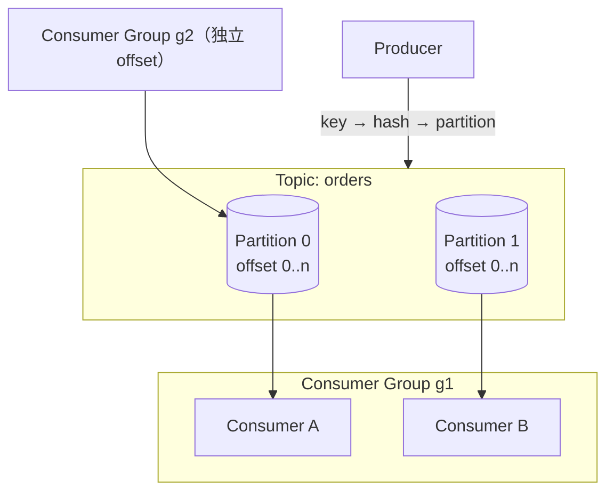

# Apache Kafka 核心概念映射

> 本页结论：用 Kafka 的术语逐一回答统一知识模型的十二个维度；关键区分是 Partition 同时承担「顺序单位、并行单位、复制单位」三重角色，Offset 是消费进度而不是删除标记。

## 实体关系

- **Broker**：Kafka 服务进程，承载若干分区的 Leader/Follower 副本。KRaft 模式下元数据（集群成员、分区 Leader、Topic 配置）以内部日志形式在 controller quorum 中复制，不依赖 ZooKeeper。
- **Topic**：逻辑分类，必须预先存在时才能按名写入（本仓库关闭了 `auto.create.topics.enable`，由 `setup` 步骤显式建 Topic）。
- **Partition**：Topic 的物理分片，一段只追加（append-only）的日志。它同时是：顺序保证的单位、消费并行度的单位、副本复制的单位。
- **Offset**：分区内每条消息的单调递增编号。消费者记录「下一个要读的 offset」（committed offset），日志本身不因消费而删除。
- **Consumer Group**：组内每个分区只分配给一个消费者（瓜分）；不同组各自维护独立 offset（广播效果靠多组实现）。
- **Replica / ISR**：每个分区有 1 个 Leader 与若干 Follower；与 Leader 保持同步的副本集合称 ISR，写入确认条件由 `acks` 与 `min.insync.replicas` 决定。

## 十二维度映射

### 1. 定位与适用场景

日志型消息系统：事件流、回放、管道、同键有序任务流。不适合按消息属性灵活路由（没有 Exchange/Binding 抽象）。

### 2. 核心实体

Producer、Topic、Partition、Consumer Group、Offset、Broker/Replica。消息本身是「record」：key + value + headers + timestamp。

### 3. 路由与分发

Kafka 的「路由」= key 到分区的映射，见专页 [分区与分发](/brokers/kafka/routing)。无 binding 概念；分发到多个下游靠多个消费组。

### 4. 存储与保留

日志追加写入段文件（segment），消费不删除记录。保留策略有两种且互不等价（规格 §7.2 强制点）：

| 策略 | 行为 | 适用 |
| :--- | :--- | :--- |
| Retention（时间/大小） | 超过阈值删除**整段**旧日志 | 普通事件流：保留 7 天之类 |
| Log Compaction | 只保留每个 key 的**最新** value | 状态快照类（如 changelog、配置） |

Retention 是「删除旧数据」，Compaction 是「压缩同 key 旧版本」，两者可组合；都不是「消费后删除」。

### 5. 生产可靠性

`acks=all` + `enable.idempotence=true` 是本仓库默认组合：确认以 ISR 全部写入为准，幂等生产避免 Broker 端重试产生重复序列。详见 [可靠性](/brokers/kafka/reliability)。

### 6. 消费可靠性

Kafka 没有 ACK/NACK 单条消息的概念：可靠性由 **offset 提交时机** 表达。手动提交（`commitSync`）在业务处理后执行；自动提交按时间间隔提交，存在丢失/重复窗口。崩溃后从已提交 offset 重读——「重投」的单位是位点之后的整段消息。

### 7. 投递语义

- at-most-once：生产不等确认 + 消费先提交 offset 再处理。
- at-least-once：`acks=all` + 处理完才提交 offset（标准姿势）。
- exactly-once：仅限 **Kafka 内部**（事务型 produce-consume，见 [可靠性](/brokers/kafka/reliability)）；跨外部系统仍需幂等消费。

### 8. 顺序语义

分区内有序，跨分区无序——「Kafka 保证全局顺序」是规格 §7.2 的禁止表述。同 key 哈希进同一分区可获得局部顺序；消费端单线程处理分区消息即保序，多线程拆分处理会破坏顺序。详见 [顺序语义](/fundamentals/ordering) 与 [顺序实验](/labs/ordering)。

### 9. 失败处理

无 Broker 内置消费重试与 DLQ。Retry Topic / DLQ 是应用层或框架层模式（如 Spring Kafka 的 RetryTopic/DLQ 注解），本质是「消费失败 → 转发到另一个 Topic」。

### 10. 高可用与扩展

分区多副本 + ISR；KRaft controller quorum 管理元数据。扩容 Broker 后需要分区再分配（reassignment）才能利用新节点。详见 [存储与高可用](/brokers/kafka/storage-ha)。

### 11. 安全与可观测性

认证（SASL/PLAIN、SCRAM、mTLS）、授权（ACL，按 Topic/Group/操作粒度）、TLS。指标经 JMX 导出（Prometheus 用 JMX Exporter）。核心指标：消费组 lag、ISR 收缩、under-replicated partitions。traceId 经 record headers 传播（本仓库 Demo 已贯穿 producer/consumer 日志）。

### 12. 限制与反模式

见专页 [陷阱与检查表](/brokers/kafka/pitfalls)。

## 三层语义示例：「消息不会丢」

| 层级 | Kafka 的成立条件 |
| :--- | :--- |
| Broker 层 | `acks=all` 且 `min.insync.replicas≥2`（多副本）时确认表示 ISR 全部落盘；本仓库单节点 RF=1，确认仅表示 Leader 已写入 |
| Client 层 | Producer 处理发送异常并重试（幂等生产避免重试重复）；Consumer 处理完成才 commitSync |
| Business 层 | 业务写入与幂等记录同事务；**提交 offset 不等于业务数据库已提交**——两者之间存在崩溃窗口（禁止表述之二，见 [可靠性](/brokers/kafka/reliability)） |

## 官方资料

- Kafka Design：<https://kafka.apache.org/documentation/#design>（checkedAt: 2026-08-19）
- Delivery Semantics：<https://kafka.apache.org/documentation/#semantics>（checkedAt: 2026-08-19）
- KRaft：<https://kafka.apache.org/documentation/#kraft>（checkedAt: 2026-08-19）
