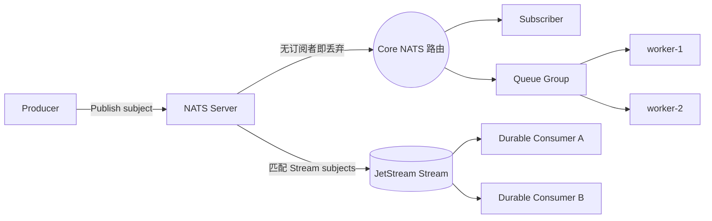

# NATS 与 JetStream 总览

<VersionBadge logo="nats" product="NATS" broker="2.11.5" client="jnats 2.21.1" image="tag+digest@.env.versions" />

> 本页结论：NATS 是分层设计的消息系统——Core NATS 提供极低延迟的易失发布订阅（发了就忘），JetStream 在其上叠加持久化日志与消费语义（Stream + Consumer + ACK）。两者的发送 API 与可靠性目标完全不同，任何结论都必须先说明说的是哪一层（规格 §7.6）。

## 定位与适用场景

- **Core NATS**：轻量连接总线。服务发现式 Subject 寻址、通配符订阅、Queue Group 负载分担、Request/Reply；适合控制面消息、遥测、微服务间轻量通信。
- **JetStream**：NATS 内置的持久事件流。消息落盘（File 存储）、可回放、Durable Consumer 记录位点、ACK/重投、多种保留策略；适合事件流、可靠任务队列、跨系统事件链。
- **不太适合**：需要 Kafka 级分区并行与超大保留的场景（JetStream 的扩展单元是 Stream/R3 复制，不是分区日志）；强多租户配额治理场景（有 Account 体系但运营复杂度需评估）。

## 架构速览



核心实体与关系（详见 [核心概念映射](/brokers/nats/concepts)）：

| 实体 | 职责 |
| :--- | :--- |
| Subject | 层级化目的地（`orders.created.eu`），支持 `*` 与 `>` 通配符订阅 |
| Queue Group | Core NATS 的竞争消费单元：同组订阅者分摊消息 |
| Stream | JetStream 的持久日志：声明式捕获一组 Subject 的消息 |
| Consumer | Stream 上的消费视图：Durable/Ephemeral × Push/Pull，各自位点与重投策略 |
| ACK / AckPolicy | JetStream 消费确认：None/All/Explicit；Explicit 下未 ACK 会重投 |

## 能力摘要

| 维度 | Core NATS | JetStream |
| :--- | :--- | :--- |
| 投递语义 | at-most-once（无存储、无确认） | at-least-once（Explicit ACK）；服务端去重窗口辅助生产端 |
| 顺序 | Subject 内对单个订阅者有序 | Stream 内有序；Consumer 按序投递受重投策略影响 |
| 重试/DLQ | 不适用（无存储） | AckWait + MaxDeliver；超限消息可导向另一 Stream 作 DLQ |
| 延迟消息 | 不适用 | 原生：消息级 `NATS-Delay` / 定时投递 |
| 回放 | 不适用 | 支持：新 Consumer 从头/按起始序列/按时间回放 |
| 高可用 | 无状态路由，Cluster 拓扑 | Stream R3 副本（Raft）；Supercluster 跨集群复制 |

## 学习路径

1. [快速开始](/brokers/nats/quick-start)：最短闭环（两个实验分别覆盖 Core 与 JetStream）。
2. [核心概念映射](/brokers/nats/concepts)：用 NATS 术语回答统一知识模型。
3. [路由与分发](/brokers/nats/routing)：Subject 通配符、Queue Group 与 Stream 捕获。
4. [可靠性](/brokers/nats/reliability)：两层的确认边界与崩溃窗口。
5. [存储与高可用](/brokers/nats/storage-ha)：存储类型、保留策略与 R3 复制。
6. [运维与观测](/brokers/nats/operations)、[陷阱与检查表](/brokers/nats/pitfalls)。

## 动手实验

- `nats core-pubsub`（L1）：无订阅者发布的 3 条消息丢失；先订阅再发布则 3 发 3 收——实证 Core NATS 的易失语义。
- `nats jetstream-replay`（L2）：Durable Consumer 消费后，第二个 Consumer 从头回放同批消息，幂等表拦截全部重复；ACK 不删除 Stream 消息。

```bash
npm run lab -- nats core-pubsub
npm run lab -- nats jetstream-replay
```

## 版本基线

- Broker：NATS Server 2.11.5（镜像 tag+digest 双锁定，见 `.env.versions`；JetStream 以 `-js` 启用）。
- Java 客户端：`io.nats:jnats:2.21.1`。
- 官方文档：<https://docs.nats.io/>（checkedAt: 2026-08-19）。
