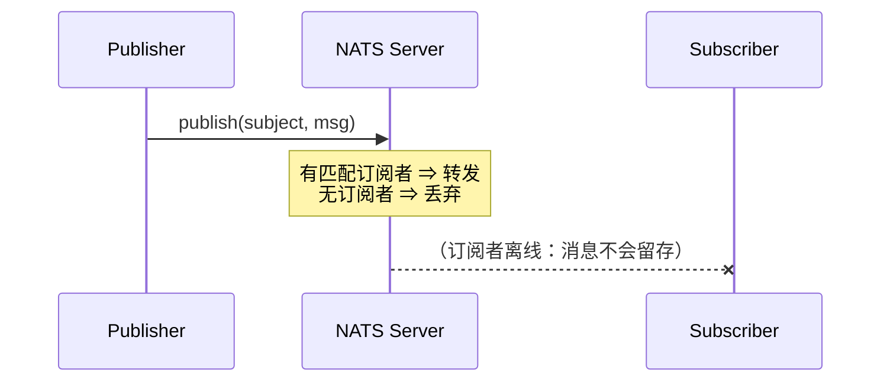
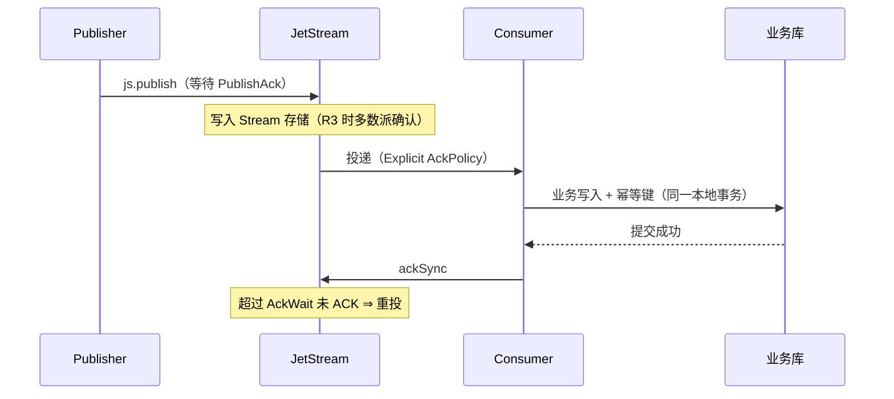

# NATS 可靠性

> 本页结论：Core NATS 是 at-most-once 的易失通道——发布无确认、订阅者离线即丢；JetStream 是 at-least-once 的持久通道——PublishAck + Explicit ACK + AckWait 重投。两层的可靠性结论不可互相迁移（规格 §7.6）。

## Core NATS：易失语义的精确边界

- **发布端**：`publish` 只是把字节写入连接缓冲并 flush；服务端**不返回任何确认**。客户端能做的上限是 `flush(timeout)` 确认「字节已到达服务端」，而不是「已被消费/保存」。
- **断线窗口**：客户端自动重连期间的发布进入本地缓冲（可配置上限），重连后补发；**服务端不会为断线的订阅者保存任何消息**——这就是 `core-pubsub` 实验第一阶段 3 条全丢的原因。
- **背压**：订阅者处理慢导致缓冲溢出时，服务端可能断开该慢消费者（slow consumer），消息同样丢失。

**适用判断**：可容忍丢失的控制消息、状态广播、指标上报；任何「丢一条就出业务事故」的链路都不应只用 Core 层。

## JetStream：at-least-once 的标准链路

三层语义（规格 §4.2）：

| 层级 | 保证 | 边界 |
| :--- | :--- | :--- |
| Broker 层 | PublishAck 表示消息已按副本策略写入 Stream；未 ACK 消息按 AckWait 重投、受 MaxDeliver 上限 | 仅覆盖 NATS 内部链路 |
| Client 层 | 业务提交后才 `ackSync`；客户端重试发布需配合去重 | 提交与 ACK 之间崩溃 ⇒ 重投 ⇒ 重复 |
| Business 层 | 幂等表拦截重复（本仓库 `jetstream-replay` 实验：回放 3 条全部 duplicate_skipped） | 幂等键必须覆盖所有消费方 |

### 生产端去重窗口

JetStream 支持发布时携带 `Msg-Id` 头：服务端在去重窗口内（默认 2 分钟，可配）对相同 Msg-Id 直接返回原 Ack，不重复写入。这缓解「发布超时重试」造成的重复，但**不覆盖消费端重复**——ACK 前崩溃仍会重投。

## 崩溃与重投参数

| 参数 | 作用 | 建议 |
| :--- | :--- | :--- |
| AckWait | 单次投递的确认超时，超时重投 | > 最长业务处理时长，避免「处理中被重投」 |
| MaxDeliver | 最大投递次数 | 有限重试；超限消息进 DLQ 流程 |
| BackOff | 重投间隔序列 | 指数退避 + 抖动，避免重试风暴 |

### 自建 DLQ（应用模式）

JetStream 没有独立的「DLQ 队列」实体；通行做法：MaxDeliver 耗尽的消息由监控方（或一个专用 Consumer）发布到 `orders.dlq` Stream，再 ACK 原消息。这是**应用层模式**，与 RocketMQ 的原生 `%DLQ%` Topic 不同（见 [重试与 DLQ 矩阵](/matrix/retry-dlq)）。

## 顺序与重投的冲突

Explicit ACK + 并行处理时，先投递的消息若后 ACK（或触发重投），**处理完成顺序**不再等于 Stream 序列顺序。需要按业务键有序时：单消费者串行处理，或用 Message Group 语义的替代设计（JetStream 无 Kafka 分区键机制，见 [路由与分发](/brokers/nats/routing)）。

## 不保证什么

- Core 层：无持久化、无确认、无重投——任何「Core NATS 保证送达」的表述都是错误的。
- JetStream：不提供跨外部系统的 exactly-once；业务副作用一致性仍需幂等消费（规格 §5.4）。
- WorkQueue 保留策略下消息被消费即删除——该策略下「回放」不再成立，跨策略结论不可泛化。

## 官方资料

- JetStream 概念：<https://docs.nats.io/nats-concepts/jetstream>（checkedAt: 2026-08-19）
- Ack 模型：<https://docs.nats.io/nats-concepts/jetstream/streams#consumer-ack-policy>（checkedAt: 2026-08-19）
