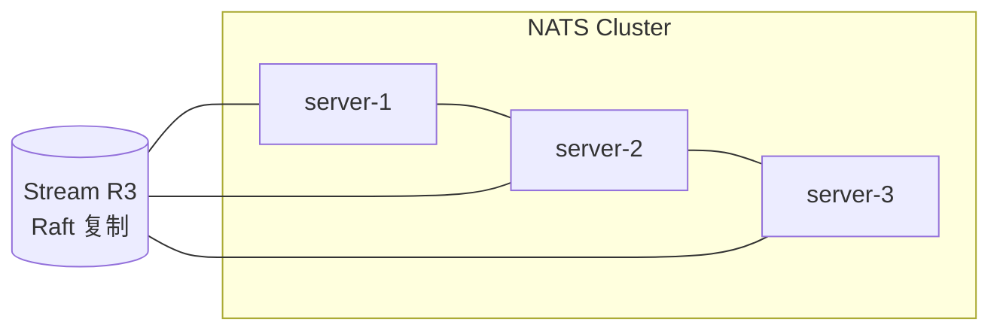

# NATS 存储与高可用

> 本页结论：JetStream 的消息存在 Stream 里（Memory/File 两种存储），删除由保留策略决定而不是 ACK；高可用靠 Stream R3 副本（Raft）与集群/超级集群拓扑。Core NATS 本身无状态，不涉及消息存储。

## 存储类型

| 存储 | 介质 | 适用 |
| :--- | :--- | :--- |
| File | 磁盘（本仓库实验使用） | 需要重启后存活的可靠消息 |
| Memory | 内存 | 低延迟、可接受重启丢失的缓冲场景 |

`-js` 启用 JetStream 时需要存储目录（容器内默认 `/data`）；本仓库实验不挂持久卷，File 存储随容器销毁——这是实验设计，生产必须挂可靠存储。

## 保留策略：谁决定删除

| 策略 | 删除条件 | 典型用途 |
| :--- | :--- | :--- |
| **Limits**（默认） | 达到 max_msgs / max_bytes / max_age 上限 | 事件日志、可回放事件流；**ACK 不删除**（`jetstream-replay` 实验断言 streamMessages=3 即此语义） |
| **Interest** | 所有 Consumer 都确认过且无订阅兴趣 | 「广播且消费完即可删」的事件分发 |
| **WorkQueue** | 消息被成功消费（ACK）后删除 | 任务队列：每条只被一个消费者处理一次 |

> 对比：Kafka 只有 Limits 类语义（retention），RabbitMQ 队列是「ACK 即删」。引用「JetStream 消息会不会被删」的结论前，必须先说明策略。

配合保留的还有 `Discard` 策略（Old/New）：达到上限时丢最老还是拒最新写入。

## 回放与位点

- 新 Consumer 默认从 Stream 头部开始（DeliverAll）——回放是默认能力而非特殊功能；也可按起始序列号或时间戳开始。
- Durable Consumer 的位点由服务端保存；`XADD` 式的时间轴由 Stream 序列号（seq）承担。
- `jetstream-replay` 实验正是利用「新 durable = 新位点 = 从头回放」复现重复消费，并验证幂等拦截。

## 高可用：副本与集群

- **Stream 副本**：R1（单副本）或 R3（三副本 Raft，多数派确认后 PublishAck）。Leader 故障时自动选举，位点与消息随副本保留。
- **集群拓扑**：Route 连接多服务器；客户端 URL 列表 + 自动重连。Core 消息在集群内按订阅兴趣转发，仍无持久化。
- **Supercluster / Mirror & Source**：跨集群复制 Stream（Mirror 镜像、Source 汇聚），用于跨地域容灾与数据聚合。

## 扩展边界（与 Kafka 对比）

| 维度 | JetStream | Kafka |
| :--- | :--- | :--- |
| 并行单元 | Stream 级（无分区） | Partition 级 |
| 单 Stream 吞吐 | 受副本组所在节点约束 | 分区横向扩展 |
| 扩容方式 | 更多 Stream / 更大副本组 / 超级集群 | 加分区加 Broker |
| 超大保留 | 受存储配额约束 | retention + 分层存储生态 |

结论：海量分区级并行的场景不是 JetStream 的主场；它的优势是「单一二进制、内建持久化、极低运维门槛的可靠消息」（见 [选型指南](/matrix/selection-guide)）。

## 官方资料

- Streams 与保留策略：<https://docs.nats.io/nats-concepts/jetstream/streams>（checkedAt: 2026-08-19）
- JetStream 集群与副本：<https://docs.nats.io/running-a-nats-service/nats_admin/jetstream_admin>（checkedAt: 2026-08-19）
