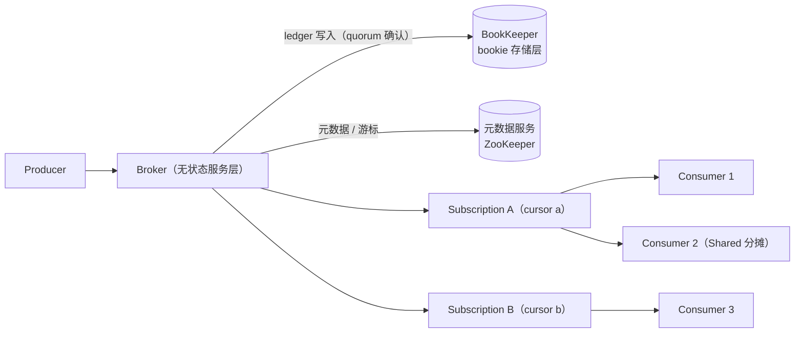

# Apache Pulsar 总览

<VersionBadge logo="pulsar" product="Apache Pulsar" broker="4.2.4" client="pulsar-client 4.2.2" image="tag+digest@.env.versions" />

> 本页结论：Pulsar 是计算存储分离的云原生消息系统——无状态 Broker 负责接入与订阅分发，消息日志以 ledger 形式持久化在 BookKeeper，元数据由独立元数据服务（本仓库实验为内嵌 ZooKeeper）管理；一个 Topic 可挂多个 Subscription，四种订阅类型分别覆盖独占、竞争消费、主备与同键有序。

## 定位与适用场景

Pulsar 的差异化在「分层」：服务层（Broker）、存储层（BookKeeper）、元数据层各自独立扩展。

- **多租户平台化接入**：Tenant/Namespace 提供配额、策略与权限的隔离单位，一个集群服务多条业务线。
- **海量 Topic 与弹性伸缩**：Broker 无状态，增减节点不搬数据；存储容量独立于计算扩容（但**不等于免容量规划**，见 [陷阱](/brokers/pulsar/pitfalls)）。
- **事件流与回放**：消息按 retention/TTL 保留，订阅游标（cursor）可重置到任意位置重读（[实验](/brokers/pulsar/reliability)）。
- **一个 Topic 多种消费拓扑**：Exclusive/Failover/Shared/Key_Shared 四种订阅类型，同一份数据同时支撑保序单消费、竞争消费与分片并行（[实验](/brokers/pulsar/routing)）。
- **不太适合**：RabbitMQ 式按内容/模式灵活路由（没有 Exchange/Binding 抽象）；追求最小依赖的轻量部署——standalone 单容器内嵌三个角色，冷启动明显偏慢（对比见 [消息模型](/fundamentals/models)）。

## 架构速览

核心实体与关系（详见 [核心概念映射](/brokers/pulsar/concepts)）：

| 实体 | 职责 |
| :--- | :--- |
| Broker | 无状态服务进程：接入生产者/消费者、管理 Topic 归属与订阅分发，本身不存消息日志 |
| Bookie（BookKeeper） | 存储节点：以 ledger（段）为单位多副本持久化消息 |
| 元数据服务 | 集群成员、Topic 归属、订阅游标等元数据（standalone 内嵌 ZooKeeper） |
| Topic | 全限定名 `persistent://tenant/namespace/local`，可选分区 Topic（partitioned topic） |
| Subscription | Topic 上的消费关系与进度载体，四种类型决定分发语义 |
| Cursor | 订阅的消费位点，持久化在元数据中，可重置（回放） |
| MessageId | 消息全局编号 `ledgerId:entryId:partitionIndex`，是 ack 与回放的位点 |

## 能力摘要

| 维度 | Pulsar（本仓库覆盖范围） |
| :--- | :--- |
| 投递语义 | at-least-once（手动 ack + 幂等落库）；事务可实现 Pulsar 内部跨 Topic/分区原子操作（本仓库未实验），跨外部系统仍需幂等消费 |
| 顺序 | 单分区内有序；分区 Topic 按 key/轮转分布，无跨分区全局顺序 |
| 重试/DLQ | 客户端 DeadLetterPolicy：negativeAck/ack 超时触发重投，超过 maxRedeliverCount 进 DLQ（[实验](/brokers/pulsar/reliability)） |
| 延迟消息 | Broker 支持延迟/定时投递（仅 Shared/Key_Shared 订阅生效）；本仓库未实验 |
| 高可用 | ledger 按 quorum 在多 bookie 复制；Broker 无状态可水平扩展；元数据服务需独立保障 |
| 回放 | 原生支持：`reset-cursor` 重置到 earliest/latest/时间戳/MessageId（[实验](/brokers/pulsar/reliability)） |

## 学习路径

1. [快速开始](/brokers/pulsar/quick-start)：最短闭环。
2. [核心概念映射](/brokers/pulsar/concepts)：用 Pulsar 术语回答统一知识模型。
3. [订阅与分发](/brokers/pulsar/routing)：四种订阅类型与分区 key 路由。
4. [可靠性](/brokers/pulsar/reliability)：ack 时机、negativeAck、重投与 DLQ。
5. [存储与高可用](/brokers/pulsar/storage-ha)：ledger、quorum、retention/TTL 与 tiered storage。
6. [运维与观测](/brokers/pulsar/operations)、[陷阱与检查表](/brokers/pulsar/pitfalls)。
7. 动手实验：[basic](/brokers/pulsar/quick-start)、[subscriptions](/brokers/pulsar/routing)、[redelivery-replay](/brokers/pulsar/reliability)。

## 版本基线

- Broker：`apachepulsar/pulsar:4.2.4` standalone 单容器（broker + BookKeeper + ZooKeeper 内嵌，镜像 tag+digest 双锁定，见 `.env.versions`；checkedAt: 2026-08-19）。
- Java 客户端：`org.apache.pulsar:pulsar-client:4.2.2`。
- 连接地址：`pulsar://127.0.0.1:6650`；管理接口 `http://127.0.0.1:8080`（pulsar-admin）。
- 官方文档：<https://pulsar.apache.org/docs/next/concepts-messaging>（checkedAt: 2026-08-19）。
