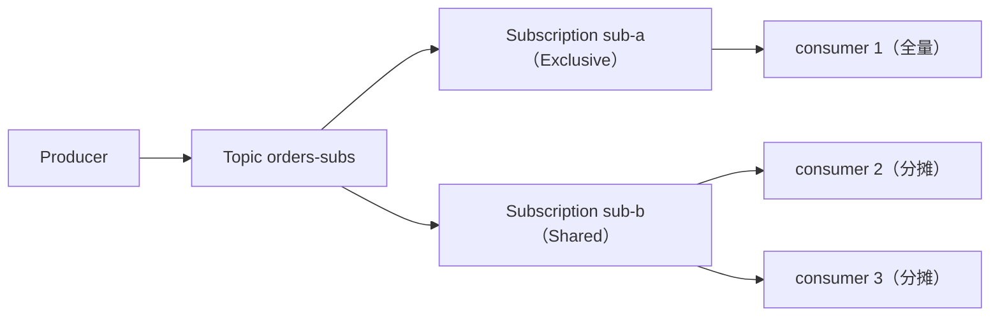

# Apache Pulsar 订阅与分发

> 本页结论：Pulsar 的「分发」就是 Topic 订阅模型——广播靠多个订阅（各自独立 cursor、各收全量），竞争消费靠订阅内的 Shared/Key_Shared 分摊；分区 Topic 之上再叠加 key/轮转路由。它没有 Exchange/Binding，也没有 Kafka 式跨 Topic 消费组：Subscription 绑定单个 Topic，既是消费关系又是进度所有者。

## 适用场景

- 一份数据多个下游：每个下游建一个订阅（审计、索引、通知各自全量）。
- 任务型竞争消费：Shared 订阅内多消费者分摊（[背压与积压](/fundamentals/backpressure)）。
- 同键有序 + 水平扩展：Key_Shared 按业务键粘连消费者。
- 保序单消费/主备：Exclusive/Failover。

## 核心模型：Topic → Subscription → Consumer



- 每个订阅持有**独立 cursor**：互不影响，互不竞争；删订阅不影响其他订阅。
- 订阅类型在首个消费者连接时确定，决定该订阅内的分发语义。

## 四种订阅类型

| 类型 | 分发语义 | 顺序 | 典型场景 |
| :--- | :--- | :--- | :--- |
| Exclusive | 全量给唯一消费者；第二个消费者订阅同一订阅名**立即冲突报错** | 单分区内全序 | 严格单消费者、保序处理 |
| Failover | 主消费者收全量，备消费者 0 条；主断开后备接管 | 单分区内全序 | 保序 + 消费侧高可用 |
| Shared | 消息在消费者间轮转分摊，无粘连 | **不保证任何顺序** | 竞争消费、吞吐优先的任务队列 |
| Key_Shared | 同 key 消息粘连同一消费者；该消费者断开后 key 重新分配 | 同 key 有序 | 按实体分片的保序并行（如 orderId） |

subscriptions 实验在同一 Topic（`persistent://public/default/orders-subs`）上依次验证四类：Exclusive 第二个消费者订阅即冲突；Shared 两个消费者各自收到 ≥1 条、合并去重后等于全量；Failover 主消费者收全量、备消费者 0 条，主退出后备接管新消息；Key_Shared 同 key 消息始终落在同一消费者：

```bash
bash demos/pulsar/subscriptions/run.sh
```

<LabOutput product="pulsar" lab="subscriptions" />

## 分区 Topic 的 key 路由

- 分区 Topic（partitioned topic）由 N 个非分区 Topic 组成；Producer 按 `hash(key) % N` 或轮转（无 key）把消息分布到各分区。
- **顺序只在单分区内**：同 key 进同分区才有局部顺序；「Pulsar Topic 没有分区概念」是禁止表述（见 [陷阱](/brokers/pulsar/pitfalls)）。
- 订阅消费分区 Topic 时，四类订阅语义在每个分区上分别生效：如 Shared 订阅中每个分区的消息各自在消费者间分摊。
- 分区数决定并行度上限（Shared/Key_Shared 的有效消费者数受分区数约束），且**只能增不能减**。

## 与 Kafka 消费组、RabbitMQ 绑定的对照

| 关注点 | Pulsar | Kafka | RabbitMQ |
| :--- | :--- | :--- | :--- |
| 消费关系 | Subscription（绑定单个 Topic，携带 cursor） | Consumer Group（可订阅多 Topic，携带 offset） | Queue + Exchange Binding |
| 广播 | 多个订阅各收全量 | 多个消费组各收全量 | fanout/topic exchange 绑多个队列 |
| 竞争消费 | 同一订阅内 Shared/Key_Shared | 同一组内瓜分分区 | 同一队列多消费者 |
| key 的角色 | 分区路由 + Key_Shared 粘连 | 分区路由 | routing key 决定绑定匹配（路由到队列，不是分片） |
| 进度的单位 | cursor（每订阅） | offset（每组） | 逐条 ACK（队列删除） |
| 拓扑选择时机 | 订阅时选类型（四种语义） | 建 Topic 时定分区数 | 声明 Exchange/Queue 时定类型 |

要点：Kafka 的「分发语义」由 Topic 分区 + 消费组固定（组内瓜分、组间广播）；Pulsar 把选择权下放到**每个订阅**——同一 Topic 可以同时存在保序的 Exclusive 订阅和并行的 Shared 订阅。RabbitMQ 的路由发生在「进队列之前」（binding 匹配），Pulsar/Kafka 的路由发生在「写入时」（key→分区）与「消费时」（订阅类型）。

## 常见误区

- 「Shared 订阅同 key 也有序」——不保证任何顺序；同键有序必须 Key_Shared（或单分区 + Exclusive/Failover），这是错误表述（见 [陷阱](/brokers/pulsar/pitfalls)）。
- 「多开消费者总能提速」——Exclusive/Failover 只有一个消费者干活；Shared/Key_Shared 受分区数与 key 分布约束，热点 key 会倾斜。
- 「订阅名随便起、随时删」——cursor 与订阅名绑定；删订阅丢进度，同名重建从默认位置开始。
- 「非分区 Topic 以后随时转分区」——形态转换需重建 Topic 并迁移生产/消费端，规划要趁早。

## 官方资料

- Subscriptions（四种类型）：<https://pulsar.apache.org/docs/next/concepts-messaging>（checkedAt: 2026-08-19）
- Architecture Overview（Topic 归属与负载）：<https://pulsar.apache.org/docs/next/concepts-architecture-overview>（checkedAt: 2026-08-19）
