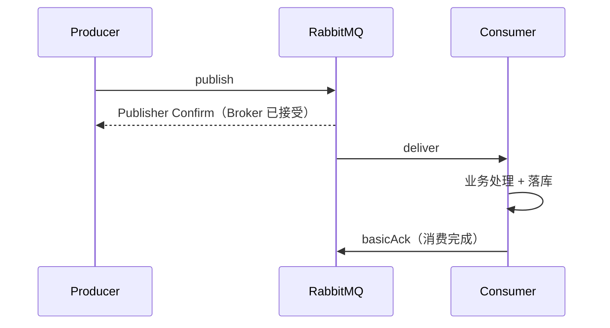

# RabbitMQ 可靠性

> 本页结论：Publisher Confirms 与 Consumer ACK 是互相独立的两段确认；可靠链路 = Confirms + 手动 ACK + 幂等消费。「不丢」永远附带前置条件，exactly-once 不适用于跨系统端到端。

## 两段确认各管一段



- **Publisher Confirm 只回答「Broker 收到了」**：它不保证消息被复制、被持久化到满意程度，更不代表任何消费者处理过。
- **Consumer ACK 只回答「这个消费者处理完了」**：与生产端的确认完全独立。
- 因此「Confirm 成功」不能作为业务成功的通知依据——这是错误表述之一。

## 生产端：Publisher Confirms

```java
channel.confirmSelect();
channel.basicPublish(...);
if (!channel.waitForConfirms(5000)) { /* nack：重试或落库补偿 */ }
```

- 逐条确认简单可靠；批量模式（waitForConfirms(long) 配合未确认计数）吞吐更高。
- Broker 返回 nack（或超时）时必须处理：重发或转入本地补偿（Outbox）。重发可能造成重复。
- 未开 Confirms 时，`basicPublish` 返回不报错不代表 Broker 收到（路由不到队列的消息会被静默丢弃或 basicReturn）。

## 消费端：ACK 模式

| 模式 | 行为 | 风险 |
| :--- | :--- | :--- |
| 自动 ACK（autoAck=true） | deliver 即视为完成 | 处理中崩溃 = 丢消息；at-most-once |
| 手动 ACK | ACK 才移除 | 忘记 ACK 会造成重投与 Unacked 堆积 |
| NACK/Reject + requeue | 立即重回队头 | 毒消息无限循环、顺序抖动 |
| NACK + DLX | 交给死信路由 | 需要预先配置 DLX 与 DLQ |

Prefetch 与 ACK 一起决定在途消息上限；崩溃后未 ACK 消息自动重投（`redelivered=true`）。

## 崩溃窗口与幂等消费（§5.4 基准实现）

正确顺序：**业务事务提交 → ACK**。

```text
1. 开启本地数据库事务
2. 插入 messageId 到 processed_messages（唯一键）
3. 唯一键冲突 → duplicate_skipped，安全 ACK
4. 首次处理 → 执行业务写入，提交事务
5. 提交成功后才 basicAck
```

第 4 步提交成功、第 5 步 ACK 前崩溃 → Broker 必然重投 → 幂等表拦截。该窗口不可消除，只能靠幂等表兜底。完整可复现实验：

```bash
bash demos/rabbitmq/consumer-crash/run.sh
```

<LabOutput product="rabbitmq" lab="consumer-crash" />

## 失败路径：重试与 DLQ

RabbitMQ 无内置消费重试。推荐模式（本仓库 retry-dlq 实验验证）：

- 工作队列 DLX → 重试队列（TTL 延迟）→ 回环到工作队列；
- 消费者用 `x-death` 计数限制最大尝试次数；
- 超限显式投递 DLQ 并告警。详见 [毒消息、重试与 DLQ](/labs/poison-message)。

## 顺序与重试的关系

- 单队列 FIFO 只在「无 requeue、无乱序 ACK」时成立。
- NACK+requeue 会把失败消息送回队头或原位置之后（取决于实现与配置），重试消息与后续消息的相对顺序可能变化。
- 需要「同 orderId 严格有序」时：routing key=orderId 绑定到专属队列 + 单消费者 + 失败进 DLQ 而非 requeue。

## 三层语义总结

| 层级 | 保证 | 条件 |
| :--- | :--- | :--- |
| Broker | 消息被接受/保留 | Confirms 开启；Quorum Queue 多数派写入；或单节点存活且已持久化 |
| Client | 不重发丢、不提前 ACK | waitForConfirms 处理 nack；手动 ACK + prefetch |
| Business | 效果恰好一次 | 幂等表 + 本地事务；Outbox 保证「业务成功必发出」 |

## 常见误区

- 「Confirm + ACK 都开了就是 exactly-once」——端到端仍可能重复（崩溃窗口），必须幂等。
- 「自动 ACK 配 durable 队列也安全」——丢消息窗口在消费侧，durable 管不到。
- 「重试次数靠 Broker」——RabbitMQ 不提供，需要应用 + x-death 或重试队列实现。

## 官方资料

- Publisher Confirms：<https://www.rabbitmq.com/docs/confirms#publisher-confirms>（checkedAt: 2026-08-19）
- Consumer Acknowledgements：<https://www.rabbitmq.com/docs/confirms#consumer-acknowledgements-and-data-safety>（checkedAt: 2026-08-19）
- Reliability Guide：<https://www.rabbitmq.com/docs/reliability>（checkedAt: 2026-08-19）
