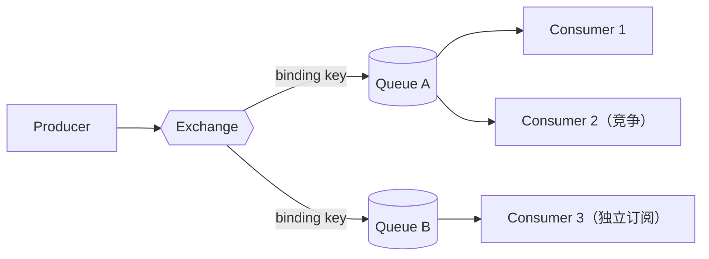

# RabbitMQ 路由与分发

> 本页结论：消息永远先到达 Exchange，再由 Binding 决定进入哪些队列；五种 Exchange 类型的路由差异决定了竞争消费、广播与模式匹配三种分发形态。

## 适用场景

- 任务分发（一个队列、多个竞争消费者）。
- 事件广播（一条事件复制给多个独立订阅）。
- 按业务键路由（地区、租户、事件子类型）。

## 核心模型：Exchange → Binding → Queue



- 同一条消息可以进入多个队列 → 各队列的订阅者都能收到（广播）。
- 同一个队列的多个消费者 → 每条消息只给其中一个（竞争消费，Work Queue）。
- 广播与竞争消费可以同时存在：先复制到队列，再在队列内竞争。

## 五种 Exchange 的路由差异

| 类型 | 路由依据 | 典型用法 |
| :--- | :--- | :--- |
| Default（匿名，""） | routing key = 队列名，直接投递 | 本仓库 basic / retry-dlq 实验用它 |
| Direct | routing key 与 binding key **完全相等** | 按明确类别分发，如 `order.created` |
| Topic | routing key 按段匹配，`*` 一段、`#` 零或多段 | 层级事件路由，本仓库 routing 实验 |
| Fanout | 忽略 routing key，投给全部绑定队列 | 纯广播 |
| Headers | 按消息 headers 键值匹配（x-match=all/any） | 少用：性能差、难维护，多数场景 Topic 可替代 |

### Topic 匹配要点（routing 实验验证）

| binding | 命中 `order.created` | 命中 `order.created.eu` |
| :--- | :--- | :--- |
| `order.created` | 是 | 否 |
| `order.#` | 是 | 是 |
| `order.created.eu` | 否 | 是 |

`#` 可匹配零段：`order.#` 也能命中 `order`。绑定 `#` 的队列会收到所有消息，常用作审计/全量订阅。

动手验证：

```bash
bash demos/rabbitmq/routing/run.sh
```

三队列分别收到 2/3/1 条，与上表一致。

<LabOutput product="rabbitmq" lab="routing" />

## 负载分发：Prefetch 的作用

多个竞争消费者时，RabbitMQ 默认轮询分发（round-robin）。若不设 Prefetch，Broker 可能一次把大量消息推给单个消费者，导致其他消费者空闲、该消费者积压。正确姿势：

```java
channel.basicQos(1); // 未 ACK 消息最多 1 条，处理完再发下一条
```

本仓库所有 Demo 均设置 `prefetch=1`，保证「慢消费者不多拿」。

## 常见误区

- 「Producer 直接发给队列」——除了 Default Exchange，消息都先经过 Exchange；发到未声明的 Exchange 会关 Channel。
- 「绑定可以解绑就没事了」——绑定关系本身是持久状态，声明幂等但删除绑定会改变流量走向，变更需当发布对待。
- 「routing key 就是 eventType」——本仓库约定 routing key 表达路由意图（可与 eventType 一致），队列名不应承载业务语义。
- 「Fanout + 单队列 = 广播」——广播要求每个订阅者有自己的队列；共用一个队列就退化成竞争消费。

## 官方资料

- Exchanges：<https://www.rabbitmq.com/tutorials/amqp-concepts#exchange-direct>（checkedAt: 2026-08-19）
- Tutorial 5（Topic）：<https://www.rabbitmq.com/tutorials/tutorial-five-java>（checkedAt: 2026-08-19）
- Prefetch：<https://www.rabbitmq.com/docs/consumer-prefetch>（checkedAt: 2026-08-19）
