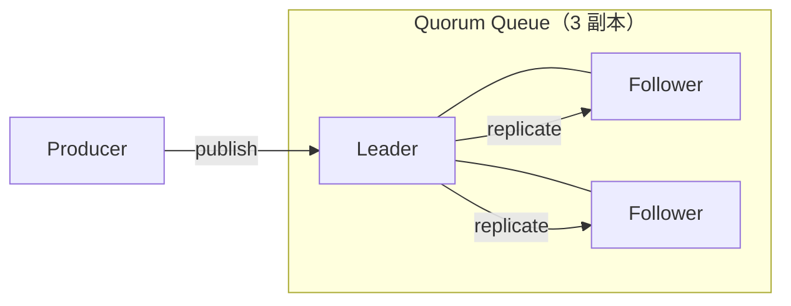

# RabbitMQ 存储与高可用

> 本页结论：Classic Queue、Quorum Queue、Stream 是三种定位完全不同的队列类型；生产可靠性场景默认选 Quorum Queue，大积压/回放场景看 Stream，不要把三者混成一种队列。

## 存储模型

RabbitMQ 的消息存储挂在队列上：

- 消息进入队列时位于内存；persistent 消息会尝试落盘（时机由 Broker 决定，不承诺同步刷盘）。
- **ACK 后消息即删除**——没有 offset、没有回放。这是队列语义，与 Kafka 的日志语义形成根本区别。
- 队列积压时消息更多驻留内存/磁盘分页，长积压会触发内存告警与流控（见 [背压与积压](/fundamentals/backpressure)）。

## 三种队列类型

| 类型 | 定位 | 复制 | 适用 |
| :--- | :--- | :--- | :--- |
| Classic Queue | 传统单副本队列（4.x 起镜像模式已弃用） | 无（节点级故障即不可用/可能丢消息） | 开发测试、可容忍丢失的临时数据 |
| Quorum Queue | Raft 多数派复制的持久化队列 | 多数派确认才返回 | 生产可靠消息的默认选择 |
| Stream | 追加日志型队列，消费不删除 | 多副本（replication factor） | 大积压、多消费组回溯重读 |

关键点：

- Quorum Queue 写入需多数派（3 副本需 2 个节点存活）确认，延迟高于 Classic Queue，这是复制换可用性的必然代价。
- Quorum Queue 强制持久化与至少一次语义，忽略部分 Classic 参数（如 per-message TTL 语义差异），迁移时须核对参数。
- Stream 的消费模型接近日志：cursor 由消费者持有，消息按 retention 保留。它与 Classic/Quorum 是不同的 API 实体（`x-queue-type=stream`），不能按普通队列类比。
- 本仓库实验统一使用 Classic Queue（最小依赖、行为直观）；Quorum/Stream 只做原理讲解，不做容器内多节点演示（属于 L3 级别，默认不执行）。

## 高可用与故障语义

- 少数派节点故障：自动切换 Leader，生产消费继续；未同步到多数派的在途消息可能丢或重排。
- 失去多数派：队列不可用（宁停勿错），恢复多数派后继续。
- Publisher Confirms 在 Quorum Queue 下表示多数派已接受——这正是「确认的含义取决于队列类型」的例子。

## 扩展

- 队列是 Broker 上的实体：单个队列只在一个节点上「驻留」，扩展消费能力靠增加队列数与消费者数，而不是给一个队列加节点。
- Sharded Queues（一致性哈希 Exchange）是常见分片模式。
- 节点扩容/缩容影响的是队列分布与 rebalance，不是 Kafka 式的分区再分配。

## 常见误区

- 「Quorum Queue 一定比 Classic 慢，所以别用」——多数派复制的延迟换的是「节点挂了消息还在」，生产消息系统几乎总是划算的。
- 「Stream 就是更快版的队列」——消费不删除、cursor 语义、retention 策略都不同，用它之前先想清楚是否真的需要回放。
- 「所有 RabbitMQ 队列都适合超长积压或日志回放」——这是错误表述：Classic/Quorum 是队列，超长积压与回放场景应评估 Stream 或日志型系统。

## 官方资料

- Quorum Queues：<https://www.rabbitmq.com/docs/quorum-queues>（checkedAt: 2026-08-19）
- Streams：<https://www.rabbitmq.com/docs/streams>（checkedAt: 2026-08-19）
- Clustering / HA：<https://www.rabbitmq.com/docs/clustering>（checkedAt: 2026-08-19）
