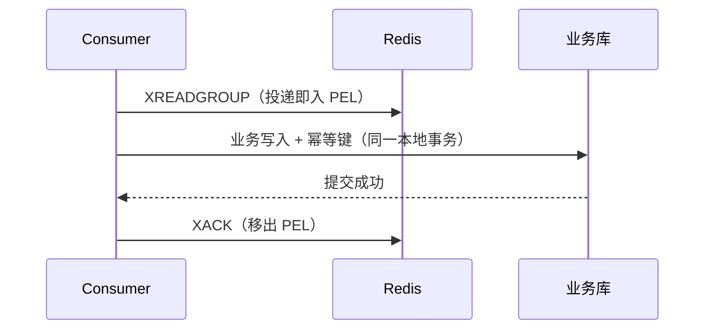

# Redis Streams 可靠性

> 本页结论：Redis Streams 的可靠链路 = `XADD` 同步写入 + Consumer Group 的 PEL 追踪 + `XACK` 前完成业务提交。它提供 at-least-once（手动 ACK）或 at-most-once（NOACK），没有服务端 exactly-once；崩溃窗口内的重复必须靠业务幂等拦截。

## 生产端：XADD 的确认边界

- `XADD` 是请求-应答式命令：服务端返回 Entry ID 表示**该节点已写入内存**（AOF 开启时按 `appendfsync` 策略落盘）。
- 主从架构下，`XADD` 返回**不等待副本同步**；需要更强保证可用 `WAIT numreplicas timeout` 等待复制——但 Redis 复制是异步模型，`WAIT` 超时后并不回滚。
- 无内置「幂等生产者」：网络超时后重发可能产生重复条目；可用**显式 Entry ID** 做去重（相同 ID 再写入会被拒绝为 busy 或覆盖，语义见官方文档），把幂等键编入 ID。

## 消费端：PEL 是可靠性的核心

三层语义（规格 §4.2）：

| 层级 | 保证 | 边界 |
| :--- | :--- | :--- |
| Broker 层 | 投递过的条目在 ACK 前一直记录在 PEL，不会因消费者断开而丢 | 条目本身可能被 XTRIM 删除，PEL 引用变成「已删除」标记 |
| Client 层 | 业务提交成功后才 `XACK`；崩溃后 `XCLAIM/XAUTOCLAIM` 接管 | 提交成功与 ACK 之间崩溃 ⇒ 重投，必然产生重复 |
| Business 层 | 幂等表（processed_messages 唯一键）拦截重复 | 幂等键必须全局唯一（本仓库用 `messageId`） |

## 崩溃窗口与重投（consumer-crash 实验）

`npm run lab -- redis-streams consumer-crash` 复现的时序：

1. consumer-1 读到第 1 条，业务提交成功，**XACK 前崩溃**（exit 137）。
2. 该条目滞留 PEL：`XPENDING` 显示 1 条未确认、归属 consumer-1。
3. consumer-2 启动后 `XCLAIM`（min-idle=0）接管，再次处理：幂等表命中 ⇒ `duplicate_skipped`，然后 `XACK`。
4. 剩余 2 条正常消费；最终 `business_rows=3`、`pending=0`、`XLEN=3`（条目从未删除）。

关键断言：**重复被观察到（duplicatesObserved=1）但没有被重复应用（duplicatesApplied=0）**——这正是 at-least-once + 幂等的标准组合。

## 失败处理与「自建重试」

Redis Streams 没有内置重试队列或 DLQ，常见自建模式：

1. `XAUTOCLAIM key group <new-consumer> <min-idle-ms> 0-0`：定期扫描空闲超时的 PEL 条目（返回新游标，适合大量 pending 的迭代）。
2. 检查 `XPENDING` 明细里的投递次数（delivered times）：超过阈值 ⇒ 把条目内容转写到 `orders.dlq` Stream 并 `XACK` 原条目。
3. DLQ Stream 由人工或工具回放。

> 与 RabbitMQ 的 TTL+DLX、RocketMQ 的原生 Retry/DLQ 不同：以上全部是**应用层模式**，不是服务端机制（见 [重试与 DLQ 矩阵](/matrix/retry-dlq)）。

## NOACK 与 at-most-once

`XREADGROUP ... NOACK` 读到的条目不进 PEL：读后即视为完成，崩溃即丢失。只适合可丢弃的遥测类数据——用它换吞吐前，先确认业务能接受丢失。

## 不保证什么

- 不提供 exactly-once：跨 Redis 与业务库没有分布式事务。
- `XACK` 之后、`XTRIM` 之前的窗口内条目仍占内存——ACK 不是容量回收。
- 主从切换可能丢失最后一段未复制的写入（含未 ACK 的 PEL 状态）；复制拓扑下的消息安全见 [存储与高可用](/brokers/redis-streams/storage-ha)。

## 官方资料

- Streams 教程与 Consumer Groups：<https://redis.io/docs/latest/develop/data-types/streams/>（checkedAt: 2026-08-19）
- XAUTOCLAIM/XCLAIM 语义：<https://redis.io/docs/latest/commands/xautoclaim/>（checkedAt: 2026-08-19）
