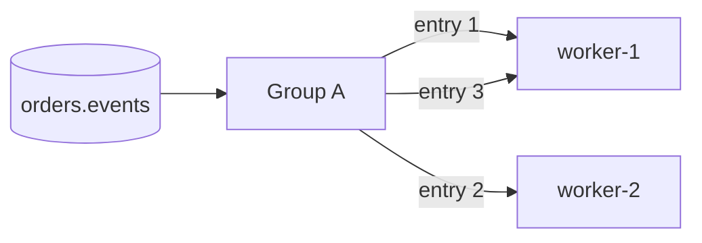
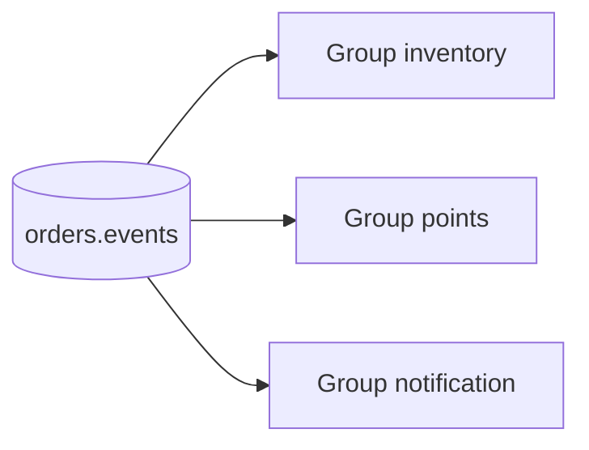

# Redis Streams 路由与分发

> 本页结论：Redis Streams 没有内容路由层——Stream key 就是目的地。「广播」靠同一条数据写入多个 Stream 或多组订阅，「竞争消费」靠组内多消费者；没有 Exchange/Binding/Tag/Subject 这类服务端过滤机制。

## 目的地即 key

与 RabbitMQ（Exchange + Binding）、NATS（Subject + 通配符）、RocketMQ（Tag 过滤）不同，Redis Streams 的分发单元就是 **Stream key**：

- Producer 用 `XADD <key>` 直接写目标 Stream，没有中间路由层。
- 想要「按业务类型分流」，只能在 Producer 侧写不同 key（如 `orders.created`、`orders.paid`），或在 Consumer 侧读完后按字段过滤——**服务端不做内容匹配**。

## 两种分发模式

### 竞争消费（组内）

同一 Consumer Group 内，`XREADGROUP` 的多个消费者瓜分**尚未投递**的条目：每条只投给组内一个消费者。



- 增加消费者即可提高吞吐（上限取决于条目产生速率与单条处理时长，而非分区数）。
- 组内**没有分区归属**：分发是服务端逐条指派，不保证「同一 aggregateId 总由同一消费者处理」。需要按 key 有序时，要么组内只放一个消费者，要么在应用层按业务键拆到多个 Stream。

### 广播（多组）

每个 Consumer Group 有独立的 last-delivered-id 与 PEL，因此**同一条目会被每个组各消费一次**——这就是 Redis Streams 的发布订阅：



对应统一教学案例的三个下游（库存/积分/通知）：各自建组、互不影响、各自维护积压。

> 注意：新建组从 `$`（当前末尾）开始时，**收不到**组建之前的条目；要全量回读需 `XGROUP CREATE ... 0` 或 `XGROUP SETID`。这是位点语义，不是路由语义。

## 与其它产品对照

| 需求 | Redis Streams 的做法 | 对比 |
| :--- | :--- | :--- |
| 按业务类型路由 | Producer 写不同 key | RabbitMQ Topic Exchange 服务端匹配 |
| 按标签过滤 | Consumer 侧过滤（读到才能判断） | RocketMQ Tag 服务端过滤 |
| 通配符订阅 | 不支持 | NATS Subject 通配符 |
| 同 key 有序 + 并行 | 多 Stream 拆分（应用层 hash） | Kafka Partition Key |

## 实验复现

`basic` 实验中的组内单消费者路径见 [快速开始](/brokers/redis-streams/quick-start)；多组广播可通过在同一 Stream 上创建第二个组并重复消费复现：

```bash
# 在 demos/redis-streams/basic 目录执行（compose 项目运行期间）
docker compose exec redis redis-cli XGROUP CREATE orders.basic group-b 0
```

## 不保证什么

- 不保证组内多消费者的完成顺序与写入顺序一致。
- 不提供服务端过滤，「读到无关消息再丢弃」的成本由消费者承担。
- 单个 Stream 的写入吞吐受单节点、单 key 限制，路由设计不能替代水平扩展（见 [存储与高可用](/brokers/redis-streams/storage-ha)）。
