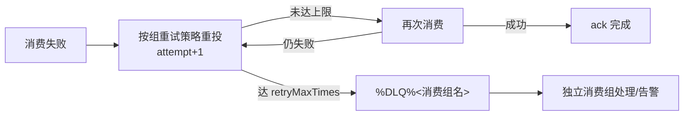

# Apache RocketMQ 可靠性

> 本页结论：RocketMQ 的可靠性由三处共同决定——生产端发送确认与幂等键、消费端 ack 时机、Broker 端内置重试与 DLQ。「ack」与「业务提交」是两个独立动作，崩溃窗口靠幂等表兜底；事务消息只保证「本地事务结果与消息投递一致」，不覆盖下游副作用。

## 生产端：发送确认与幂等键

发送有同步、异步、单向三种模式；同步发送拿到回执才算「被接受」。但必须澄清一条禁止表述：

- **「发送 SDK 最终失败 = Broker 一定没收到」是错的。** 网络超时、客户端重试之下，消息可能已经写入 Broker。发送端的「失败」只代表你没拿到确认，不代表 Broker 状态。
- 因此**消费端必须用幂等键（messageId/业务唯一键）去重**，不能依赖「发送失败就没这消息」的假设。

本仓库把 `messageId` 作为 Key 写入消息，并在消费端以幂等表去重。

## 消费端：PushConsumer 与 SimpleConsumer

| 模式 | 驱动方式 | 确认动作 | 适用 |
| :--- | :--- | :--- | :--- |
| PushConsumer | 框架回调监听器 | 返回 `SUCCESS`/`FAILURE` | 业务简单、交给框架管节奏 |
| SimpleConsumer | 主动 `receive` 拉取 | 处理完逐条 `ack` | 需精确掌控 ack 时机（本仓库 basic） |

两者都遵循同一条铁律：**业务事务提交后才确认**。PushConsumer 返回 `SUCCESS` 过早、或 SimpleConsumer 先 `ack` 再处理，都会引入丢消息窗口。

## 崩溃窗口与幂等消费（§5.4 基准实现）

正确顺序：**业务事务提交 → ack**。

```text
1. 开启本地数据库事务
2. 插入 messageId 到 processed_messages（唯一键）
3. 唯一键冲突 → duplicate_skipped，安全 ack
4. 首次处理 → 执行业务写入，提交事务
5. 提交成功后才 ack
```

第 4 步提交成功、第 5 步 ack 前崩溃 → Broker 重投 → 幂等表拦截。该窗口不可消除。本仓库 rocketmq basic 实验（SimpleConsumer）即按此实现：

<LabOutput product="rocketmq" lab="basic" />

## 事务消息的边界（Half Message 与回查）

事务消息解决「本地事务结果」与「消息投递」的一致，流程：

1. 发送 **Half Message**（对消费者不可见）；
2. 执行本地事务；
3. 按本地事务结果 `commit`（投递）或 `rollback`（丢弃）；
4. Broker 长时间未收到二次确认时**回查（check-back）**生产者，由 `TransactionChecker` 返回 COMMIT/ROLLBACK/UNKNOWN。

动手验证（首查返回 UNKNOWN、第二次 COMMIT，最终恰好消费 1 次）：

```bash
bash demos/rocketmq/transaction/run.sh
```

<LabOutput product="rocketmq" lab="transaction" />

本实验 `transactionCheckInterval=2000`、`transactionCheckMax=15`、`transactionTimeout=3000`，使回查窗口内可见 `checkBacks≥2`。

边界必须说清楚（禁止表述之一）：

- **「事务消息 = 跨系统强一致/原子提交」是错的。** Half Message 只保证「本地事务结果与消息投递一致」；**下游消费者处理、外部数据库/HTTP 副作用都不在其覆盖范围内**，下游仍需可靠消费 + 幂等。
- 它是「最终一致」的工具，不是分布式强一致事务。

## 消费失败：重试、最大次数与 DLQ

RocketMQ 内置消费重试，状态过程：



- 重试次数与间隔由**消费组**承载：`updateSubGroup -r <retryMaxTimes> -p <策略JSON>`。
- 重试耗尽后消息进 `%DLQ%<消费组名>`，需用独立消费组单独订阅处理。

动手验证（毒消息 `aggregateId=order-poison` 返回 FAILURE，重试 2 次后进 DLQ）：

```bash
bash demos/rocketmq/retry-dlq/run.sh
```

<LabOutput product="rocketmq" lab="retry-dlq" />

本实验消费组配置 `retryMaxTimes=2`、策略 `CUSTOMIZED next=[1000,1000]`；耗尽后由独立组 `orders-dlq-inspect` 收出，断言 `dlqReceived=1`。

**重试是失败恢复，不是限流/背压**——把重试当日常流控是禁止表述（见 [陷阱](/brokers/rocketmq/pitfalls)）。

## 三层语义总结

| 层级 | 保证 | 条件 |
| :--- | :--- | :--- |
| Broker | 消息被接受/保留 | 同步刷盘 + 同步复制才多副本可读；本仓库单节点 `ASYNC_FLUSH`/`ASYNC_MASTER` 仅覆盖该 Broker 存活场景 |
| Client | 不重发丢、不提前 ack | 发送结果处理 + 幂等键；业务提交后才 ack（或才返回 SUCCESS） |
| Business | 效果恰好一次 | 幂等表 + 本地事务；事务消息不覆盖下游副作用 |

## 常见误区

- 「发送失败就当消息不存在」——可能已写入，必须幂等去重。
- 「事务消息提交后下游就恰好一次」——见上文边界说明。
- 「ack 了就等于业务已落库」——ack 与业务提交是两个系统上的动作。

## 官方资料

- 领域模型（Message）：<https://rocketmq.apache.org/docs/domainModel/04main>（checkedAt: 2026-08-19）
- RocketMQ 文档首页：<https://rocketmq.apache.org/docs/>（checkedAt: 2026-08-19）
