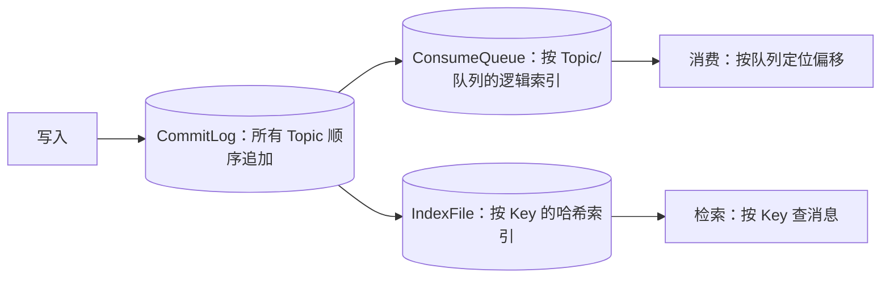

# Apache RocketMQ 存储与高可用

> 本页结论：RocketMQ 的存储是「统一 CommitLog + ConsumeQueue/IndexFile 双索引」，消费不删除消息（保留期清理，类似日志）；高可用由主从复制 / DLedger（Raft）/ 5.x Controller 模式提供，5.x 另以无状态 Proxy 分离接入与存储。

## 存储模型：一份日志、两种索引

- **CommitLog**：所有 Topic 的消息统一、顺序追加写入同一日志文件——顺序写盘是吞吐关键。
- **ConsumeQueue**：每个 Topic 的每个 MessageQueue 一份逻辑索引（偏移 + 大小 + Tag 哈希），消费时据此定位 CommitLog。
- **IndexFile**：按消息 Key 建哈希索引，支持按 Key 检索（对应 Key 的「查消息」用途，见 [路由与分发](/brokers/rocketmq/routing)）。
- 消息写入后**不因消费而删除**：删除只由保留期触发（本仓库 `deleteWhen=04`、`fileReservedTime=48`）。这是与队列型 Broker 的根本区别（见 [消息模型](/fundamentals/models)）。
- 刷盘时机由 `flushDiskType` 决定：本仓库 `ASYNC_FLUSH`（异步刷盘，靠副本兜底）；`SYNC_FLUSH` 为同步刷盘。

## 复制与高可用

| 模式 | 机制 | 特点 |
| :--- | :--- | :--- |
| 主从（静态） | `brokerRole`：`SYNC_MASTER`/`ASYNC_MASTER` | Master 写入，Slave 复制；本仓库 `ASYNC_MASTER` 单 Master |
| DLedger（Raft） | 基于 Raft 的副本组，自动选主 | Master 故障可自动切换，多数派写入 |
| Controller（5.x） | 独立/内嵌 Controller 管理选主 | 简化主从切换运维（原理层面，本仓库不部署） |

- **同步复制**：确认表示多副本可读，可用性换延迟；**异步复制**：Master 崩溃可能丢未同步部分。
- 本仓库为单节点实验（`ASYNC_MASTER` + `ASYNC_FLUSH`），只演示协议行为；多副本故障注入属更高层级，默认不执行（不把单机数字当生产基准）。

## 5.x：无状态 Proxy

- 4.x 客户端直连 Broker；5.x 引入**无状态 Proxy** 承接 gRPC 接入、聚合收发与鉴权，Broker 专注存储。
- Proxy 可独立部署或与 Broker 合并（LOCAL 模式）；本仓库 Proxy 独立成服务，映射 `127.0.0.1:8081`。
- 好处：接入层可水平扩展、客户端更轻、存储与接入解耦；NameServer 仍负责路由注册。

## 扩展与容量

- 扩 Broker 后新 Topic/队列可分布到新节点；既有队列不自动迁移，需规划。
- 队列数决定组内消费分担上限（见 [路由与分发](/brokers/rocketmq/routing)）。
- 容量要点：保留时长 × 每日写入量 × 副本数 ≈ 磁盘需求下限；积压由 Consume Diff 表达，不额外占存储（日志本就在）。

## 常见误区

- 「消费过的消息会被清理」——删除只看保留期，与消费进度无关。
- 「异步复制 + 异步刷盘也不丢」——Master 崩溃时未复制/未刷盘的消息可能丢；确认语义看配置组合。
- 「5.x 客户端还能直连 Broker」——5.x gRPC 客户端经 Proxy 接入。

## 官方资料

- RocketMQ 文档首页：<https://rocketmq.apache.org/docs/>（checkedAt: 2026-08-19）
- Topic：<https://rocketmq.apache.org/docs/domainModel/02topic>（checkedAt: 2026-08-19）
