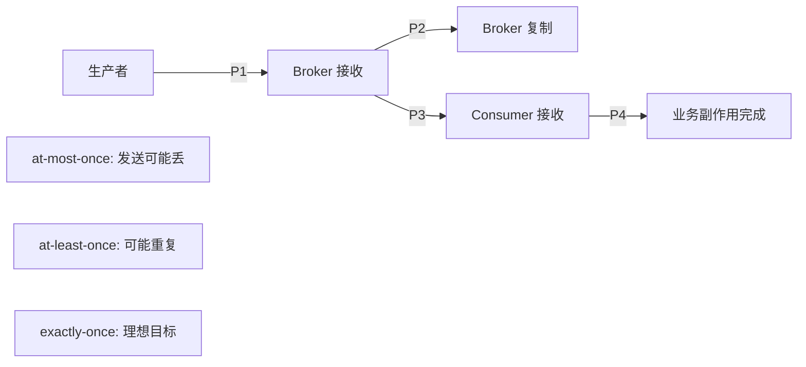

# Hello MQ - 基础概念

> 掌握消息系统的**通用语义模型**，再进入任何产品细节。

## 📖 阅读指南

本栏目讲解所有消息队列、事件流平台的共性理论。建议按以下顺序学习：

---

## 核心内容

### 1. [为什么需要异步消息](why-messaging.md)

从同步 RPC 的痛点出发，理解消息系统的核心价值：

- 解耦生产者和消费者
- 削峰填谷，应对流量洪峰
- 异步处理，提升用户体验
- 数据持久化，容灾备份

---

### 2. [消息模型](models.md)

四种基本消息传递模式：

| 模型 | 特点 | 代表产品 |
|------|------|---------|
| **队列 (Queue)** | 单消费者竞争消费 | RabbitMQ, ActiveMQ |
| **发布订阅 (Pub/Sub)** | 广播到多个订阅者 | Redis Streams, NATS |
| **分区日志 (Partitioned Log)** | 顺序读取 + 多消费者组 | Kafka, Pulsar |
| **事件流 (Event Streaming)** | 持久化日志 + 回放能力 | Kafka, Kafka Streams |

---

### 3. [投递语义](delivery-semantics.md)

**最重要的概念！**三种语义保证的范围：

- **At-most-once**: "尽力发送，丢了不管" —— 快速但不保证
- **At-least-once**: "至少一次，可能有重复" —— 大多数场景够用
- **Exactly-once**: "恰好一次，零丢失零重复" —— 强一致性场景必需

---

### 4. [顺序语义](ordering.md)

消息顺序保证的代价：

| 级别 | 描述 | 性能影响 |
|------|------|---------|
| **全局顺序** | 所有消息有序 | 极高，几乎不可用 |
| **分区/队列内顺序** | 同 key 的消息有序 | 中等，可接受 |
| **无顺序保证** | 乱序交付 | 最低，最高性能 |

**关键认知**: "顺序 = 吞吐量"的权衡关系

---

### 5. [存储与回放](storage-and-replay.md)

消费后的数据如何处理：

- **删除策略**: 消费即删 vs 保留副本
- **保留时长**: TTL (Time To Live) 配置
- **回放能力**: 历史数据的重新消费
- **积压处理**: Backlog 机制与处置方案

---

### 6. [背压与积压](backpressure.md)

当消费者跟不上生产者时：

- **成因**: 处理能力不足 / 下游故障
- **观测**: 监控 Lag（延迟量）、Queue Size
- **处置**: 
  - 紧急扩容消费者
  - 降级非核心功能
  - 丢弃低优先级消息

---

## 🔗 相关资源

- **产品分卷**: [`/products`](/products/rabbitmq/) - 8 个消息队列的详细文档
- **实验手册**: [`/matrix/experiment`](/matrix/experiment/basic-flow) - 可复现的故障演练
- **横向对比**: [`/matrix`](/matrix/selection-guide) - 选型决策树

---

## 💡 学习方法

1. **先看基础原理** (`index.md`, `why-messaging.md`) —— 建立心智模型
2. **再看投递语义** (`delivery-semantics.md`) —— 理解可靠性边界
3. **最后看产品细节** (`/products/{mq}/`) —— 了解具体实现

---

## ⏱️ 预计学习时间

| 内容 | 难度 | 时间 |
|------|------|------|
| 基础原理 | ★★☆☆☆ | 30 分钟 |
| 投递语义 | ★★★☆☆ | 45 分钟 |
| 顺序语义 | ★★★★☆ | 60 分钟 |
| 背压与积压 | ★★★★☆ | 45 分钟 |

适合目标读者：**后端开发者、架构师、运维工程师**

---

## 📚 扩展阅读

- [《分布式消息系统设计与实现》](https://github.com/datastrato/gravitino)
- [Kafka 官方最佳实践](https://kafka.apache.org/documentation/#recommendedsettings)
- [RabbitMQ 可靠性指南](https://www.rabbitmq.com/reliability.html)
