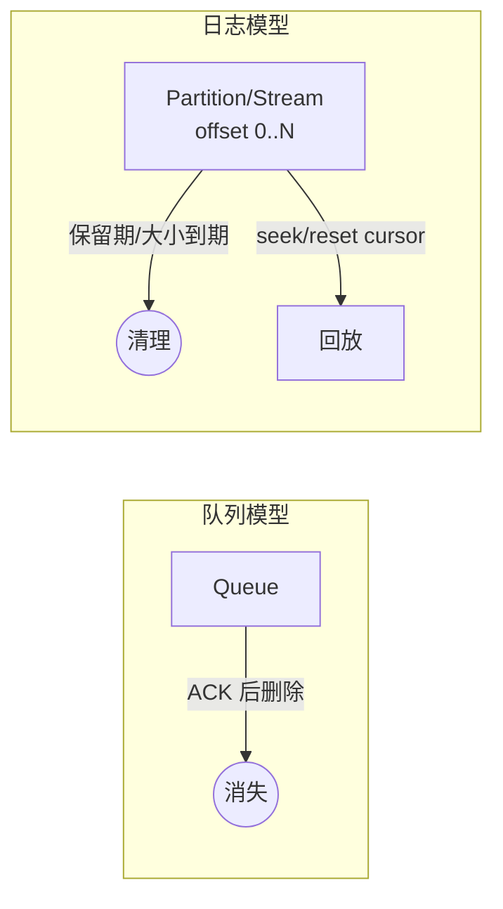

# 存储与回放

> 本页结论：“消费”是否删除数据是队列模型与日志模型的根本分野；回放能力由保留策略决定，消费位点是回放的操纵杆。

## 两种存储模型

| 模型 | 消费后数据 | 回放 | 代表 |
| :--- | :--- | :--- | :--- |
| 队列模型（消费即删） | 确认后删除 | 有限（依赖 TTL/DLX 等旁路） | RabbitMQ Classic Queue、RocketMQ |
| 日志模型（消费不删） | 按保留策略清理 | 保留期内任意位置回放 | Kafka、Pulsar、Redis Streams |



## 保留策略（Retention）

- **按时间**：保留 N 天（如 Kafka `retention.ms`）。
- **按大小**：总量上限，滚动删除最旧段。
- **压缩（Log Compaction)**：日志型产品可只保留每个 Key 的最新值（适合状态快照，不适合事件全量审计）。
- **分层存储（Tiered Storage）**：冷数据转移到对象存储以延长可回放窗口（Pulsar/Kafka 生态能力）。

## 回放的操纵杆：消费位点

- 日志型：Offset/Cursor 可重置到最早、最新或指定时间戳；消费组彼此独立，回放不影响其他组。
- 队列型：没有位点概念；“回放”需要生产者重发或借助 DLX 重投。

## 保证成立的条件

- 回放可行 ⟺ 消息仍在保留期内 ⟺ 保留策略与磁盘容量匹配。
- 持久化消息在 Broker 重启后可用，依赖持久化配置与副本条件（各产品分卷说明）。

## 不保证什么

- 队列模型的“已消费”消息不可找回（除非业务侧另有事件存储）。
- 日志模型的“可回放”不承诺无限期：保留期一过即清理；压缩主题丢失同 Key 旧值。
- 回放会产生消费洪峰，需要评估下游处理能力（见[背压与积压](/concepts/backpressure)）。

## 常见误区

- 把 Kafka 的 Topic 当 RabbitMQ 队列用：期望消费即删、按条清理。
- 假设“消息还在 Broker 里”就能回放——先核对保留策略与位点状态。

## 实验复现命令

```bash
bash demos/rabbitmq/basic/run.sh   # 队列模型：消费确认后队列深度归零，无回放入口
```

Kafka/Pulsar 的回放实验在 Phase 2/3 落地。

## 官方资料与版本说明

保留与压缩语义以各产品官方文档为准（[官方资料基线](/reference/sources)，checkedAt: 2026-08-19）。
