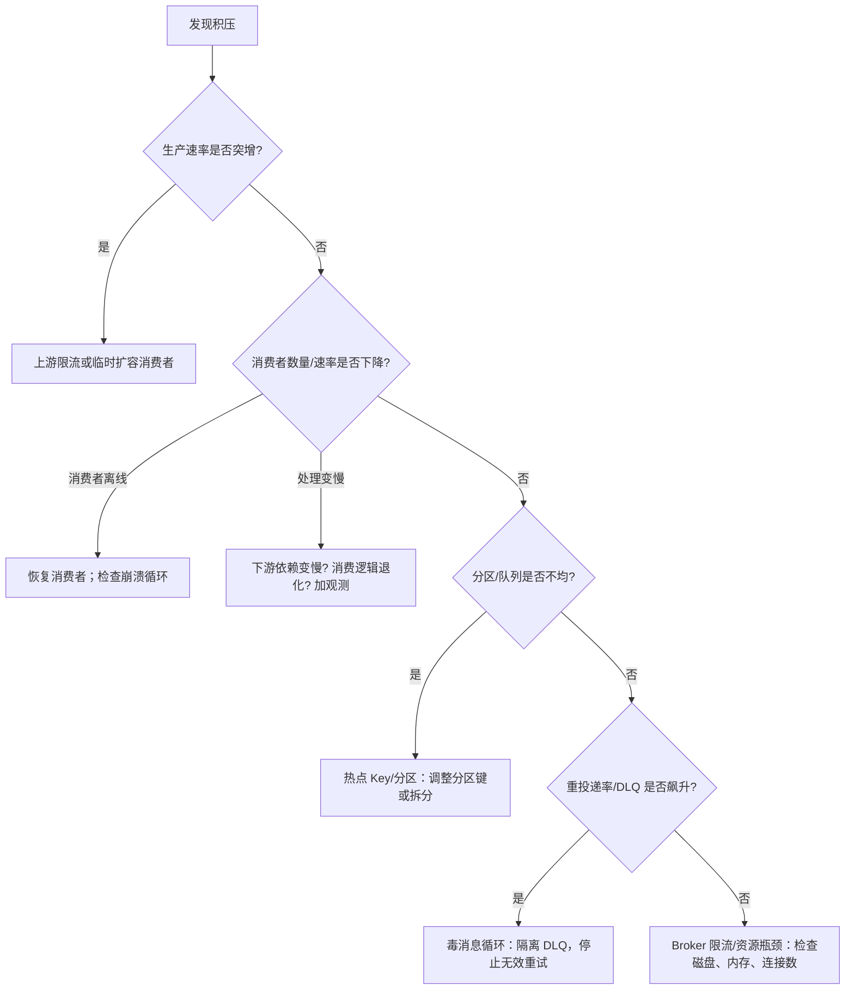

# 背压与积压

> 本页结论：积压（Backlog）是“生产速率 > 消费能力”的信号；先定位成因（生产突增 / 消费变慢 / 消费者离线 / 分区不均 / 毒消息循环 / Broker 限流），再决定扩容、限流还是隔离。

## 核心指标

| 模型 | 积压指标 |
| :--- | :--- |
| 队列型 | Queue Depth（ready + unacked）、最老消息年龄 |
| 日志型 | Consumer Lag（最新位点 − 消费位点）、各分区 lag 分布 |
| Redis Streams | Stream 长度 + Pending Entries List（PEL）数量与滞留时长 |
| Pulsar | Subscription Backlog |

辅助指标：消费速率、处理延迟 P95、重投递率、DLQ 增量、Broker 磁盘/内存水位。

## 积压定位决策树



## 处置手段

1. **水平扩容消费者**（竞争消费/消费组模型）；日志型注意消费者数 ≤ 分区数。
2. **限流保护下游**：与其把下游打挂，不如让积压停留在 Broker（配合磁盘容量评估）。
3. **隔离毒消息**：有限重试 + DLQ，避免同一条坏消息反复阻塞（见[毒消息实验](/labs/poison-message)）。
4. **批量与预取调优**：增大 prefetch/批大小可提升吞吐，但会拉长单条确认延迟、扩大崩溃重复窗口。
5. **回放预案**：积压清理或位点重置会产生消费洪峰，需预留处理能力。

## 保证成立的条件

- 积压告警阈值必须结合业务可容忍延迟设定，而不是只看绝对数量。
- 扩容有效 ⟺ 顺序约束允许（同一顺序单元不能并行消费，见[顺序语义](/fundamentals/ordering)）。

## 不保证什么

- Broker 不能无限积压：队列型受内存/磁盘限制（可能触发流控或拒绝发布），日志型受保留策略限制（积压超过保留期会**丢未消费消息**）。
- 消费者数量不是越多越好：超过并发单元数（分区数）只是空转。

## 观测指标清单

- Producer：发送速率、确认延迟、错误率。
- Broker：入站/出站速率、存储大小、磁盘/内存水位、连接数。
- Consumer：消费速率、处理延迟、失败率、重投递率。
- Backlog：深度/lag、最老消息年龄。
- DLQ：新增速率、存量、最老消息年龄。

## 实验复现命令

```bash
npm run lab -- rabbitmq retry-dlq   # 毒消息循环的识别与隔离
```

积压-恢复实验（消费者离线后追赶）在后续版本补充。

## 官方资料与版本说明

各产品的流控与积压观测命令见产品分卷运维页（当前：[RabbitMQ 运维与观测](/brokers/rabbitmq/operations)）。
