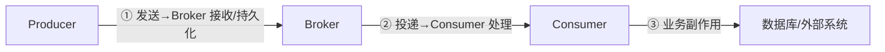
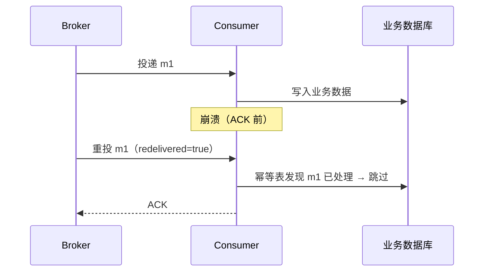

# 投递语义

> 本页结论：at-most-once / at-least-once / exactly-once 描述的是“哪一段链路”的保证；生产确认与消费确认是两段独立的确认，任何“不丢”结论都必须附带前置条件与故障窗口。

## 三段链路



| 语义 | 含义 | 代价 |
| :--- | :--- | :--- |
| at-most-once（至多一次） | 不重投；发送或处理失败时消息可能丢失 | 最低延迟，可能丢消息 |
| at-least-once（至少一次） | 不丢失；失败时重投，**业务必须预期重复** | 需要幂等消费或去重 |
| exactly-once（恰好一次） | 效果上每条消息只被应用一次 | 仅覆盖特定边界，见下 |

## 三层语义说明法

每项“保证”必须拆开看：

| 层级 | 要回答的问题 |
| :--- | :--- |
| Broker 层 | 什么条件下接受、持久化、复制或重投消息？（确认级别、副本条件、队列持久化） |
| Client 层 | SDK 超时、重试、ACK、Offset 提交如何配置？超时后重试可能造成重复 |
| Business 层 | 数据库写入与外部副作用如何保持一致？Outbox + 幂等消费 |

## 关键纠偏

- **at-least-once 意味着业务必须预期重复**，不是“偶尔可能重复”。消费者崩溃窗口（处理成功但确认前崩溃）必然产生重投。
- **exactly-once 有边界**。例如 Kafka 的事务性 exactly-once 覆盖“Kafka 内部读取-处理-写入”；写外部数据库仍需幂等设计。不要把 Broker 事务夸大为跨系统事务。
- **生产确认 ≠ 消费处理**。Publisher Confirm 只表示 Broker 承担了保管责任。
- “已消费”可能指 ACK、Offset 已提交或游标前移，不一定代表业务副作用成功。

## 故障窗口示例：确认后、业务前崩溃



幂等表（`processed_messages` 唯一键）是这个窗口的唯一防线——详见[消费者崩溃与重投实验](/labs/consumer-crash)。

## 保证成立的条件

- 不丢消息（生产侧）：开启生产确认 + Broker 持久化/复制条件满足后才算发送成功。
- 不丢消息（消费侧）：手动确认，业务成功后才 ACK/提交 Offset。
- 端到端“效果恰好一次”：at-least-once + 幂等消费（业务唯一键），这是工程上的通用做法。

## 不保证什么

- 默认配置下（自动 ACK、无确认发送）任何产品都不保证不丢。
- exactly-once 不覆盖消息之外的任意外部副作用（邮件、第三方 API）。

## 实验复现命令

```bash
bash demos/rabbitmq/consumer-crash/run.sh   # 重投发生且被幂等拦截：duplicatesObserved=1, duplicatesApplied=0
```

## 官方资料与版本说明

各产品的确认机制与配置见 [RabbitMQ 可靠性](/brokers/rabbitmq/reliability)；官方来源见[官方资料基线](/reference/sources)（checkedAt: 2026-08-19）。
