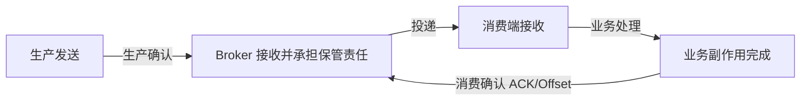
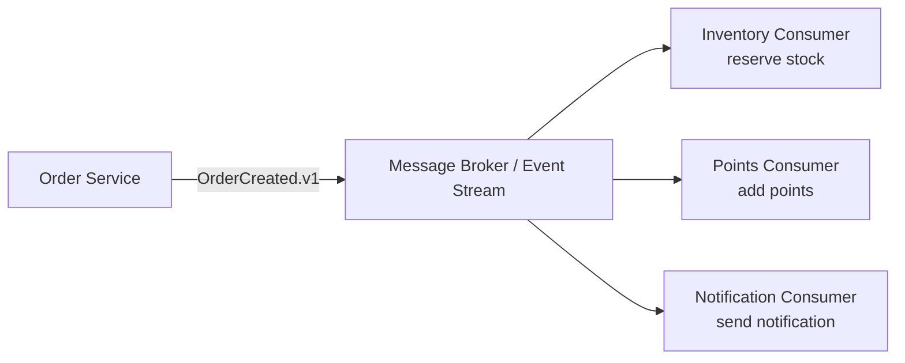

# 基础原理

> 本页结论：先建立产品无关的消息系统知识骨架，再进入任何产品分卷，避免把同名概念直接等价。

本分卷用**产品无关的中性术语**讲解消息系统的核心语义。所有结论遵循三层语义说明法：Broker 层（服务端接受/复制/保留/重投的条件）、Client 层（SDK 超时/重试/ACK/Offset 配置）、Business 层（数据库与外部副作用的一致性）。

## 阅读顺序

1. [为什么需要异步消息](/fundamentals/why-messaging)：异步消息解决同步 RPC 解决不了的问题。
2. [消息模型](/fundamentals/models)：队列、发布订阅、分区日志与事件流的差异。
3. [投递语义](/fundamentals/delivery-semantics)：at-most-once / at-least-once / exactly-once 各自保证哪一段链路。
4. [顺序语义](/fundamentals/ordering)：全局顺序、分区/队列内顺序与失败重试的冲突。
5. [存储与回放](/fundamentals/storage-and-replay)：消费是否删除数据、保留策略与回放能力。
6. [背压与积压](/fundamentals/backpressure)：积压的成因、观测与处置。

## 核心心智模型

一条消息从发送到“被处理”，至少经过四个互相独立的状态：

- **生产确认**（Publisher Confirm / Produce Ack）≠ 消费者已处理。
- **消费确认**（Consumer ACK / Offset Commit）≠ 业务副作用绝对成功。
- “消息不丢”的任何结论都必须附带前置条件（确认级别、持久化、副本数）与故障范围（哪个时间窗口崩溃）。

## 统一实验案例

全部产品实验使用同一条电商订单事件链（规格 §5.1）：

消息契约采用统一信封（`messageId`、`eventType`、`schemaVersion`、`traceId`、`correlationId`、`aggregateId`、`payload`），在 [实验室](/labs/) 中可一键复现。
