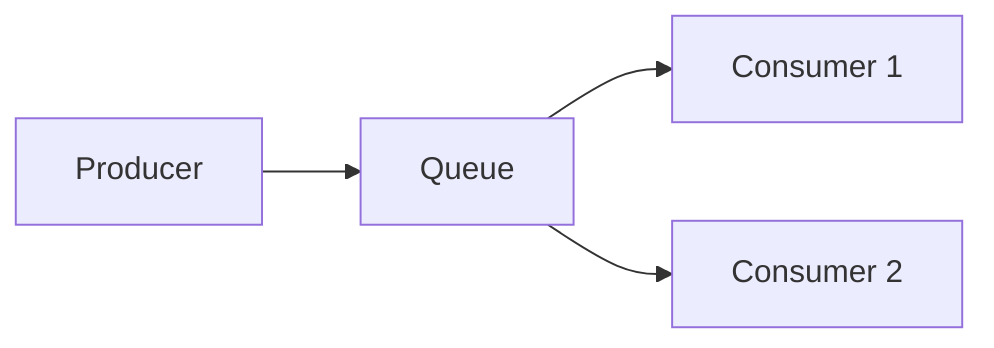
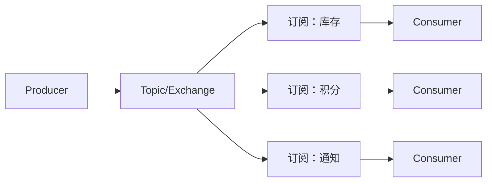
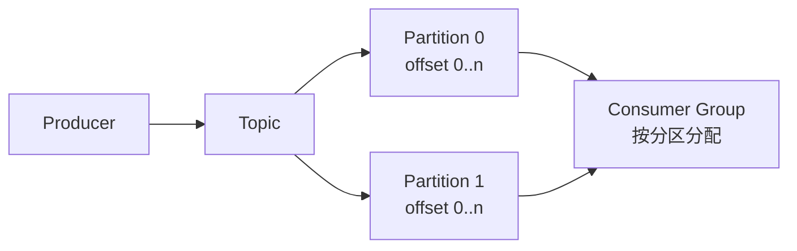

# 消息模型

> 本页结论：队列、发布订阅、分区日志、请求响应四种模型解决不同问题；选型第一步是确定需要的模型，而不是挑选产品。

## 四种基本模型

下面提供可切换的交互拓扑：选择模型查看参与方与消息流向，点「播放消息流」高亮一条消息的路径（静态示意，不连接真实 Broker）。

<TopologyDiagram
  :modes="[
    {
      name: '竞争消费',
      description: '一条消息只被组内一个消费者处理；消费者越多，处理能力越强（RabbitMQ Queue / Kafka 同组消费者 / Pulsar Shared）。',
      nodes: [
        { id: 'p', label: '生产者', kind: 'producer' },
        { id: 'q', label: 'Queue / 分区', kind: 'broker' },
        { id: 'c1', label: '消费者 A', kind: 'consumer' },
        { id: 'c2', label: '消费者 B', kind: 'consumer' },
      ],
      edges: [
        { from: 'p', to: 'q', label: '入队' },
        { from: 'q', to: 'c1', label: '二选一投递' },
        { from: 'q', to: 'c2', label: '二选一投递' },
      ],
    },
    {
      name: '发布订阅',
      description: '每个订阅方各自收到一份完整副本；新增订阅方不影响已有订阅方。',
      nodes: [
        { id: 'p', label: '发布者', kind: 'producer' },
        { id: 't', label: 'Topic', kind: 'broker' },
        { id: 's1', label: '订阅方 1', kind: 'consumer' },
        { id: 's2', label: '订阅方 2', kind: 'consumer' },
      ],
      edges: [
        { from: 'p', to: 't', label: '发布' },
        { from: 't', to: 's1', label: '副本 1' },
        { from: 't', to: 's2', label: '副本 2' },
      ],
    },
    {
      name: '分区日志',
      description: '消息追加到分区、按位点编号；消费组独立推进位点，历史可按位点/时间回放。',
      nodes: [
        { id: 'p', label: '生产者', kind: 'producer' },
        { id: 'part', label: 'Partition（追加日志）', kind: 'broker' },
        { id: 'g1', label: '消费组 1', kind: 'consumer' },
        { id: 'g2', label: '消费组 2（回放）', kind: 'consumer' },
      ],
      edges: [
        { from: 'p', to: 'part', label: 'append' },
        { from: 'part', to: 'g1', label: '按位点顺序读' },
        { from: 'part', to: 'g2', label: '重置位点后重读' },
      ],
    },
  ]"
/>

### 1. 竞争消费（Work Queue / Competing Consumers）

一条消息只被组内**一个**消费者处理，消费者水平扩展处理能力。



典型场景：任务分发、订单处理。关键语义：分发公平性、预取（Prefetch）、单条消息只成功处理一次（配合确认）。

### 2. 发布订阅（Pub/Sub）

一条消息被**每个订阅**各投递一次；订阅内部可以再竞争消费。



典型场景：事件广播。关键语义：每个订阅独立维护消费位置；新增订阅通常只能消费其建立之后的消息（日志型系统可回放除外）。

### 3. 分区日志（Partitioned Log / Event Stream）

消息追加写入分区，消费不删除数据，按游标（Offset/Cursor）推进，可任意回放。



典型场景：事件溯源、审计流、流处理上游。关键语义：分区内有序、消费组再均衡、保留期与回放。

### 4. 请求响应（Request/Reply）

借助消息通道完成一问一答，通常有临时回复队列或关联 ID。适合需要跨进程调用但不想直连的场景；不适合要求严格低延迟的同步调用。

## 保证成立的条件

- 竞争消费的“每条只处理一次”依赖**消费确认 + 业务幂等**（at-least-once 下重复投递是常态）。
- 发布订阅的“每个订阅都能收到”依赖各订阅自身的确认与重试配置。
- 分区日志的“可回放”依赖保留期（Retention）未被清理。

## 不保证什么

- 队列模型的“消费即删”不提供历史回放；不要把它当日志用。
- 日志模型的“高吞吐”不代表低延迟场景同样合适。
- 请求响应模式需要自行处理超时与关联，Broker 不提供 RPC 框架的完整语义。

## 常见误区

- 把 RabbitMQ 的 Topic Exchange（路由机制）与 Kafka 的 Topic（订阅通道+日志）当作同一概念。
- 认为发布订阅天然广播给“所有消费者”——实际单位是**订阅**，同一订阅内的多个消费者仍是竞争消费。

## 实验复现命令

```bash
bash demos/rabbitmq/basic/run.sh     # 竞争消费：发 3 收 3，单队列单消费者
bash demos/rabbitmq/routing/run.sh   # 三个独立订阅（队列）对同一交换机的不同路由
```

## 官方资料与版本说明

模型定义为中性描述；产品映射见 [RabbitMQ 概念映射](/brokers/rabbitmq/concepts) 与[统一术语表](/reference/glossary)。
