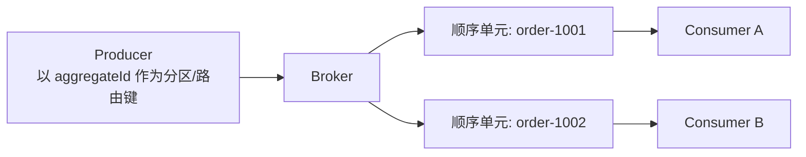
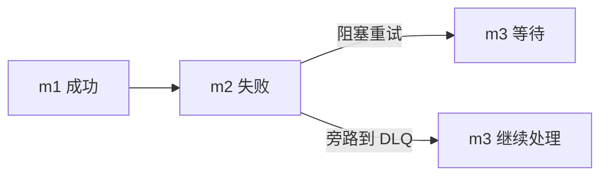

# 顺序语义

> 本页结论：消息系统只承诺“某个范围内”的顺序（分区/队列/Key/单消费者）；全局顺序代价极高，失败重试必然与顺序冲突。

## 顺序的层级

| 层级 | 含义 | 代价 |
| :--- | :--- | :--- |
| 全局顺序（Total Order） | 所有消息按发送顺序被所有消费者看到 | 只能单队列/单分区/单消费者，吞吐受限 |
| 队列/分区内顺序 | 同一队列或分区内按写入顺序消费 | 需要把相关消息路由到同一单元 |
| Key 顺序 | 同一业务 Key（如 `orderId`）的消息有序 | 由路由/分区键保证，跨 Key 无序 |
| 单消费者顺序 | 单个消费者按接收顺序处理 | 并发处理即失效 |

## 核心模型

把需要有序的消息映射到同一顺序单元，是顺序设计的通用做法：



- 队列型产品（如 RabbitMQ）：单队列 + 单消费者 + `prefetch=1` 才能得到处理顺序；多消费者竞争消费时处理顺序不保证。
- 日志型产品（如 Kafka/Pulsar）：以分区键决定局部顺序；消费组内一个分区只被一个消费者处理。

## 失败重试与顺序的冲突

顺序消费中一条消息失败会阻塞后续消息（头阻塞，Head-of-line Blocking）。两种取舍：

1. **阻塞重试**：保住顺序，牺牲进度；重试次数必须有限，否则毒消息卡死整个单元。
2. **跳过/旁路**：保住进度，破坏顺序；失败消息进入重试队列或 DLQ，后续消息继续。



## 保证成立的条件

- 生产端：相同 Key 的消息必须由同一生产者会话、按序发送（并发发送会破坏进入 Broker 的顺序）。
- Broker：消息必须落在同一队列/分区；扩缩容、再均衡可能短暂影响（日志型产品分区再分配时可能重复或暂停）。
- 消费端：单线程处理该单元；`prefetch`/拉取批量为 1 或串行提交。

## 不保证什么

- 单分区/单队列内顺序 **不等于端到端业务完成顺序**：下游外部调用耗时不同，完成顺序可能颠倒。
- 重投递的消息可能晚于后续消息被处理（崩溃恢复后），严格顺序场景必须检测并处置。

## 常见误区

- “多开消费者更快还能保序”——竞争消费破坏处理顺序。
- “设置了 Key 就全局有序”——Key 只保证同 Key 局部有序。

## 实验复现命令

```bash
npm run lab -- rabbitmq retry-dlq   # 观察失败消息旁路对正常消息进度的影响
```

## 官方资料与版本说明

中性定义见[统一术语表](/reference/glossary)；Kafka/Pulsar 的分区顺序细节在其分卷落地（Phase 2/3）。
