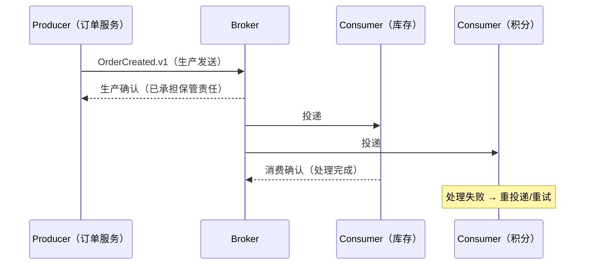

# 为什么需要异步消息

> 本页结论：异步消息解决的是解耦、削峰与最终一致性三类问题，代价是引入投递不确定性，需要显式的可靠性设计。

## 适用场景

继续增加同步 RPC 无法解决以下问题：

1. **调用链耦合**：下单接口同步调用库存、积分、通知，任一下游故障都会拖垮主流程。
2. **峰值压力**：秒杀瞬时流量远超下游处理能力，同步调用只能靠拒绝请求兜底。
3. **长耗时副作用**：发送邮件、生成报表、调用第三方 API 不应阻塞用户请求。
4. **事件广播**：多个下游系统都需要“订单已创建”这一事实，生产者不应逐一维护订阅关系。

## 核心模型



生产者把消息交给 Broker 后即可返回；Broker 承担保管与转发职责；消费者按自己的能力处理。这是从“同步调用链”到“事件驱动协作”的本质变化。

## 最小配置

引入消息系统的最小代价清单：

- 为每类事件定义契约：唯一标识、事件类型、Schema 版本、追踪字段。
- 明确投递语义：允许重复就必须有幂等消费；不允许丢失就必须开启生产确认与消费确认。
- 建立观测：发送确认延迟、消费积压、重投递率。

## 不保证什么

- 异步消息**不是免费的**：端到端延迟增加、系统状态更难推理、需要额外的 Broker 运维。
- 引入 Broker 不会自动获得“不丢消息”：默认配置下多数产品存在丢失窗口（见[投递语义](/fundamentals/delivery-semantics)）。
- 它也不替代事务：跨服务的数据一致性仍需 Outbox、幂等消费、Saga 等模式（后续分卷覆盖）。

## 常见误区

- “上了 MQ 就解耦了”——如果消费者仍然依赖生产者的接口契约或共享数据库，解耦只是形式上的。
- “异步一定更快”——单条消息的端到端延迟通常变高；收益在吞吐与可用性，不在单请求延迟。

## 实验复现命令

```bash
bash demos/rabbitmq/basic/run.sh   # 观察生产确认、投递、消费确认三个独立状态
```

## 官方资料与版本说明

本页为产品无关的原理性内容，不依赖特定产品版本；各产品差异见对应分卷与[官方资料基线](/reference/sources)。
