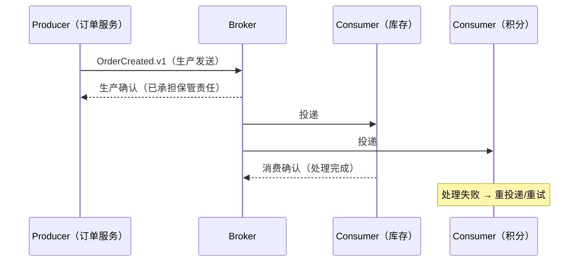
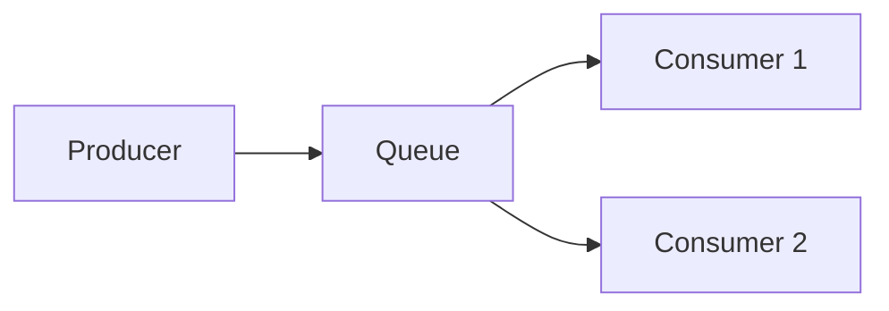
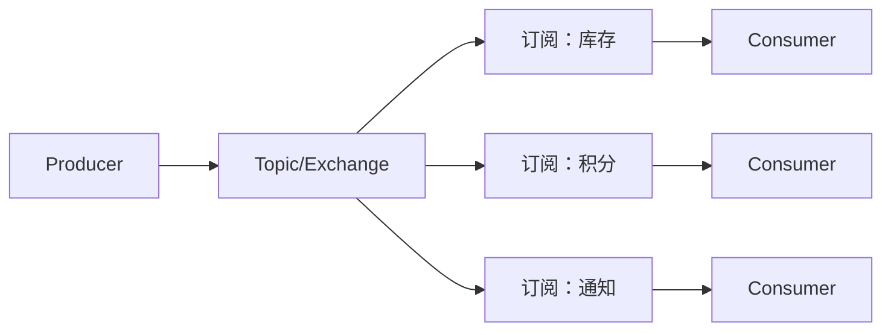
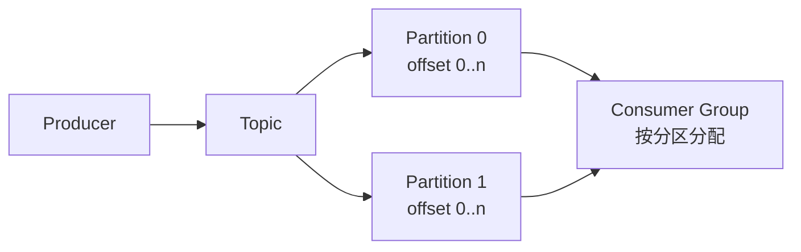
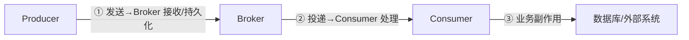
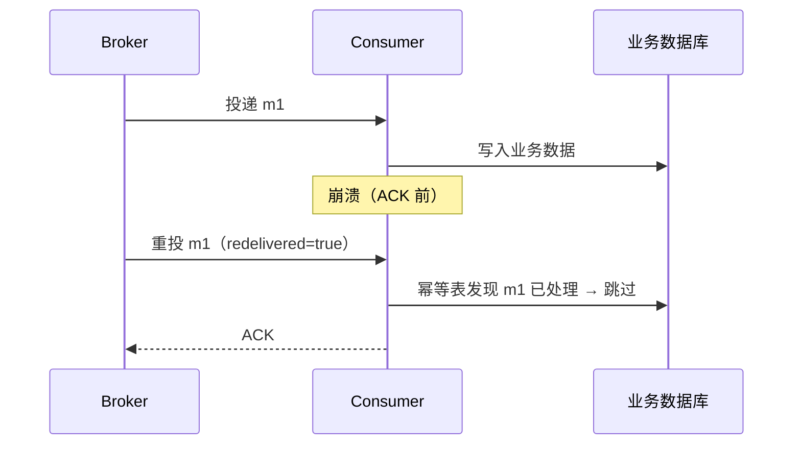
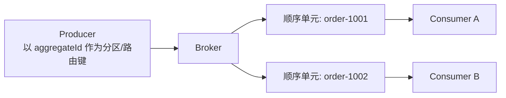
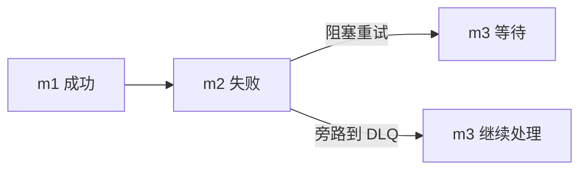
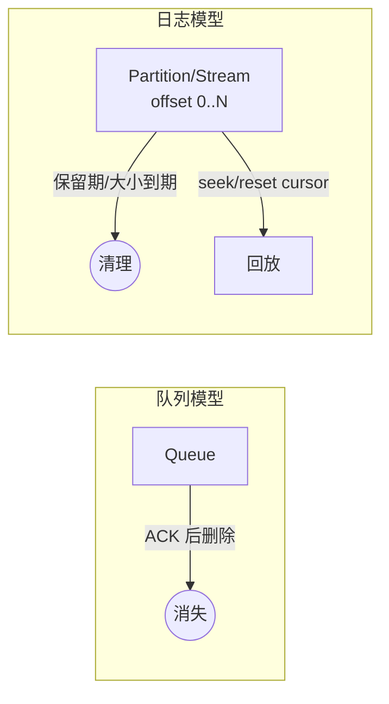
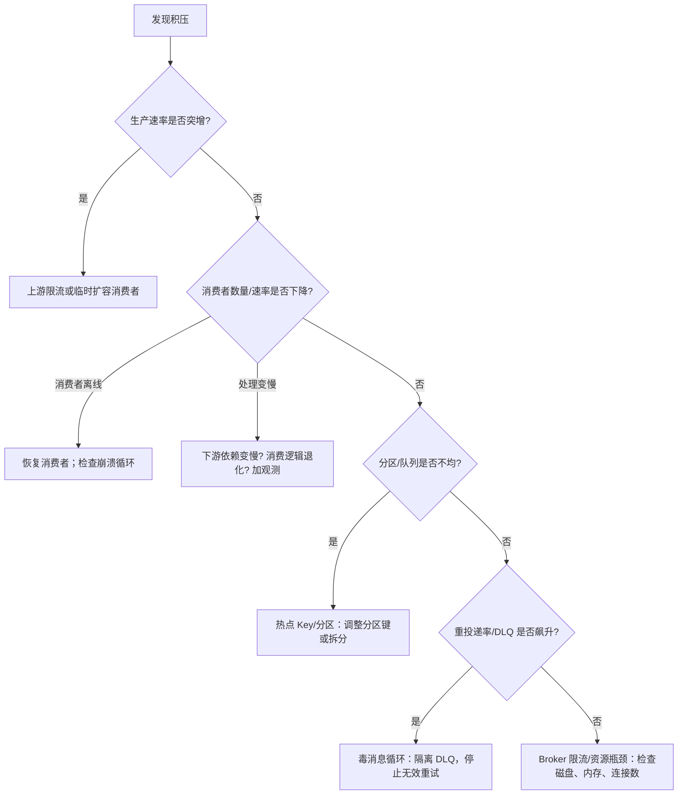

## 🎯 典型消息系统快速入口

前 5 个为高频使用场景的代表性产品，其余 3 个可在导航栏「更多」下拉中查看。

| 产品 | 类型 | 核心价值 | 分卷文档 |
| :--- | :--- | :--- | --- |
| [RabbitMQ](/products/rabbitmq/) 🐰 | Queue | 灵活路由、可靠投递、延迟/优先级队列 | [8 页详解](/products/rabbitmq/) → |
| [Apache Kafka](/products/kafka/) 🦓 | Log | 分区持久日志、高吞吐事件流、实时数据处理 | [8 页详解](/products/kafka/) → |
| [RocketMQ](/products/rocketmq/) 🚀 | Queue-Log | 事务消息、定时/延迟消息、金融级可靠性 | [8 页详解](/products/rocketmq/) → |
| [Apache Pulsar](/products/pulsar/) 🦋 | Log-Cloud | 存算分离、多租户、云原生原生设计 | [8 页详解](/products/pulsar/) → |
| [Redis Streams](/products/redis-streams/) 💾 | Stream | 内存高性能、简单 API、嵌入式事件总线 | [8 页详解](/products/redis-streams/) → |

<div class="grid-container" style="display: grid; grid-template-columns: repeat(auto-fit, minmax(280px, 1fr)); gap: 16px; margin-top: 24px;">

<a href="/products/" style="text-decoration: none;">
  <div style="background: var(--vp-c-bg-soft); border: 1px solid var(--vp-c-divider); padding: 20px; border-radius: 12px; height: 100%; transition: all 0.3s ease;">
    <h3 style="margin: 0 0 8px 0; color: var(--vp-c-brand-1);">📚 查看所有 8 个产品</h3>
    <p style="margin: 0; font-size: 0.875rem; color: var(--vp-c-text-2);">包括 NATS JetStream、ActiveMQ Artemis、ActiveMQ Classic</p>
  </div>
</a>

<a href="/matrix/" style="text-decoration: none;">
  <div style="background: var(--vp-c-bg-soft); border: 1px solid var(--vp-c-divider); padding: 20px; border-radius: 12px; height: 100%; transition: all 0.3s ease;">
    <h3 style="margin: 0 0 8px 0; color: var(--vp-c-brand-1);">⚖️ 横向能力对比矩阵</h3>
    <p style="margin: 0; font-size: 0.875rem; color: var(--vp-c-text-2);">投递语义、顺序保证、重试与 DLQ、延迟消息、回放保留、扩展复制、安全模型七大维度深度对比</p>
  </div>
</a>

<a href="/playground/" style="text-decoration: none;">
  <div style="background: var(--vp-c-bg-soft); border: 1px solid var(--vp-c-divider); padding: 20px; border-radius: 12px; height: 100%; transition: all 0.3s ease;">
    <h3 style="margin: 0 0 8px 0; color: var(--vp-c-brand-1);">🔬 15+ 可复现实验手册</h3>
    <p style="margin: 0; font-size: 0.875rem; color: var(--vp-c-text-2);">基础收发、消费者崩溃重投、毒消息 DLQ、事务回查、顺序回放、积压追赶等完整故障演练脚本</p>
  </div>
</a>

</div>

---

## 🔄 从同步调用到事件驱动

切换下面的模式，观察调用关系如何从「点对点强耦合」演化为「经 Broker 解耦」；点「播放消息流」可高亮一条消息的流转路径。

<TopologyDiagram
  title="交互拓扑：同步调用 → 事件驱动"
  :modes="[
    {
      name: '同步调用',
      description: '订单服务逐个直调下游：任一环节慢或挂，整条链路一起慢、一起挂。',
      nodes: [
        { id: 'order', label: '订单服务', kind: 'producer' },
        { id: 'stock', label: '库存服务', kind: 'consumer' },
        { id: 'points', label: '积分服务', kind: 'consumer' },
        { id: 'notify', label: '通知服务', kind: 'consumer' },
      ],
      edges: [
        { from: 'order', to: 'stock', label: 'HTTP，阻塞等待' },
        { from: 'order', to: 'points', label: 'HTTP，阻塞等待' },
        { from: 'order', to: 'notify', label: 'HTTP，阻塞等待' },
      ],
    },
    {
      name: 'Queue 工作队列',
      description: '订单只发一条事件到队列，多个工作者竞争消费、负载均衡；消费失败可重投。',
      nodes: [
        { id: 'order', label: '订单服务', kind: 'producer' },
        { id: 'queue', label: 'Queue（Broker）', kind: 'broker' },
        { id: 'w1', label: '工作者 A', kind: 'consumer' },
        { id: 'w2', label: '工作者 B', kind: 'consumer' },
      ],
      edges: [
        { from: 'order', to: 'queue', label: '发布事件后即返回' },
        { from: 'queue', to: 'w1', label: '竞争投递' },
        { from: 'queue', to: 'w2', label: '竞争投递' },
      ],
    },
    {
      name: 'Pub/Sub 广播',
      description: '一条 OrderCreated 事件扇出给所有订阅方：各下游独立订阅、互不影响。',
      nodes: [
        { id: 'order', label: '订单服务', kind: 'producer' },
        { id: 'exchange', label: 'Topic/Exchange', kind: 'broker' },
        { id: 'stock', label: '库存订阅方', kind: 'consumer' },
        { id: 'points', label: '积分订阅方', kind: 'consumer' },
        { id: 'notify', label: '通知订阅方', kind: 'consumer' },
      ],
      edges: [
        { from: 'order', to: 'exchange', label: 'OrderCreated' },
        { from: 'exchange', to: 'stock', label: '每订阅方各一份' },
        { from: 'exchange', to: 'points', label: '每订阅方各一份' },
        { from: 'exchange', to: 'notify', label: '每订阅方各一份' },
      ],
    },
    {
      name: '分区日志',
      description: '消息追加进分区、按位点编号；多个消费组各自维护位点，可随时回放（Kafka/Pulsar 模型）。',
      nodes: [
        { id: 'order', label: '订单服务', kind: 'producer' },
        { id: 'p0', label: 'Partition 0', kind: 'broker' },
        { id: 'g1', label: '消费组：计费', kind: 'consumer' },
        { id: 'g2', label: '消费组：审计', kind: 'consumer' },
      ],
      edges: [
        { from: 'order', to: 'p0', label: '按 key 分区追加' },
        { from: 'p0', to: 'g1', label: '按位点顺序读' },
        { from: 'p0', to: 'g2', label: '独立位点，可回放' },
      ],
    },
  ]"
/>

模型细节与产品对照见[消息模型](/#mq-models)。

---

## 📊 关键能力横向对比

七个产品在核心功能上的支持方式不同——「原生」不等于「免费」，「业务实现」也不等于「不可行」。

| 能力 | RabbitMQ | Kafka | RocketMQ | Pulsar | Redis Streams | NATS | Artemis |
| :--- | :--- | :--- | :--- | :--- | :--- | :--- | :--- |
| **端到端 exactly-once** | 业务实现 | 仅集群内 EOS | 业务实现 | 业务实现 | 业务实现 | 业务实现 | 业务实现 |
| **顺序消息** | 单队列内 | 分区内 | MessageGroup 内 | 分区 + 订阅类型相关 | 单 Stream 内 | Subject/Stream 内 | 单队列内 + Message Group |
| **内置重试与 DLQ** | 组合配置（TTL+DLX） | 业务实现 | 原生（Broker 内置） | 组合配置（DeadLetterPolicy） | 业务实现（PEL+XCLAIM） | 组合配置（AckWait+MaxDeliver） | 原生（address-setting） |
| **延迟消息** | 组合配置（TTL+DLX） | 业务实现 | 原生（定时投递） | 业务实现 | 不适用 | 原生（JetStream 延迟投递） | 原生（_AMQ_SCHED_DELAY） |
| **消息回放** | 不适用（ACK 即删） | 原生（位点/时间戳） | 原生（位点重置） | 原生（reset-cursor） | 原生（XRANGE/XGROUP SETID） | Core 不适用；JetStream 原生 | 不适用（ack 即删） |

选型没有万能冠军：按输入维度筛选候选，见 [选型指南](/matrix/selection-guide)。

---

## 🚀 本地实验 Quick Start

```bash
git clone https://github.com/xy2401/hello-mq.git && cd hello-mq
npm install

# 运行单个实验
bash demos/rabbitmq/basic/run.sh                 # 启动 RabbitMQ，发 3 条、收 3 条并校验

# 运行全部实验
for s in demos/*/*/run.sh; do bash "$s"; done    # 15 个实验全跑一遍
```

环境要求与完整说明见[实验约定](/reference/lab-conventions)。

适合目标读者：**需要深入理解消息系统底层原理、构建高可靠分布式系统的后端工程师与 SRE**。


---


<!-- merged-section:mq-fundamentals -->

## 消息系统基础概念 {#mq-fundamentals}

<a id="mq-why-messaging"></a>

### 为什么需要异步消息

> 本页结论：异步消息解决的是解耦、削峰与最终一致性三类问题，代价是引入投递不确定性，需要显式的可靠性设计。

#### 适用场景

继续增加同步 RPC 无法解决以下问题：

1. **调用链耦合**：下单接口同步调用库存、积分、通知，任一下游故障都会拖垮主流程。
2. **峰值压力**：秒杀瞬时流量远超下游处理能力，同步调用只能靠拒绝请求兜底。
3. **长耗时副作用**：发送邮件、生成报表、调用第三方 API 不应阻塞用户请求。
4. **事件广播**：多个下游系统都需要“订单已创建”这一事实，生产者不应逐一维护订阅关系。

#### 核心模型



生产者把消息交给 Broker 后即可返回；Broker 承担保管与转发职责；消费者按自己的能力处理。这是从“同步调用链”到“事件驱动协作”的本质变化。

#### 最小配置

引入消息系统的最小代价清单：

- 为每类事件定义契约：唯一标识、事件类型、Schema 版本、追踪字段。
- 明确投递语义：允许重复就必须有幂等消费；不允许丢失就必须开启生产确认与消费确认。
- 建立观测：发送确认延迟、消费积压、重投递率。

#### 不保证什么

- 异步消息**不是免费的**：端到端延迟增加、系统状态更难推理、需要额外的 Broker 运维。
- 引入 Broker 不会自动获得“不丢消息”：默认配置下多数产品存在丢失窗口（见[投递语义](/#mq-delivery-semantics)）。
- 它也不替代事务：跨服务的数据一致性仍需 Outbox、幂等消费、Saga 等模式（后续分卷覆盖）。

#### 常见误区

- “上了 MQ 就解耦了”——如果消费者仍然依赖生产者的接口契约或共享数据库，解耦只是形式上的。
- “异步一定更快”——单条消息的端到端延迟通常变高；收益在吞吐与可用性，不在单请求延迟。

#### 实验复现命令

```bash
bash demos/rabbitmq/basic/run.sh   # 观察生产确认、投递、消费确认三个独立状态
```

#### 官方资料与版本说明

本页为产品无关的原理性内容，不依赖特定产品版本；各产品差异见对应分卷与[官方资料基线](/reference/sources)。

<a id="mq-models"></a>

### 消息模型

> 本页结论：队列、发布订阅、分区日志、请求响应四种模型解决不同问题；选型第一步是确定需要的模型，而不是挑选产品。

#### 四种基本模型

下面提供可切换的交互拓扑：选择模型查看参与方与消息流向，点「播放消息流」高亮一条消息的路径（静态示意，不连接真实 Broker）。

<TopologyDiagram
  :modes="[
    {
      name: '竞争消费',
      description: '一条消息只被组内一个消费者处理；消费者越多，处理能力越强（RabbitMQ Queue / Kafka 同组消费者 / Pulsar Shared）。',
      nodes: [
        { id: 'p', label: '生产者', kind: 'producer' },
        { id: 'q', label: 'Queue / 分区', kind: 'broker' },
        { id: 'c1', label: '消费者 A', kind: 'consumer' },
        { id: 'c2', label: '消费者 B', kind: 'consumer' },
      ],
      edges: [
        { from: 'p', to: 'q', label: '入队' },
        { from: 'q', to: 'c1', label: '二选一投递' },
        { from: 'q', to: 'c2', label: '二选一投递' },
      ],
    },
    {
      name: '发布订阅',
      description: '每个订阅方各自收到一份完整副本；新增订阅方不影响已有订阅方。',
      nodes: [
        { id: 'p', label: '发布者', kind: 'producer' },
        { id: 't', label: 'Topic', kind: 'broker' },
        { id: 's1', label: '订阅方 1', kind: 'consumer' },
        { id: 's2', label: '订阅方 2', kind: 'consumer' },
      ],
      edges: [
        { from: 'p', to: 't', label: '发布' },
        { from: 't', to: 's1', label: '副本 1' },
        { from: 't', to: 's2', label: '副本 2' },
      ],
    },
    {
      name: '分区日志',
      description: '消息追加到分区、按位点编号；消费组独立推进位点，历史可按位点/时间回放。',
      nodes: [
        { id: 'p', label: '生产者', kind: 'producer' },
        { id: 'part', label: 'Partition（追加日志）', kind: 'broker' },
        { id: 'g1', label: '消费组 1', kind: 'consumer' },
        { id: 'g2', label: '消费组 2（回放）', kind: 'consumer' },
      ],
      edges: [
        { from: 'p', to: 'part', label: 'append' },
        { from: 'part', to: 'g1', label: '按位点顺序读' },
        { from: 'part', to: 'g2', label: '重置位点后重读' },
      ],
    },
  ]"
/>

##### 1. 竞争消费（Work Queue / Competing Consumers）

一条消息只被组内**一个**消费者处理，消费者水平扩展处理能力。



典型场景：任务分发、订单处理。关键语义：分发公平性、预取（Prefetch）、单条消息只成功处理一次（配合确认）。

##### 2. 发布订阅（Pub/Sub）

一条消息被**每个订阅**各投递一次；订阅内部可以再竞争消费。



典型场景：事件广播。关键语义：每个订阅独立维护消费位置；新增订阅通常只能消费其建立之后的消息（日志型系统可回放除外）。

##### 3. 分区日志（Partitioned Log / Event Stream）

消息追加写入分区，消费不删除数据，按游标（Offset/Cursor）推进，可任意回放。



典型场景：事件溯源、审计流、流处理上游。关键语义：分区内有序、消费组再均衡、保留期与回放。

##### 4. 请求响应（Request/Reply）

借助消息通道完成一问一答，通常有临时回复队列或关联 ID。适合需要跨进程调用但不想直连的场景；不适合要求严格低延迟的同步调用。

#### 保证成立的条件

- 竞争消费的“每条只处理一次”依赖**消费确认 + 业务幂等**（at-least-once 下重复投递是常态）。
- 发布订阅的“每个订阅都能收到”依赖各订阅自身的确认与重试配置。
- 分区日志的“可回放”依赖保留期（Retention）未被清理。

#### 不保证什么

- 队列模型的“消费即删”不提供历史回放；不要把它当日志用。
- 日志模型的“高吞吐”不代表低延迟场景同样合适。
- 请求响应模式需要自行处理超时与关联，Broker 不提供 RPC 框架的完整语义。

#### 常见误区

- 把 RabbitMQ 的 Topic Exchange（路由机制）与 Kafka 的 Topic（订阅通道+日志）当作同一概念。
- 认为发布订阅天然广播给“所有消费者”——实际单位是**订阅**，同一订阅内的多个消费者仍是竞争消费。

#### 实验复现命令

```bash
bash demos/rabbitmq/basic/run.sh     # 竞争消费：发 3 收 3，单队列单消费者
bash demos/rabbitmq/routing/run.sh   # 三个独立订阅（队列）对同一交换机的不同路由
```

#### 官方资料与版本说明

模型定义为中性描述；产品映射见 [RabbitMQ 概念映射](/products/rabbitmq/concepts) 与[统一术语表](/reference/glossary)。

<a id="mq-delivery-semantics"></a>

### 投递语义

> 本页结论：at-most-once / at-least-once / exactly-once 描述的是“哪一段链路”的保证；生产确认与消费确认是两段独立的确认，任何“不丢”结论都必须附带前置条件与故障窗口。

#### 三段链路



| 语义 | 含义 | 代价 |
| :--- | :--- | :--- |
| at-most-once（至多一次） | 不重投；发送或处理失败时消息可能丢失 | 最低延迟，可能丢消息 |
| at-least-once（至少一次） | 不丢失；失败时重投，**业务必须预期重复** | 需要幂等消费或去重 |
| exactly-once（恰好一次） | 效果上每条消息只被应用一次 | 仅覆盖特定边界，见下 |

#### 三层语义说明法

每项“保证”必须拆开看：

| 层级 | 要回答的问题 |
| :--- | :--- |
| Broker 层 | 什么条件下接受、持久化、复制或重投消息？（确认级别、副本条件、队列持久化） |
| Client 层 | SDK 超时、重试、ACK、Offset 提交如何配置？超时后重试可能造成重复 |
| Business 层 | 数据库写入与外部副作用如何保持一致？Outbox + 幂等消费 |

#### 关键纠偏

- **at-least-once 意味着业务必须预期重复**，不是“偶尔可能重复”。消费者崩溃窗口（处理成功但确认前崩溃）必然产生重投。
- **exactly-once 有边界**。例如 Kafka 的事务性 exactly-once 覆盖“Kafka 内部读取-处理-写入”；写外部数据库仍需幂等设计。不要把 Broker 事务夸大为跨系统事务。
- **生产确认 ≠ 消费处理**。Publisher Confirm 只表示 Broker 承担了保管责任。
- “已消费”可能指 ACK、Offset 已提交或游标前移，不一定代表业务副作用成功。

#### 故障窗口示例：确认后、业务前崩溃



幂等表（`processed_messages` 唯一键）是这个窗口的唯一防线——详见[消费者崩溃与重投实验](/playground/consumer-crash)。

#### 保证成立的条件

- 不丢消息（生产侧）：开启生产确认 + Broker 持久化/复制条件满足后才算发送成功。
- 不丢消息（消费侧）：手动确认，业务成功后才 ACK/提交 Offset。
- 端到端“效果恰好一次”：at-least-once + 幂等消费（业务唯一键），这是工程上的通用做法。

#### 不保证什么

- 默认配置下（自动 ACK、无确认发送）任何产品都不保证不丢。
- exactly-once 不覆盖消息之外的任意外部副作用（邮件、第三方 API）。

#### 实验复现命令

```bash
bash demos/rabbitmq/consumer-crash/run.sh   # 重投发生且被幂等拦截：duplicatesObserved=1, duplicatesApplied=0
```

#### 官方资料与版本说明

各产品的确认机制与配置见 [RabbitMQ 可靠性](/products/rabbitmq/reliability)；官方来源见[官方资料基线](/reference/sources)（checkedAt: 2026-08-19）。

<a id="mq-ordering"></a>

### 顺序语义

> 本页结论：消息系统只承诺“某个范围内”的顺序（分区/队列/Key/单消费者）；全局顺序代价极高，失败重试必然与顺序冲突。

#### 顺序的层级

| 层级 | 含义 | 代价 |
| :--- | :--- | :--- |
| 全局顺序（Total Order） | 所有消息按发送顺序被所有消费者看到 | 只能单队列/单分区/单消费者，吞吐受限 |
| 队列/分区内顺序 | 同一队列或分区内按写入顺序消费 | 需要把相关消息路由到同一单元 |
| Key 顺序 | 同一业务 Key（如 `orderId`）的消息有序 | 由路由/分区键保证，跨 Key 无序 |
| 单消费者顺序 | 单个消费者按接收顺序处理 | 并发处理即失效 |

#### 核心模型

把需要有序的消息映射到同一顺序单元，是顺序设计的通用做法：



- 队列型产品（如 RabbitMQ）：单队列 + 单消费者 + `prefetch=1` 才能得到处理顺序；多消费者竞争消费时处理顺序不保证。
- 日志型产品（如 Kafka/Pulsar）：以分区键决定局部顺序；消费组内一个分区只被一个消费者处理。

#### 失败重试与顺序的冲突

顺序消费中一条消息失败会阻塞后续消息（头阻塞，Head-of-line Blocking）。两种取舍：

1. **阻塞重试**：保住顺序，牺牲进度；重试次数必须有限，否则毒消息卡死整个单元。
2. **跳过/旁路**：保住进度，破坏顺序；失败消息进入重试队列或 DLQ，后续消息继续。



#### 保证成立的条件

- 生产端：相同 Key 的消息必须由同一生产者会话、按序发送（并发发送会破坏进入 Broker 的顺序）。
- Broker：消息必须落在同一队列/分区；扩缩容、再均衡可能短暂影响（日志型产品分区再分配时可能重复或暂停）。
- 消费端：单线程处理该单元；`prefetch`/拉取批量为 1 或串行提交。

#### 不保证什么

- 单分区/单队列内顺序 **不等于端到端业务完成顺序**：下游外部调用耗时不同，完成顺序可能颠倒。
- 重投递的消息可能晚于后续消息被处理（崩溃恢复后），严格顺序场景必须检测并处置。

#### 常见误区

- “多开消费者更快还能保序”——竞争消费破坏处理顺序。
- “设置了 Key 就全局有序”——Key 只保证同 Key 局部有序。

#### 实验复现命令

```bash
bash demos/rabbitmq/retry-dlq/run.sh   # 观察失败消息旁路对正常消息进度的影响
```

#### 官方资料与版本说明

中性定义见[统一术语表](/reference/glossary)；Kafka/Pulsar 的分区顺序细节在其分卷落地（Phase 2/3）。

<a id="mq-storage-and-replay"></a>

### 存储与回放

> 本页结论：“消费”是否删除数据是队列模型与日志模型的根本分野；回放能力由保留策略决定，消费位点是回放的操纵杆。

#### 两种存储模型

| 模型 | 消费后数据 | 回放 | 代表 |
| :--- | :--- | :--- | :--- |
| 队列模型（消费即删） | 确认后删除 | 有限（依赖 TTL/DLX 等旁路） | RabbitMQ Classic Queue、RocketMQ |
| 日志模型（消费不删） | 按保留策略清理 | 保留期内任意位置回放 | Kafka、Pulsar、Redis Streams |



#### 保留策略（Retention）

- **按时间**：保留 N 天（如 Kafka `retention.ms`）。
- **按大小**：总量上限，滚动删除最旧段。
- **压缩（Log Compaction)**：日志型产品可只保留每个 Key 的最新值（适合状态快照，不适合事件全量审计）。
- **分层存储（Tiered Storage）**：冷数据转移到对象存储以延长可回放窗口（Pulsar/Kafka 生态能力）。

#### 回放的操纵杆：消费位点

- 日志型：Offset/Cursor 可重置到最早、最新或指定时间戳；消费组彼此独立，回放不影响其他组。
- 队列型：没有位点概念；“回放”需要生产者重发或借助 DLX 重投。

#### 保证成立的条件

- 回放可行 ⟺ 消息仍在保留期内 ⟺ 保留策略与磁盘容量匹配。
- 持久化消息在 Broker 重启后可用，依赖持久化配置与副本条件（各产品分卷说明）。

#### 不保证什么

- 队列模型的“已消费”消息不可找回（除非业务侧另有事件存储）。
- 日志模型的“可回放”不承诺无限期：保留期一过即清理；压缩主题丢失同 Key 旧值。
- 回放会产生消费洪峰，需要评估下游处理能力（见[背压与积压](/#mq-backpressure)）。

#### 常见误区

- 把 Kafka 的 Topic 当 RabbitMQ 队列用：期望消费即删、按条清理。
- 假设“消息还在 Broker 里”就能回放——先核对保留策略与位点状态。

#### 实验复现命令

```bash
bash demos/rabbitmq/basic/run.sh   # 队列模型：消费确认后队列深度归零，无回放入口
```

Kafka/Pulsar 的回放实验在 Phase 2/3 落地。

#### 官方资料与版本说明

保留与压缩语义以各产品官方文档为准（[官方资料基线](/reference/sources)，checkedAt: 2026-08-19）。

<a id="mq-backpressure"></a>

### 背压与积压

> 本页结论：积压（Backlog）是“生产速率 > 消费能力”的信号；先定位成因（生产突增 / 消费变慢 / 消费者离线 / 分区不均 / 毒消息循环 / Broker 限流），再决定扩容、限流还是隔离。

#### 核心指标

| 模型 | 积压指标 |
| :--- | :--- |
| 队列型 | Queue Depth（ready + unacked）、最老消息年龄 |
| 日志型 | Consumer Lag（最新位点 − 消费位点）、各分区 lag 分布 |
| Redis Streams | Stream 长度 + Pending Entries List（PEL）数量与滞留时长 |
| Pulsar | Subscription Backlog |

辅助指标：消费速率、处理延迟 P95、重投递率、DLQ 增量、Broker 磁盘/内存水位。

#### 积压定位决策树



#### 处置手段

1. **水平扩容消费者**（竞争消费/消费组模型）；日志型注意消费者数 ≤ 分区数。
2. **限流保护下游**：与其把下游打挂，不如让积压停留在 Broker（配合磁盘容量评估）。
3. **隔离毒消息**：有限重试 + DLQ，避免同一条坏消息反复阻塞（见[毒消息实验](/playground/poison-message)）。
4. **批量与预取调优**：增大 prefetch/批大小可提升吞吐，但会拉长单条确认延迟、扩大崩溃重复窗口。
5. **回放预案**：积压清理或位点重置会产生消费洪峰，需预留处理能力。

#### 保证成立的条件

- 积压告警阈值必须结合业务可容忍延迟设定，而不是只看绝对数量。
- 扩容有效 ⟺ 顺序约束允许（同一顺序单元不能并行消费，见[顺序语义](/#mq-ordering)）。

#### 不保证什么

- Broker 不能无限积压：队列型受内存/磁盘限制（可能触发流控或拒绝发布），日志型受保留策略限制（积压超过保留期会**丢未消费消息**）。
- 消费者数量不是越多越好：超过并发单元数（分区数）只是空转。

#### 观测指标清单

- Producer：发送速率、确认延迟、错误率。
- Broker：入站/出站速率、存储大小、磁盘/内存水位、连接数。
- Consumer：消费速率、处理延迟、失败率、重投递率。
- Backlog：深度/lag、最老消息年龄。
- DLQ：新增速率、存量、最老消息年龄。

#### 实验复现命令

```bash
bash demos/rabbitmq/retry-dlq/run.sh   # 毒消息循环的识别与隔离
```

积压-恢复实验（消费者离线后追赶）在后续版本补充。

#### 官方资料与版本说明

各产品的流控与积压观测命令见产品分卷运维页（当前：[RabbitMQ 运维与观测](/products/rabbitmq/operations)）。
