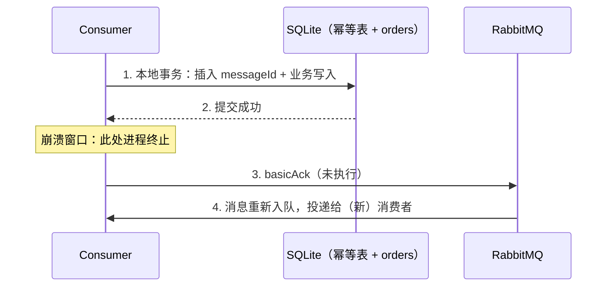

# 消费者崩溃与重投（consumer-crash）

> 本页结论：消费者在「业务已提交、ACK 未发出」之间崩溃，RabbitMQ 会重投同一条消息；幂等表让这次重投只产生一次 `duplicate_skipped`，而不会重复落库——这正是 at-least-once 下业务必须预期重复的含义。

## 适用场景

- 理解 at-least-once 投递的具体作用范围：Broker 保证「至少投一次」，不保证「只投一次」。
- 验证规格 §5.4 的幂等消费基准实现：DB 提交后才 ACK，崩溃窗口由幂等表兜底。
- 这是 Phase 1 的退出条件实验：从零启动 RabbitMQ，复现「崩溃 → 重投 → 幂等拦截」。

## 崩溃窗口在哪里

手动 ACK 的消费流程存在一个无法消除的窗口：



如果第 2 步之后、第 3 步之前进程终止，Broker 认为消息从未被确认，必然重投。反过来，若先 ACK 后写库，则存在「ACK 已发、业务未提交」的丢消息窗口。顺序只能是：**业务事务提交 → ACK**，重复交给幂等表处理。

## 实验步骤

```bash
npm run lab -- rabbitmq consumer-crash
```

编排分两轮：

1. 第一轮：Producer 发送 3 条消息；Consumer 处理完第 1 条（`business_committed`）后，在 ACK 前执行崩溃注入（`Runtime.halt(137)`），进程退出码 137。lab 断言崩溃确实发生——失败注入必须被观察到，而不是「恰好没触发」。
2. 第二轮：lab 重启 Consumer。第 1 条消息带 `redelivered=true` 再次到达，幂等表命中，`status=duplicate_skipped` 并安全 ACK；随后正常处理第 2、3 条。

两轮共用同一个 SQLite 幂等库（`.lab/` 目录），模拟同一业务实例重启。

## 断言

| 断言 | 期望 | 说明 |
| :--- | :--- | :--- |
| crashExitCode | 137 | 崩溃注入确实发生 |
| receivedTotal | 4 | 3 条唯一消息 + 1 条重投 |
| redeliveredCount | 1 | 仅 order-1001 被重投 |
| duplicatesObserved | 1 | 幂等表观察到 1 次重复 |
| duplicatesApplied | 0 | 重复未产生任何业务写入 |
| business_rows | 3 | orders 表恰好 3 行 |

## 提交快照

<LabOutput product="rabbitmq" lab="consumer-crash" />

快照中关键三行：

```text
[consumer] ... messageId=mid-1 ... status=business_committed   # 第一轮：业务已提交
[consumer] ... messageId=mid-1 ... status=crash_injected        # ACK 前崩溃（exit 137）
[consumer] ... messageId=mid-1 ... redelivered=true ... status=duplicate_skipped  # 第二轮：幂等拦截
```

## 常见误区

- 「ACK 之后才落库」——顺序反了，崩溃窗口变成丢消息窗口。
- 「重投是小概率，可以不管」——at-least-once 意味着业务**必须预期重复**，而不是「偶尔可能重复」。
- 「幂等表只是优化」——它是崩溃窗口的正确性组件，不可省略。
- 「`redelivered=true` 就跳过」——重投消息可能第一次就没处理完，必须走完整幂等流程。

## 官方资料与版本说明

- RabbitMQ 4.1.4，`amqp-client` 5.34.0。
- Acknowledgement Modes 与 redelivery：<https://www.rabbitmq.com/docs/confirms#acknowledgement-modes>（checkedAt: 2026-08-19）
