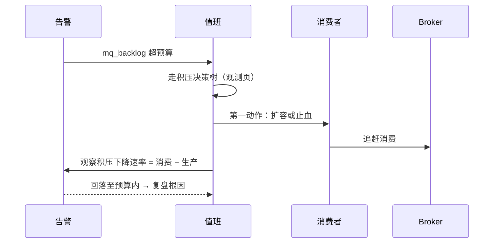

# 故障剧本（Failure Playbook）

> 本页结论：四类高频故障——积压持续增长、重投风暴、磁盘水位、脑裂/少数派——各自有固定的处置节奏：先止血（第一动作），再定位（确认项），最后恢复（恢复动作）。剧本的意义是故障发生前就定好动作，而不是现场临时发明。本仓库实验为单节点环境，多节点故障（脑裂类）内容依据官方文档（证据等级 E1，规格 §11.2）整理，落地前必须结合自身环境演练。

## 使用方式

每个剧本一张表：现象 → 第一动作 → 确认项 → 恢复动作。指标口径统一用[可观测性](/operations/observability)的统一指标名。积压类故障的整体时序：

## 剧本一：积压持续增长

| 阶段 | 内容 |
| :--- | :--- |
| 现象 | mq_backlog 持续上升；端到端事件年龄增大；可能伴随消费速率下降或生产速率上升 |
| 第一动作 | 打开[积压定位决策树](/operations/observability)：先比生产/消费速率差值，再看消费者存活与分区归属；确认前不要盲目重启 |
| 确认项 | ① 生产是否突增（正常业务还是上游 bug）② 消费者是否全部/部分离线 ③ 是否存在无主分区/再均衡循环 ④ 重投率是否升高（毒消息或下游故障）⑤ Broker 是否限流、磁盘/内存水位 |
| 恢复动作 | 生产突增 → 扩消费者或上游限流；消费者变慢 → 剖析处理延迟与下游依赖；分区不均 → 修订阅/消费组配置；确认消费速率 > 生产速率后观察追赶至预算内 |

## 剧本二：重投风暴

| 阶段 | 内容 |
| :--- | :--- |
| 现象 | 重投率陡增、重复拦截数（duplicate_skipped）陡增、DLQ 新增速率上升、消费速率「看起来正常」但业务成功数下降 |
| 第一动作 | 判断是瞬时下游故障还是毒消息循环：若下游正在恢复，先降低重试强度（暂停无延迟 requeue/暂停消费者止血），避免重试本身压垮下游 |
| 确认项 | ① 失败集中在一个 messageId/一个事件类型（毒消息）还是全面失败（下游故障）② attempt 分布：是否全部打满上限 ③ DLQ 深度与最老消息年龄 ④ 下游依赖（DB/第三方）健康状态 |
| 恢复动作 | 毒消息 → 确认已隔离进 DLQ，修复解析逻辑后回放（见[重试与 DLQ](/patterns/retry-and-dlq)）；下游故障 → 修复下游，让重试自然收敛；恢复后核对业务成功数与端到端延迟回到基线 |

## 剧本三：磁盘水位

| 阶段 | 内容 |
| :--- | :--- |
| 现象 | Broker 磁盘使用率越过水位线；RabbitMQ 触发 disk_free_limit 阻塞发布；Kafka/Pulsar 写入报错或主动限流；存储增长常由积压或保留期配置变化引起 |
| 第一动作 | 止血优先：清理确认无用的过期数据前，先评估能否缩短保留期、下线积压已无价值的队列/topic；RabbitMQ 被阻塞时先恢复磁盘空间再谈其他 |
| 确认项 | ① 哪个目录/分区占用最大（消息存储 vs 索引 vs 快照/日志）② 积压贡献了多少存储 ③ 保留期与副本数配置是否被近期改过 ④ 磁盘类型与扩容可行性 |
| 恢复动作 | 扩容磁盘或加节点；按[容量规划](/operations/capacity-planning)公式重算保留期×副本预算；把磁盘水位加入告警（双阈值：预警 + 强制动作线）；复盘积压与保留期变更的审批流程 |

## 剧本四：脑裂 / 少数派

| 阶段 | 内容 |
| :--- | :--- |
| 现象 | 集群网络分区：部分节点互相不可达；可能出现两个「多数派」或某分区只剩少数节点；客户端看到连接漂移、写入被拒或数据不一致风险 |
| 第一动作 | 优先保护数据：让少数派停止服务而不是继续接受写入。RabbitMQ 使用 pause_minority 分区策略；Kafka 依赖 min.insync.replicas 让 ISR 不足的分区拒绝写入（宁可不可用，不假确认，见 [Kafka 可靠性](/brokers/kafka/reliability)）；Pulsar 依赖 broker 故障转移与元数据服务仲裁 |
| 确认项 | ① 分区双方各有哪些节点、哪边是多数派 ② quorum/ISR/元数据仲裁状态 ③ 客户端实际连在哪一侧 ④ 网络故障是链路、交换机还是节点宕机 |
| 恢复动作 | 修复网络后让少数派重新加入并同步；核对副本/成员恢复完整（RabbitMQ quorum 成员、Kafka ISR 回到目标副本数、Pulsar bundle 重新分配）；检查分区期间是否有写入被拒并补偿；复盘：副本数、min.insync.replicas/quorum 写入条件、分区策略是否符合业务对「可用 vs 正确」的取舍 |

说明：本仓库单节点实验无法复现脑裂（[存储与高可用](/brokers/rabbitmq/storage-ha)等页面给出的是各产品的机制说明），该剧本依据官方文档的推荐配置整理，属于 E1 级内容；在生产采用前必须在预发环境做分区演练。

## 所有剧本的共同纪律

- **先止血再定位**：止血动作（限流、暂停、隔离）不应依赖根因结论。
- **动作要可观测**：每个恢复动作之后必须能在统一指标上看到变化（积压下降、重投收敛、水位回落），看不到变化说明打错了地方。
- **恢复 ≠ 结束**：DLQ 回放、被拒写入补偿、积压追赶的完成确认都要列入复盘清单；然后更新剧本本身。

## 常见误区

- 「积压了先重启消费者」——重启可能触发再均衡，扩大故障面；先走决策树。
- 「重投风暴就把重试关掉」——关重试把「重复问题」换成「积压 + 延迟问题」，要先判断风暴成因。
- 「脑裂时两边都继续写，事后再合并」——多数消息系统没有安全的事后合并路径，少数派必须停写。

## 官方资料

- RabbitMQ Clustering / Partition Handling：<https://www.rabbitmq.com/docs/partitions>（checkedAt: 2026-08-19）
- RabbitMQ Memory & Disk Alarms：<https://www.rabbitmq.com/docs/alarms>（checkedAt: 2026-08-19）
- Kafka min.insync.replicas 与 ISR：<https://kafka.apache.org/documentation/#brokerconfigs_min.insync.replicas>（checkedAt: 2026-08-19）
- Pulsar 文档入口（故障转移与元数据）：<https://pulsar.apache.org/docs/>（checkedAt: 2026-08-19）
