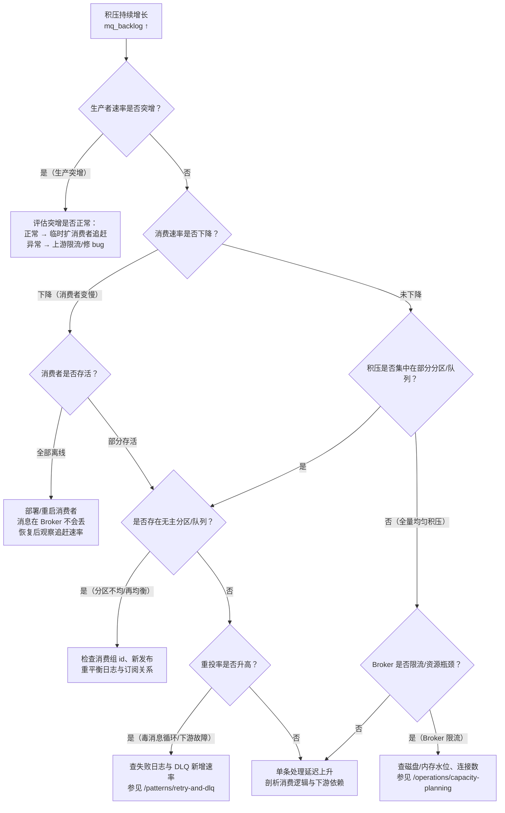

# 可观测性：统一指标模型与积压定位

> 本页结论：四个产品的监控术语不同（queue depth / consumer lag / 堆积 / backlog），但必须映射到同一套统一指标模型（规格 §12.1）：生产确认率、积压、重投率、DLQ 深度、端到端延迟、Broker 资源六组。出现积压时先走决策树定位是「生产突增、消费变慢、消费者离线、分区不均、毒消息循环还是 Broker 限流」，再决定扩容还是止血。日志必须带 `traceId` 等统一字段（§12.2），否则跨服务链路无法拼接。

## 统一指标模型（规格 §12.1）

统一指标名是本仓库的观测语言：写文档、做告警、复盘故障都用这套名字，产品原生指标只作为数据源。

### Producer：生产确认率与发送质量

| 统一指标 | 含义 | RabbitMQ | Kafka | RocketMQ | Pulsar |
| :--- | :--- | :--- | :--- | :--- | :--- |
| 发送速率 | msg/s | 应用埋点 / management API | producer metrics（record-send-rate） | 客户端埋点 / dashboard | msgRateIn（topic 维度） |
| 生产确认率 | 收到 Broker 确认 / 发出 | publisher confirm 返回计数 | acks 响应；send future 成功率 | sendResult 成功比例 | send 回调成功率 |
| 确认延迟 | 发出 → 确认 P95 | confirm 耗时 | request-latency | 客户端埋点 | 客户端埋点 |
| 错误/超时/重试率 | 失败与客户端重发 | nack / returned | record-error-rate、retry 计数 | 发送重试计数 | send 失败计数 |
| 批大小 | 每批条数/字节 | — | batch-size | 客户端埋点 | batching 配置与指标 |

### Consumer：消费速率、重投率与失败率

| 统一指标 | 含义 | 数据源示例 |
| :--- | :--- | :--- |
| 消费速率 | msg/s | 各产品消费侧指标（Kafka records-consumed-rate、Pulsar msgRateOut 等） |
| 处理延迟 | 单条处理耗时 P50/P95/P99 | 应用埋点（§12.2 的 `durationMs`） |
| 失败率 | 处理抛异常比例 | 应用埋点（`status=failed`） |
| 重投率 | redelivered 消息占比 | RabbitMQ redelivered 计数；Kafka 重读 ≈ lag 回退；RocketMQ 重试消息；Pulsar msgRedeliverCount |
| 活跃消费者数 | 组内在线实例 | RabbitMQ consumers 计数；Kafka group members；RocketMQ 在线实例；Pulsar consumers 计数 |

### Backlog：积压（四产品映射到同一指标 mq_backlog）

| 产品 | 原生口径 | 查询入口 |
| :--- | :--- | :--- |
| RabbitMQ | Queue Depth（ready + unacked） | management API / `rabbitmqctl list_queues` |
| Kafka | Consumer Lag（每分区 max offset − committed offset） | `kafka-consumer-groups --describe` |
| RocketMQ | 消费堆积（broker offset − consumer offset diff） | dashboard / `mqadmin consumerProgress` |
| Pulsar | msgBacklog（subscription 未确认条数） | `pulsar-admin topics stats` |

### DLQ：深度、年龄与回放

| 统一指标 | 含义 |
| :--- | :--- |
| DLQ 深度（存量） | 当前未处理的死信条数——核心告警项 |
| DLQ 新增速率 | 单位时间新入 DLQ 条数，风暴时比深度更早报警 |
| 最老消息年龄 | DLQ 中最老消息的滞留时长，衡量处理及时性 |
| 回放成功率 | DLQ 回放后成功处理的比例，衡量回放流程健康度 |

### Broker 资源与 Business 端到端

- **Broker**：入站/出站速率、存储大小、磁盘/内存/网络水位、连接数、不可用分区/副本状态（RabbitMQ quorum 成员、Kafka under-replicated partitions、Pulsar unassigned bundles 等）。磁盘水位告警直接关联[故障剧本](/operations/failure-playbook)。
- **Business**：端到端事件年龄（`now − occurredAt`，消费成功时刻计算）、重复拦截数（幂等表 `duplicate_skipped` 计数）、业务应用成功数。端到端延迟是唯一能回答「用户视角慢不慢」的指标，信封里的 `occurredAt`（规格 §5.2）就是为它准备的。

## 积压定位决策树

发现 `mq_backlog` 持续增长后，按顺序排查（对应 §12.1 要求的六类原因）：



经验规则：

- 看「生产速率 vs 消费速率」的**差值**而不是绝对值——两者都正常地高也可能积压。
- 重投率升高通常早于失败率告警（重试中的消息还在被「消费」）。
- 消费者恢复后的追赶阶段，积压下降速率 ≈ 消费速率 − 生产速率；若追赶不动，说明扩容不足。

## traceId 贯穿日志（§12.2）

统一日志字段（生产、Broker 侧可观测事件、消费三处都要有）：

```text
timestamp level service product lab
messageId eventType schemaVersion aggregateId
traceId correlationId destination partitionOrQueue
consumerGroup consumer attempt redelivered
status durationMs errorType
```

异步边界的上下文传递规则：

1. **注入**：Producer 把当前 `traceId`/`correlationId` 写入消息（信封字段，规格 §5.2 必填）或 Broker header。
2. **提取**：Consumer 从消息中取出并写入 MDC/日志上下文，消费期间所有日志自动携带。
3. **Span 划分**：Producer send 是一个 Span，Broker 存储是边界（不是 Span），Consumer 处理是另一个 Span——两者通过信封字段链接而非直接父子。
4. **重试延续原 Trace**：重试消息沿用原 `traceId`，`attempt` 字段递增；这样一次失败-重试-成功的全过程可在同一 trace 下检索。请求-应答的应答消息同样延续 `correlationId`（见[请求-应答](/patterns/request-reply)）。

没有 `traceId` 的日志在多消费者、多重试的系统里无法定位「这条消息到底被谁处理了几次」——这是[幂等消费](/patterns/idempotent-consumer)排障的第一依赖。

## 告警的最小集合

| 告警 | 触发 | 对应动作 |
| :--- | :--- | :--- |
| 积压超预算 | mq_backlog 超过容量规划阈值 | 走积压决策树 |
| 生产确认率下降 | 确认率 < 阈值持续 N 分钟 | 查 Broker 可用性与网络 |
| DLQ 新增/深度 | 深度 > 0 增速异常 或 深度超阈 | 见[故障剧本·重投风暴](/operations/failure-playbook) |
| 端到端事件年龄 | P95 超业务时限 | 先定位积压还是处理慢 |
| Broker 磁盘水位 | 超过水位线 | 见[故障剧本·磁盘水位](/operations/failure-playbook) |

## 官方资料

- Kafka Monitoring：<https://kafka.apache.org/documentation/#monitoring>（checkedAt: 2026-08-19）
- RabbitMQ Monitoring：<https://www.rabbitmq.com/docs/monitoring>（checkedAt: 2026-08-19）
- Pulsar Metrics：<https://pulsar.apache.org/docs/reference-metrics/>（checkedAt: 2026-08-19）
- RocketMQ 文档入口（dashboard/运维）：<https://rocketmq.apache.org/docs/>（checkedAt: 2026-08-19）
