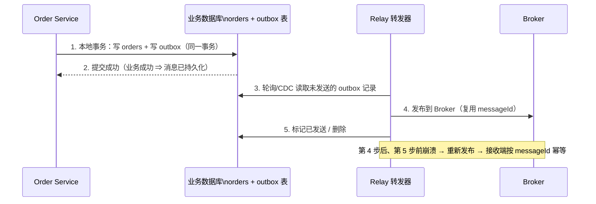

# Outbox（发件箱）

> 本页结论：Outbox 把「业务写入」和「消息写入」放进同一个本地数据库事务（业务表 + outbox 表），提交后由独立的转发器（Relay）把 outbox 投递到 Broker。它保证「业务成功 ⇒ 消息最终一定发出」，代价是投递变成最终一致、且是 at-least-once——接收端必须幂等。

## 要解决的问题

「写库 + 发消息」是两个系统上的两个动作，任何顺序都有失败窗口：

| 顺序 | 故障点 | 后果 |
| :--- | :--- | :--- |
| 先发 MQ，后写库 | 写库失败/崩溃 | 消息已发出，业务没落地 → 下游看到不存在的事件 |
| 先写库，后发 MQ | 发送失败/崩溃 | 业务成功，消息丢失 → 下游永远不知道 |

双写没有原子性。Outbox 的思路是：**不直接发 MQ，先把消息写进和业务同一个数据库**，让本地事务保证两者同生共死；发送动作交给独立组件异步完成。

## 结构与流程

三个关键点：

1. **同事务**：outbox 表必须与业务表在同一个数据库、同一个事务里。跨库的「outbox」不成立。
2. **转发器**：两种常见实现——轮询（`SELECT … WHERE sent=false` + 更新标记）或 CDC（订阅数据库变更日志，如 binlog/WAL）。转发器崩溃不丢消息：未标记的记录下一轮还会被捡起来。
3. **messageId 提前生成**：消息在写 outbox 时就带全局唯一 `messageId`（规格 §5.2），转发器重复发布时内容不变，接收端可用它去重。

## Outbox 只解决发送侧

Relay「发布成功但标记失败」会重发同一条消息，所以整条链是 at-least-once。Outbox 必须与接收侧模式配套：

- 接收端：[幂等消费](/patterns/idempotent-consumer)（`processed_messages` 唯一键拦截重复）；
- 毒消息：[重试与 DLQ](/patterns/retry-and-dlq)；
- 全链路用 `traceId`/`correlationId` 串联排障（见[可观测性](/operations/observability)）。

## 与其他机制的关系

- **Kafka 事务不是替代**：Kafka EOS 覆盖的是 topic→topic 的原子性，外部数据库写入不在其内（见 [Kafka 可靠性](/brokers/kafka/reliability)的「事务的边界」）。业务库 + Kafka 的组合仍需 Outbox 或 CDC。
- **RocketMQ 事务消息是另一条路**：Broker 提供「半消息 + 本地事务回查」，由 Broker 驱动确认；与 Outbox 目标相同（业务成功必发出），机制不同（回查 vs 转发器），选型时比较运维成本与产品绑定。
- **CDC 变体**：用变更日志代替轮询，避免扫表与发送延迟，但引入 CDC 管道这一新组件，失败模式也随之转移。

## 保证成立的条件 / 不保证什么

- 条件：业务表与 outbox 同库同事务；转发器至少一次投递；接收端幂等；outbox 记录保留到确认发送成功。
- 不保证：消息与业务写入「同时」对外可见（存在转发延迟）；恰好一次投递；转发器自身故障时零延迟（只是不丢）。

## 常见误区

- 「Outbox 就是 exactly-once」——它给的是「业务成功 ⇒ 最终至少发一次」；exactly-once 要靠接收端幂等合成。
- 「Relay 可以在事务提交前就开始发」——事务可能回滚，发出去的消息收不回来。
- 「双写（代码里先写库再 send）加个重试就够了」——进程崩溃时重试机会都没有；失败窗口的形状见上文表格。
- 「outbox 表可以无限堆积」——已发送记录要归档/清理，否则扫表越来越慢（见[容量规划](/operations/capacity-planning)）。

## 官方资料与模式参考

- RocketMQ 事务消息（官方机制对照）：<https://rocketmq.apache.org/docs/featureBehavior/04transactionmessage>（checkedAt: 2026-08-19）
- Kafka Transactions（边界说明）：<https://kafka.apache.org/documentation/#transactions>（checkedAt: 2026-08-19）
- 模式参考（非产品官方文档）：Transactional Outbox，microservices.io：<https://microservices.io/patterns/data/transactional-outbox.html>（checkedAt: 2026-08-19）
