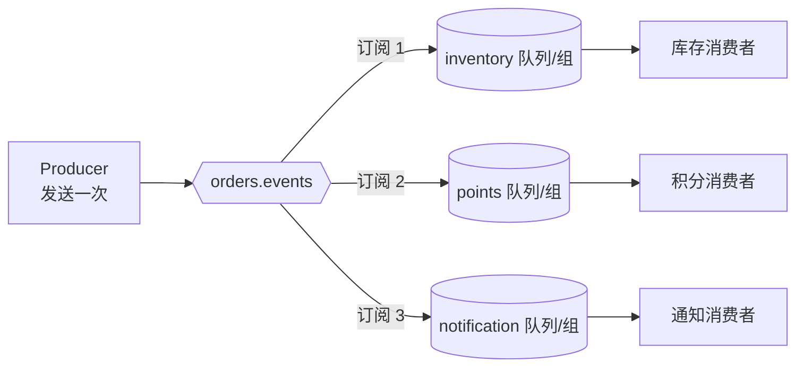

# 发布订阅（Pub/Sub）

> 本页结论：发布订阅让同一条事件被复制到每个独立订阅，订阅之间进度独立、积压独立、互不阻塞；扇出靠绑定/订阅关系完成，生产者只发一次。每个订阅内部仍然是竞争消费，每个订阅各自承担 at-least-once 语义，各自需要幂等。

## 适用场景

- 一个业务事件（`order.created`）要通知多个互不相干的下游：库存、积分、通知、数仓。
- 下游会持续增减：新增订阅不应要求生产者改代码、重新发布。
- 各下游处理速度差异大，需要各自的缓冲与追赶能力。

## 核心模型

要点：

- **一条消息、多个副本**：每个订阅看到的是完整事件流，不是分摊。
- **订阅独立**：订阅 1 积压或离线，不影响订阅 2 的消费进度（存储侧的影响见下文「不保证什么」）。
- **订阅内部仍是工作队列**：同一订阅的多个消费者竞争消费（见[工作队列](/patterns/work-queue)）。

本仓库 routing 实验演示了 Topic Exchange 的绑定分发，断言「同一条消息被复制到多个队列」：见[毒消息、重试与 DLQ](/matrix/experiment/poison-message)的 routing 部分。

## 四产品实现对照

| 产品 | 扇出机制 | 「一个订阅」对应什么 | 订阅间隔离 |
| :--- | :--- | :--- | :--- |
| RabbitMQ | Exchange（fanout/topic/direct）+ 绑定 | 每个订阅者一条自己的队列 | 队列独立，积压互不影响 |
| Kafka | Topic + consumer group | 每个订阅者一个独立 group.id | 组间 offset 独立；但共享日志存储与保留期 |
| RocketMQ | Topic + consumer group | 每个订阅者一个独立 consumer group（集群模式） | 组间消费位点独立 |
| Pulsar | Topic + subscription | 每个订阅一个具名 subscription | 订阅有独立游标；积压可能影响 TTL 下的数据保留 |

关键差异在「订阅」的实现位置：RabbitMQ 的扇出发生在 Exchange 绑定层（消息物理复制到各队列）；Kafka 只存一份日志，靠各 group 的 offset 实现「各自从头读」——所以 Kafka 新增订阅可以回放历史（在保留期内），RabbitMQ 新绑定的队列只能收到绑定之后的消息（见[存储与回放](/concepts/storage-and-replay)）。

## 事件语义：eventType 而不是队列名

本项目约定要求 `eventType` 使用小写点分命名（如 `order.created`），**不得用队列名/topic 名代替业务语义**。发布订阅的拓扑会变（拆分队列、改名、迁移产品），事件类型是契约的一部分（见 [Schema 演进](/patterns/schema-evolution)）。

## 保证成立的条件 / 不保证什么

- 条件：每个订阅按 at-least-once 配置确认机制；每个订阅各自实现幂等与重试。
- 不保证：各订阅「同时」收到事件——每个订阅有自己的消费速率与积压；不保证跨订阅的全局顺序；Kafka/RocketMQ/Pulsar 中慢订阅积压超过保留期时，落后部分可能永久读不到（存储型系统的保留期边界，见[存储与回放](/concepts/storage-and-replay)）。

## 常见误区

- 「发布订阅 = 实时推送」——每个订阅仍是拉取/推送式消费，会有积压与延迟，需要各自观测（见[可观测性](/operations/observability)）。
- 「一条事件全局只投一次」——是「每个订阅至少一次」；每个订阅都要按重复投递设计。
- 「下游挂了会拖累其他订阅」——RabbitMQ 不会（队列独立）；Kafka 不会阻塞其他组，但该组自己会积压并可能撞上保留期。
- 「新增订阅就能拿到全部历史」——仅对保留期内的存储型系统（Kafka/RocketMQ/Pulsar）成立，RabbitMQ 新队列只收新消息。

## 官方资料

- RabbitMQ Tutorial 3 – Publish/Subscribe：<https://www.rabbitmq.com/tutorials/tutorial-three-python>（checkedAt: 2026-08-19）
- RabbitMQ Topic Exchange：<https://www.rabbitmq.com/tutorials/amqp-concepts#exchange-topic>（checkedAt: 2026-08-19）
- Kafka Consumer Groups：<https://kafka.apache.org/documentation/#intro_consumers>（checkedAt: 2026-08-19）
- Pulsar Subscriptions：<https://pulsar.apache.org/docs/concepts-messaging/>（checkedAt: 2026-08-19）
