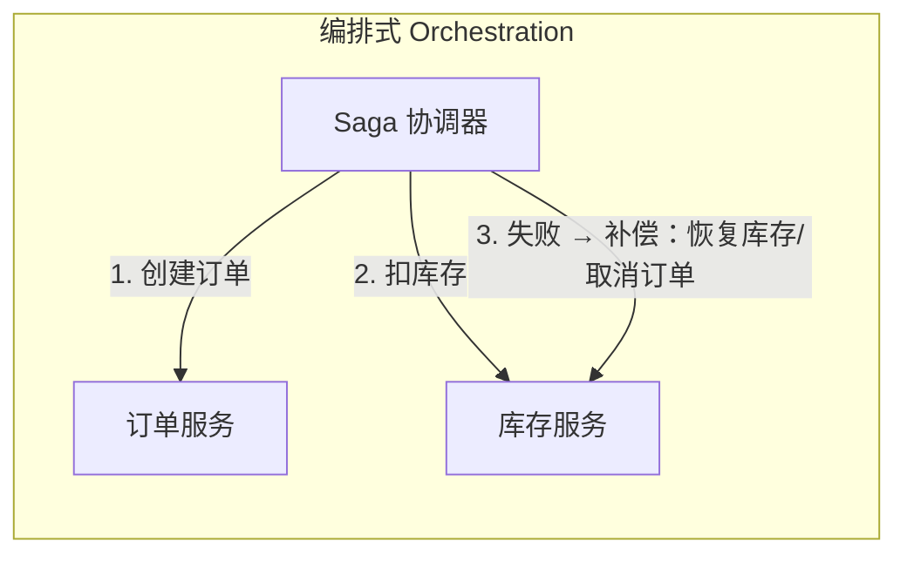
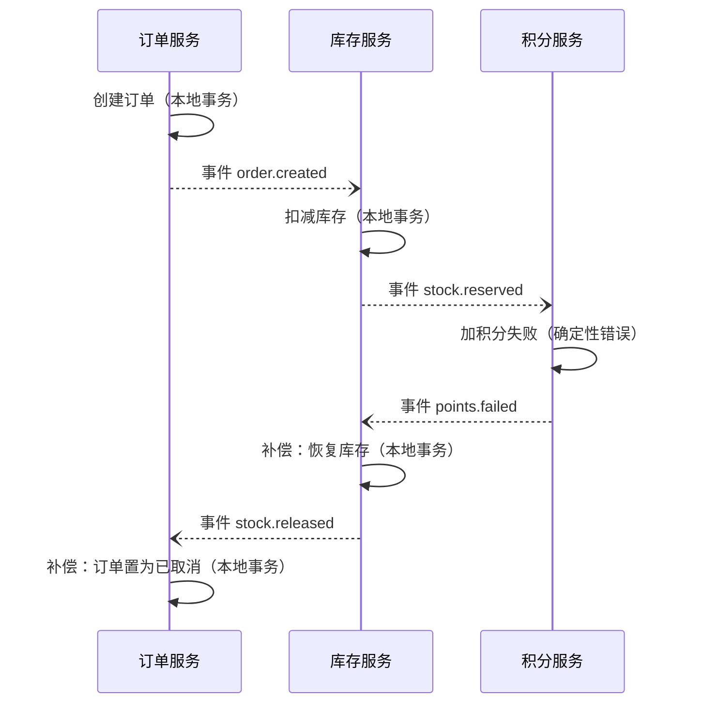

# Saga（长事务拆分与补偿）

> 本页结论：Saga 把跨服务的长事务拆成一串「本地事务 + 消息」，任一步失败时执行前序步骤的补偿操作撤销业务效果。它给出的是最终一致，不是强一致：中间状态对外可见，补偿本身也可能失败，因此 Saga 必须建立在可靠投递（Outbox）、幂等消费和重试/DLQ 之上，且永远不承诺 ACID 级别的原子性与隔离性。

## 要解决的问题

下单链路涉及多个服务各自的数据库：

```text
订单服务：创建订单（本地事务）
库存服务：扣减库存（另一个数据库）
积分服务：加积分（又一个数据库）
```

跨库没有统一事务可用（两阶段提交在可用性与运维成本上通常不可接受）。Saga 的取舍是：**放弃「同时成功或同时回滚」的原子幻觉，用补偿把已发生的业务效果撤销掉**，接受过程中存在中间状态。

## 两种组织方式



| 维度 | 协同式（Choreography） | 编排式（Orchestration） |
| :--- | :--- | :--- |
| 推进方式 | 每个服务完成本地事务后发事件，下游监听事件继续 | 一个协调器依次向各参与者发命令并收集结果 |
| 流程可见性 | 分散在各服务的事件订阅里，链路长时难以回答「现在进行到哪」 | 状态集中在协调器，易观测、易补偿 |
| 耦合 | 服务之间通过事件耦合，无中心组件 | 参与者依赖协调器的命令协议 |
| 适用 | 步骤少（3 步以内）、流程稳定的链路 | 步骤多、分支多、需要明确补偿决策点的链路 |

协同式时序示例（订单 → 库存 → 积分，积分失败触发补偿）：



## 补偿的性质

- 补偿是**业务级撤销**（恢复库存额度、订单置为取消、冲正积分），不是数据库 ROLLBACK——已发出的短信、已打印的面单无法物理撤销，这类步骤要么放到 Saga 末尾，要么接受不可逆。
- 补偿**必须幂等**：补偿命令同样会重复投递，按[幂等消费](/patterns/idempotent-consumer)处理。
- 补偿**也可能失败**：补偿失败 → 重试 → 超限进 DLQ → 人工介入。Saga 的终态不止「成功/已补偿」，还有「补偿中/需人工」，状态机必须显式建模。
- 补偿顺序一般与执行顺序相反，但设计时要逐对验证（先恢复库存还是先取消订单，取决于业务约束）。

## Saga 与消息基础设施的依赖

Saga 的每一步都靠消息驱动，因此它不替代本页其他模式，而是叠加在它们之上：

| 依赖 | 作用 | 对应页面 |
| :--- | :--- | :--- |
| 业务成功必发出 | 本地事务与发事件同事务（Outbox），或 RocketMQ 事务消息回查 | [Outbox](/patterns/outbox) |
| 重复投递去重 | 每个参与者按 messageId/业务键幂等 | [幂等消费](/patterns/idempotent-consumer) |
| 步骤失败处理 | 瞬时故障有限重试，毒消息进 DLQ 告警 | [重试与 DLQ](/patterns/retry-and-dlq) |
| 链路追踪 | 同一 traceId 贯穿执行与补偿，否则无法定位「卡在哪一步」 | [可观测性](/operations/observability) |

## 保证成立的条件 / 不保证什么

- 条件：每步本地事务 + 可靠投递 + 参与者和补偿器都幂等 + 补偿失败有人工兜底。
- 不保证：强一致——执行中途，外部能看到「订单已创建但库存未扣」的中间状态（无隔离性）；不保证补偿一定成功；不保证端到端耗时上界（补偿链可能很长）。
- 如果业务确实需要读不到中间状态，Saga 不是正确工具，考虑预留/冻结式的领域建模或接受同步调用。

## 常见误区

- 「Saga = 分布式事务，效果等同 ACID」——Saga 明确放弃隔离性与原子性，只承诺最终一致。
- 「补偿总会成功，失败分支不用设计」——补偿走的是同一套消息链路，同样会超时、重复、变毒消息。
- 「编排式协调器必须是强一致的状态存储」——协调器状态本身落在普通数据库里，靠幂等与重试保证推进，不需要也不该引入新的一致性组件。

## 官方资料与模式参考

- RocketMQ 事务消息（「本地事务 + 可靠发送」的产品侧支持）：<https://rocketmq.apache.org/docs/featureBehavior/04transactionmessage>（checkedAt: 2026-08-19）
- 模式参考（非产品官方文档）：Saga，microservices.io：<https://microservices.io/patterns/data/saga.html>（checkedAt: 2026-08-19）
