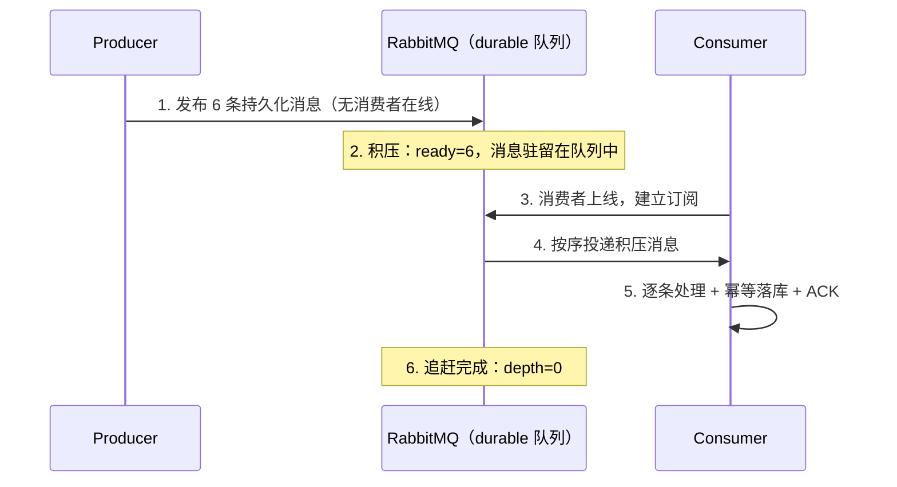

# 积压与追赶（backlog-recovery）

[在交互实验台查看离线积压与恢复追赶](/playground/?product=rabbitmq&scenario=backlog-recovery&track=offline)

> 本页结论：消费者离线期间，durable 队列把消息安全地积压在 Broker 端；消费者恢复后从积压点继续追赶，最终队列清零、业务恰好落库一次——积压不等于丢失，但积压期间的容量与追赶速度必须被当作运维指标管理。

## 适用场景

- 对应「消费者宕机 10 分钟」情景：消息去哪了？恢复后会发生什么？
- 观察 durable 队列在无消费者时的行为：消息不会被丢弃，而是排队等待。
- 建立「积压（backlog）→ 追赶（catch-up）→ 清零」的标准恢复叙事，为运维篇的积压定位决策树提供一手证据。

## 时序



关键点：第 1 步发生时没有任何消费者，Broker 不会因此拒收或丢弃——持久化队列的职责就是替缺席的消费者保管消息（受内存/磁盘配额约束，见官方资料）。

## 实验步骤

```bash
bash demos/rabbitmq/backlog-recovery/run.sh
```

编排分两个阶段：

1. 积压阶段：先声明 durable 队列 `orders.backlog`，Producer 发送 6 条消息（3 个 fixture × 2 轮，每轮生成新的 `messageId`），全程不启动消费者。lab 通过 `rabbitmqctl list_queues` 断言积压深度恰好为 6。
2. 追赶阶段：启动 Consumer 消费同一队列，逐条幂等落库并手动 ACK，收满 6 条退出。lab 断言队列深度归零、6 条全部收到；由于两轮消息 orderId 相同，业务幂等把写入收敛为 3 行，另 3 条记为 `duplicate_skipped`。

## 断言

| 断言 | 期望 | 说明 |
| :--- | :--- | :--- |
| confirmed | 6 | Publisher Confirms 全部确认，积压前无丢失 |
| backlogDepth | 6 | 无消费者时 6 条全部驻留队列 |
| received | 6 | 消费者追赶收到全部积压 |
| uniqueMessageIds | 6 | 6 条不同 messageId 全部被投递 |
| businessCommitted | 3 | 第一轮 3 个订单各落库一次 |
| businessDuplicatesSkipped | 3 | 第二轮同 orderId 被业务幂等拦截（messageId 不同、业务键相同） |
| business_rows | 3 | orders 表恰好 3 行，积压追赶不产生重复业务效果 |
| queueDepthAfter | 0 | 追赶完成，积压清零 |

## 提交快照

<LabOutput product="rabbitmq" lab="backlog-recovery" />

## 常见误区

- 「消费者挂了消息就丢了」——durable 队列 + 持久化消息 + Publisher Confirms 的组合下，积压期间消息在 Broker 端安全驻留；真正需要担心的是队列资源耗尽触发流控或磁盘报警。
- 「恢复后能立刻追平」——追赶速度受消费吞吐限制；积压量大时需要监控追赶斜率，必要时临时扩容消费者（注意单队列并发受限于消费者数与 prefetch）。
- 「积压清零就没事了」——清零只说明本次追赶完成；必须复盘积压的根因（消费变慢？下游故障？流量突增？），否则下一轮积压只是时间问题。

## 官方资料与版本说明

- RabbitMQ 4.1.4，`amqp-client` 5.34.0。
- Queues（durable 与消息驻留）：<https://www.rabbitmq.com/docs/queues>（checkedAt: 2026-08-19）
- Consumer prefetch 与吞吐：<https://www.rabbitmq.com/docs/consumer-prefetch>（checkedAt: 2026-08-19）
