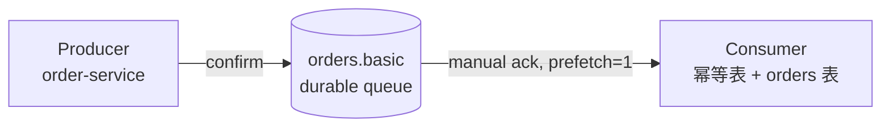

# 基础收发流程（basic）

> 本页结论：用 RabbitMQ 复现一条最小可靠链路——Publisher Confirms 确认生产、手动 ACK 确认消费、幂等表落库；三个状态各自独立，可在日志与断言中逐一核对。

## 适用场景

- 第一次启动 RabbitMQ 并跑通完整收发闭环。
- 理解「发送成功」「消费成功」「业务落库成功」是三个互不等价的状态。
- 熟悉 hello-mq 的统一日志字段与断言方式。

## 拓扑



- 队列 `orders.basic`：durable，不自动过期，消费后不删除消息（RabbitMQ 语义：ACK 后移除）。
- Producer：开启 Publisher Confirms（`confirmSelect`），消息 persistent，逐条等待确认。
- Consumer：手动 ACK，`prefetch=1`；先经幂等表 + 业务写入的本地事务，提交成功后才 ACK。

## 实验步骤

```bash
bash demos/rabbitmq/basic/run.sh
```

lab 入口会依次执行：启动 Broker → 声明队列 → 发送 3 条 `OrderCreated.v1`（fixture：order-1001/1002/1003）→ 消费者处理并落库 → 采集队列深度与 DB 行数 → 断言 → 停止容器。

## 正常流程

1. Producer 逐条发送并收到 Broker 确认：`status=confirmed`，最终 `confirmed=3`。
2. Consumer 收到消息：`status=received`（含 `attempt`、`redelivered` 字段）。
3. 幂等检查通过后，在一个 SQLite 本地事务里完成 `processed_messages` 插入与 `orders` 业务写入：`status=business_committed`。
4. DB 提交成功后才调用 `basicAck`。三条消息处理完毕，队列深度归零。

## 故障流程

本实验是 L1 冒烟，不注入故障。崩溃与重投场景见 [消费者崩溃与重投](/playground/consumer-crash)。

## 保证成立的条件

- Broker 确认消息已接受（单节点下即写入内存/磁盘）后，Publisher Confirm 才返回。
- Consumer 手动 ACK 且 `prefetch=1`：未 ACK 的消息在消费者断开时会重新入队。
- 幂等表与业务表处于同一个 SQLite 事务，提交是原子的。

## 不保证什么

- Publisher Confirm 不表示消费者已处理——两段确认互相独立（见 [可靠性](/products/rabbitmq/reliability)）。
- 单节点无副本：Broker 节点磁盘损坏仍可能丢消息；高可用配置见 [存储与高可用](/products/rabbitmq/storage-ha)。

## 断言

| 断言 | 期望 |
| :--- | :--- |
| confirmed | 3 |
| received | 3 |
| uniqueMessageIds | 3 |
| business_rows | 3 |
| queueDepthAfter | 0 |

## 提交快照

<LabOutput product="rabbitmq" lab="basic" />

## 官方资料与版本说明

- RabbitMQ 4.1.4（镜像 digest 锁定，见 `.env.versions`），客户端 `amqp-client` 5.34.0。
- Publisher Confirms：<https://www.rabbitmq.com/docs/confirms>（checkedAt: 2026-08-19）
- Consumer Acknowledgements：<https://www.rabbitmq.com/docs/confirms#acknowledgement-modes>（checkedAt: 2026-08-19）
