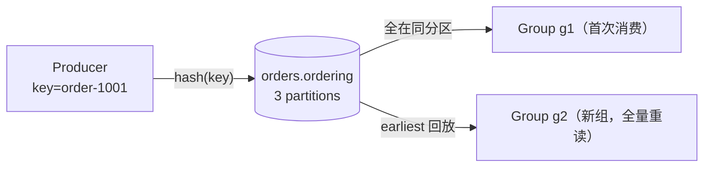

# 顺序、消费组与回放（Kafka）

[在交互实验台查看首次消费与 offset 回放](/playground/?product=kafka&scenario=ordering-replay&track=initial)

> 本页结论：Kafka 的顺序只在分区内成立——同 key 进同分区、组内瓜分分区、新消费组可从 earliest 全量回放；本页用三个实验分别验证，并给出与 RabbitMQ 的语义对照。

## 适用场景

- 需要「同 orderId 事件按序处理」的业务流。
- 验证消费组并行度与分区的关系。
- 验证回放能力（新消费组/位点重置从头读）。

## 拓扑



## 实验一：同 key 有序（ordering-replay）

```bash
bash demos/kafka/ordering-replay/run.sh
```

步骤：Producer 用同一 key（`order-1001`）发送 6 条带序号消息 → 断言 6 条落在**同一分区**（`samePartitionOnProduce=1`）→ 消费组 g1 按序接收（`observedOrder=[1..6]`）→ 新消费组 g2 以 `auto.offset.reset=earliest` 从 offset 0 全量回放（`replayed=6`、`replayFromOffset0=0`）。

<LabOutput product="kafka" lab="ordering-replay" />

结论与边界：

- 同 key → 同分区 → 分区内写入有序；消费端单线程读分区即保序。
- 回放不改变日志本身：g1 的消费不影响 g2，offset 是**组级**位点。
- 跨分区无顺序可言；消费端多线程处理同一分区会打乱顺序（见 [分区与分发](/products/kafka/routing)）。

## 实验二：消费组瓜分分区（consumer-group）

```bash
bash demos/kafka/consumer-group/run.sh
```

步骤：先发 3 条到 3 分区 Topic → 组 A 两个消费者并行消费（空闲超时退出后合并统计：每条消息恰被组内一个消费者收到一次，两个消费者都观察到分区分配）→ 组 B 独立消费，同样收到全量 3 条。

<LabOutput product="kafka" lab="consumer-group" />

结论与边界：

- 组内瓜分：每个分区至多一个消费者；消费者数超过分区数时多余者空转。
- 组间广播：位点按组独立，组 B 的接收与组 A 互不影响。
- 分配的具体归属由协议决定（本实验断言「两者都有分配」而非具体归属，因为分配结果不保证可复现）。

## 与 RabbitMQ / Pulsar 的顺序语义对照

| 维度 | Kafka | RabbitMQ | Pulsar |
| :--- | :--- | :--- | :--- |
| 顺序单位 | Partition（key 决定归属） | 单个 Queue（binding 决定归属） | 分区（key 路由）+ 订阅类型共同决定 |
| 同键有序怎么做 | key=orderId → 同分区 | routing key=orderId → 专属队列 + 单消费者 | key=orderId → 分区 + Key_Shared 订阅（同 key 粘连同一消费者） |
| 并行与顺序的冲突 | 分区数 = 并行上限，全局顺序需单分区 | 队列数类似；单队列多消费者会竞争乱序 | 分区数类似；Shared 订阅换并行但放弃顺序 |
| 失败后顺序 | 无 requeue；失败消息通常转发 DLQ Topic，原分区继续 | NACK+requeue 会把消息送回队列，顺序可能抖动 | negativeAck/ack 超时触发重投，同分区内重试消息与后续消息的顺序会被打乱 |
| 回放 | 原生：位点重置/新组 earliest | 不适用（ACK 即删；Streams 除外） | 原生：reset-cursor 到 earliest/时间戳（redelivery-replay 实验验证） |
| 多订阅 | 多消费组各自位点 | 多队列各自绑定 | 同一 topic 可并存多个订阅（Exclusive/Shared/Failover/Key_Shared），各自独立游标 |

统一结论（对应 [顺序语义](/#mq-ordering)）：三家都只提供**局部顺序**；「全局顺序」需要牺牲并行度，且都要在消费端保持单线程处理同一顺序单位。Pulsar 的额外维度是订阅类型：Shared 换吞吐但无跨消费者顺序，Key_Shared 才能同时兼得同键有序与并行（见 [subscriptions 实验](/products/pulsar/routing)）。

## 断言汇总

| 实验 | 关键断言 | 期望 |
| :--- | :--- | :--- |
| ordering-replay | samePartitionOnProduce / observedOrder / replayed / replayFromOffset0 | 1 / [1..6] / 6 / 0 |
| consumer-group | groupAReceived / groupAUnique / a1Assigned+a2Assigned / groupBReceived / groupALag | 3 / 3 / 均有 / 3 / 0 |

## 官方资料与版本说明

- Kafka 4.3.1（镜像 digest 锁定，见 `.env.versions`），客户端 `kafka-clients` 4.3.1。
- The Producer（分区选择）：<https://kafka.apache.org/documentation/#theproducer>（checkedAt: 2026-08-19）
- The Consumer（组与位点）：<https://kafka.apache.org/documentation/#theconsumer>（checkedAt: 2026-08-19）
