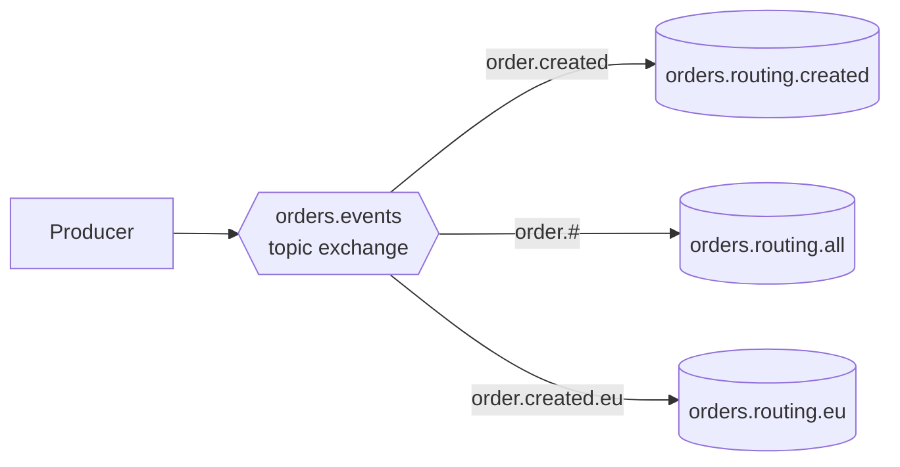
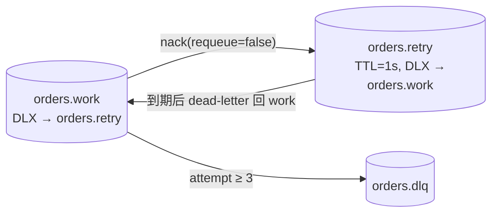

# 毒消息、重试与 DLQ（routing / retry-dlq）

> 本页结论：Topic Exchange 按路由键把同一事件分发给不同订阅者；毒消息经「TTL + DLX 回环」有限重试 3 次后被隔离进 DLQ，正常消息不受阻塞——RabbitMQ 的重试是组合配置出来的模式，不是 Broker 内置的消费重试。

## routing：Topic Exchange 分发 {#routing}

### 拓扑



三条消息、三种路由键：`order.created`、`order.created`、`order.created.eu`。绑定决定分发：

| 队列 | 绑定模式 | 收到的消息 | 说明 |
| :--- | :--- | :--- | :--- |
| orders.routing.created | `order.created` | 2 | 精确匹配，`order.created.eu` 不是 `order.created` |
| orders.routing.all | `order.#` | 3 | `#` 匹配零个或多个段 |
| orders.routing.eu | `order.created.eu` | 1 | 精确匹配 EU 变体 |

### 运行与断言

```bash
bash demos/rabbitmq/routing/run.sh
```

断言按队列核对收到数量、唯一 messageId 数量与消费后的队列深度。要点：同一条消息被复制到多个队列是发布订阅（Pub/Sub）语义；队列内部才是竞争消费。

<LabOutput product="rabbitmq" lab="routing" />

## retry-dlq：毒消息的有限重试

### 为什么要隔离毒消息

一条无法被业务处理的消息（Schema 缺失字段、引用不存在的数据、确定性报错的代码路径）如果被无限 `basicNack(requeue=true)`，会卡住队列头部，阻塞后续所有消息。正确做法是：有限重试 + 隔离到死信队列（Dead Letter Queue, DLQ），保留证据供人工处理。

### 拓扑：TTL + DLX 回环

RabbitMQ 没有内置「消费失败自动重试 N 次」。本实验用队列参数组合出重试环：



- `orders.work`：`x-dead-letter-exchange=""` + `x-dead-letter-routing-key=orders.retry`，被拒绝的消息进入重试队列。
- `orders.retry`：`x-message-ttl=1000` + DLX 指回 `orders.work`，到期后自动回到工作队列，形成带 1 秒延迟的重试。
- 重试次数来自消息头 `x-death`：Broker 在消息每次被 dead-letter 时追加记录，消费者统计 `reason=rejected` 的累计计数，`attempt = 1 + rejected 计数`。
- 达到 `max-attempts=3` 后，消费者显式发布到 `orders.dlq` 并 ACK 原消息。

### 实验过程

```bash
bash demos/rabbitmq/retry-dlq/run.sh
```

Producer 发送 order-1001、order-1002 与一条故意不符合 Schema 的毒消息（fixture `poison-message.json`，payload 缺少必填字段，业务写入必然抛异常）。Consumer：

1. order-1001/1002：`business_committed`，正常落库（`business_rows=2`）。
2. 毒消息：attempt=1 失败 → `status=retry`；约 1 秒后 attempt=2 再失败；attempt=3 达到上限 → `status=poison_to_dlq`。
3. 断言 DLQ 深度为 1，work/retry 队列清空。

### 断言

| 断言 | 期望 | 说明 |
| :--- | :--- | :--- |
| confirmed | 3 | 含毒消息，Broker 不校验业务内容 |
| business_rows | 2 | 毒消息未产生业务写入 |
| poisonAttempts | 1,2,3 | x-death 计数确实递增 |
| poisonMovedToDlq | 1 | 显式投递 DLQ 恰好一次 |
| dlqMessages | 1 | DLQ 隔离成功 |

<LabOutput product="rabbitmq" lab="retry-dlq" />

## 保证成立的条件 / 不保证什么

- 重试延迟由 retry 队列 TTL 决定；TTL 到期是从队头开始计算的（队列级 TTL），不适合做大量差异化延迟的调度器。
- 进入 DLQ 不代表消息「处理失败的原因」被记录；生产实践应同时把失败原因写入日志或旁路存储，DLQ 只保留原始消息。
- DLX、TTL、x-death 都是组合使用的队列特性，与 Kafka 的 retry topic 模式、RocketMQ 的 Broker 内置重试不是同一机制，不可互相类比（见 [投递语义矩阵](/#mq-delivery-semantics) 与后续横向矩阵）。
- 毒消息进 DLQ 后业务侧仍需告警与人工回放；DLQ 不是「删掉就没事」的垃圾桶。

## 常见误区

- 「nack(requeue=true) 一直重试」——无延迟、无计数，毒消息会无限占用队头。
- 「RabbitMQ 有内置消费重试」——重试环是应用 + 队列参数组合出来的模式。
- 「DLQ 里的消息会自动处理」——不会，需要人工或独立流程消费 DLQ。

## 官方资料与版本说明

- RabbitMQ 4.1.4，`amqp-client` 5.34.0。
- Dead Letter Exchanges：<https://www.rabbitmq.com/docs/dlx>（checkedAt: 2026-08-19）
- Time-to-Live：<https://www.rabbitmq.com/docs/ttl>（checkedAt: 2026-08-19）
- Topic Exchange：<https://www.rabbitmq.com/tutorials/amqp-concepts#exchange-topic>（checkedAt: 2026-08-19）
