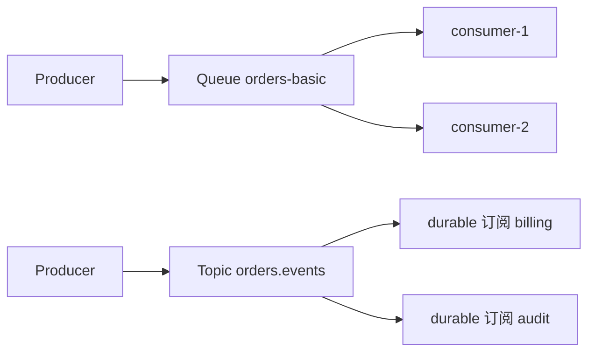

# ActiveMQ Classic 路由与分发

> 本页结论：Classic 的路由核心是两类原生目的地——Queue（竞争消费）与 Topic（发布订阅）；在此之上用 selector 做内容过滤、JMSXGroupID 做同组粘连、VirtualTopics 让 Topic 拥有竞争消费能力。

## Queue 与 Topic

| 目的地 | 语义 | 对应心智 |
| :--- | :--- | :--- |
| Queue | 消息被**一个**消费者取走，确认后删除 | 任务队列 / Kafka 消费组 |
| Topic | 每个（durable）订阅各得一份 | 发布订阅 / Kafka 多消费组 |

- 目的地首次被生产或消费时自动创建，没有显式建队命令——拼写错误会留下一堆野队列，生产需要命名规约与控制台巡检兜底（本仓库 [cli-tools 实验](/products/activemq-classic/operations)实测了自动创建）。
- Topic 的非 durable 订阅随连接消失；需要离线补收必须用 durable subscription。

## 竞争消费与分发方式

- 同一 Queue 上多个消费者：Broker 轮转分发；消费者越多吞吐越高，但全局处理顺序不再保证。
- 消费端 `receive`/监听器拉取，预取缓冲由消费者 prefetch 控制（prefetch 越大吞吐越高、再均衡时未确认消息越多）。
- 慢消费者不会阻塞 Queue 上的其他消费者，但会积累队列深度；Topic 侧默认有 pendingMessageLimitStrategy 限制慢订阅的滞留量（镜像默认 conf 对 `topic>` 设了 constant limit=1000），超限丢弃最旧消息保护生产端。

## JMSXGroupID：同组粘连

需要「同一订单的消息顺序处理、不同订单并行」时，用消息属性 `JMSXGroupID`：

- 同一 group id 的消息被粘连给同一消费者，直到该消费者断开（组被重新分配）。
- 与 Kafka 分区键、Artemis `_AMQ_GROUP_ID`、RocketMQ MessageGroup 同类心智，但 Classic 无分区：粘连由 Broker 维护的组归属完成。
- 组数量远大于消费者数时负载均衡良好；少数巨型组会造成倾斜。

## 内容过滤：Selector

消费者创建时可带 JMS selector（SQL-92 子集），如 `region = 'EU' AND amount > 100`：

- 过滤在 Broker 侧执行，不匹配的消息不会投递给该消费者；
- selector 只作用于消息属性，不能过滤载荷内容；把路由键放进属性是惯例。

## VirtualTopics：Topic 上的竞争消费

Topic 的订阅各自收全量，无法水平扩展单个订阅的处理能力。VirtualTopics 把逻辑 Topic 映射到物理队列（官方文档 E1）：

- 生产者发往 `VirtualTopic.orders.events`；
- 每个消费组建一个队列 `Consumer.<组ID>.VirtualTopic.orders.events`，各队列收全量副本，队列内多消费者竞争消费；
- 等价于「Kafka 多消费组」心智：组间广播、组内竞争。

另有 composite destination（一次发送扇出到多个目的地）等进阶路由，属低频工具，此处不展开。

## 与统一模型的对照

| 其它产品机制 | Classic 等价物 |
| :--- | :--- |
| Kafka 分区键 | `JMSXGroupID`（组粘连，非分区） |
| Kafka 消费组（Topic 上） | VirtualTopics 的 Consumer.*.VirtualTopic.* 队列 |
| RabbitMQ exchange + binding | Queue/Topic + selector（无 exchange 层） |
| RocketMQ SQL92 过滤 | JMS selector（同为 SQL-92 子集，属性级） |

## 边界

- 无通配订阅树（不像 NATS Subject 或 MQTT topic filter 在路由层做层级通配；MQTT 协议接入时由其映射处理）。
- 无按载荷的哈希分区：需要并行度 + 顺序时，用多个队列 + 业务侧分派，或接受 JMSXGroupID 粘连的粒度。
