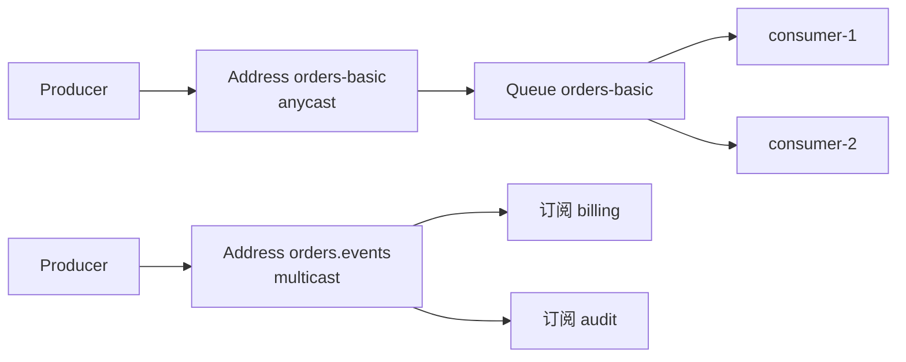

# ActiveMQ Artemis 路由与分发

> 本页结论：Artemis 的路由核心是 Address 的两种路由类型——anycast（竞争消费）与 multicast（发布订阅）；在此之上用 selector 做内容过滤、`_AMQ_GROUP_ID` 做同组粘连、divert 做地址间转发。

## anycast 与 multicast

| 路由类型 | 语义 | 对应心智 |
| :--- | :--- | :--- |
| anycast | 消息进入该地址的队列，被**一个**消费者取走 | 任务队列 / Kafka 消费组 |
| multicast | 每个订阅各得一份（订阅 = durable queue） | 发布订阅 / Kafka 多消费组 |

- 地址的路由类型在创建时声明；自动创建（默认开启）时按首个使用者意图推断，生产环境建议显式建地址避免类型漂移。
- 同一地址可以只挂一种路由类型的实际用途；「一个地址两种类型各配一个队列」属于配置失误，不要依赖。

## 竞争消费与分发方式

- 同一 anycast 队列上多个消费者：服务端轮转（round-robin）分发；消费者越多吞吐越高，但全局处理顺序不再保证。
- 消费端 `receive` 拉取（CORE/JMS），不是服务端推送；预取缓冲由会话的消费窗口控制。
- 慢消费者不会阻塞其他消费者（队列级竞争），但会积累队列深度——见 [运维与观测](/products/artemis/operations) 的积压指标。

## Message Group：同组粘连

需要「同一订单的消息顺序处理、不同订单并行」时，用消息属性 `_AMQ_GROUP_ID`：

- 同一 group id 的消息被粘连给同一消费者，直到该消费者断开或组被重置（`_AMQ_GROUPING_KEY` 配合分组生命周期）。
- 与 RocketMQ MessageGroup、Kafka 分区键同类，但实现在队列层：无分区概念，粘连由 Broker 维护的组归属表完成。
- 组数量远大于消费者数时负载均衡良好；少数巨型组会造成倾斜。

## 内容过滤：Selector

multicast/anycast 的消费者可在创建时带 JMS selector（SQL-92 子集），如 `region = 'EU' AND amount > 100`：

- 过滤在 Broker 侧执行，不匹配的消息**不会投递给该消费者**（multicast 下等于该订阅不产生积压）。
- selector 只作用于消息属性，不能过滤载荷内容；把路由键放进属性是惯例。

## Divert：地址间转发

divert 把消息从一个地址转发到另一个地址（可带过滤与转换），用于：

- 审计旁路：全量转发一份到审计地址，不影响主链路。
- 迁移过渡：新旧地址双写。
- divert 是 Broker 配置项，动态增删需重载配置——不适合当高频业务路由用。

## 与统一模型的对照

| 其它产品机制 | Artemis 等价物 |
| :--- | :--- |
| Kafka 分区键 | `_AMQ_GROUP_ID`（组粘连，非分区） |
| RabbitMQ exchange + binding | Address 路由类型 + selector（无 exchange 层） |
| RocketMQ SQL92 过滤 | JMS selector（同为 SQL-92 子集，属性级） |
| Pulsar Key_Shared | `_AMQ_GROUP_ID` 粘连 |

## 边界

- 无通配订阅树（不像 NATS Subject 或 MQTT topic filter 那样在路由层做层级通配；MQTT 协议接入时由其映射处理）。
- 无按载荷的哈希分区：需要并行度 + 顺序时，用多个队列 + 业务侧分派，或接受 group 粘连的粒度。
