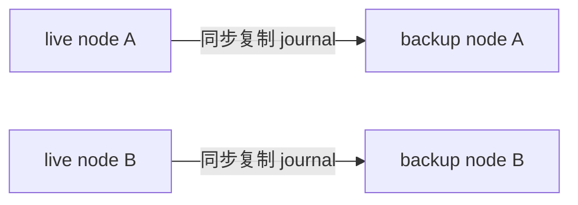

# ActiveMQ Artemis 存储与高可用

> 本页结论：Artemis 用追加式 journal 持久化消息，确认后删除，无日志式保留与回放；地址积压超阈值时自动分页（paging）到磁盘。高可用靠 live/backup 复制对或共享存储，集群把 Queue 分布到多节点——但单个队列不做分区拆分。

## 存储模型：journal + 确认即删除

- **journal**：追加写日志（`journal-type=NIO/ASYNCIO`），消息、确认、队列状态变更顺序落盘；ASYNCIO 依赖 libaio，吞吐更高，NIO 兼容性最好。
- **确认即删除**：消息被所有队列确认后从 journal 生命周期中移除——Artemis 不是保留日志，不能像 Kafka/Pulsar/Redis Streams 那样按位点或时间回放。
- **大消息**：超过 `min-large-message-size` 的消息直接流式写入大消息目录，不占 journal 缓冲。
- **non-destructive 队列**（特殊）：配置后确认不删除消息，可模拟「保留」语义；属于旁路工具，不要当日志存储用。

## 积压与分页（paging）

地址级 `address-full-policy` 决定积压行为：

| 策略 | 行为 |
| :--- | :--- |
| PAGE（默认） | 超过 `max-size-messages`/字节阈值后，新消息分页写入磁盘，内存保持可控 |
| BLOCK | 生产者阻塞直到回落（背压直接传导给生产端） |
| FAIL | 拒绝写入（生产者收到异常） |
| DROP | 丢弃新消息（仅限可丢场景） |

分页是「积压不爆内存」的安全网，但分页中的消息消费变慢（磁盘读）；持续分页说明消费能力不足，见 [运维与观测](/products/artemis/operations) 的深度告警。

## 高可用：复制对或共享存储

- **复制（replication）**：live/backup 成对，journal 同步复制；live 故障后 backup 提升。多对部署需仲裁（colocation 或 ZooKeeper/外部仲裁器）防脑裂——仲裁配置是高可用部署的第一优先级。
- **共享存储（shared store）**：live/backup 共享同一存储（如分布式文件系统），故障切换靠存储锁；部署简单但对存储要求高。
- 切换语义：同步复制下已确认消息不丢；客户端需重连与幂等兜底（切换瞬间的 in-flight 消息会重投）。

## 扩展：集群分布 Queue，不分区单 Queue

- 集群把不同 Queue 分布到各节点（消息重分配 redistribution 可均衡积压）；
- **单个 Queue 只存在于一个节点**：单队列吞吐上限 ≈ 单节点能力。需要更高并行度时拆多个队列（按业务维度）或用 Message Group 粘连，而不是期望自动分区；
- 与 Kafka（分区内扩展）和 Pulsar（topic 分片）的扩展路径根本不同——选型时先估算单队列吞吐需求。

## 与其它产品对照

| 维度 | Artemis | Kafka/Pulsar | Redis Streams |
| :--- | :--- | :--- | :--- |
| 持久化单元 | journal（确认后回收） | 分区/分片日志（保留） | Stream 条目（XTRIM 裁剪） |
| 回放 | ➖ | ✅ offset/位置重置 | ✅ XRANGE 回读 |
| 积压承载 | 分页到磁盘 | 日志即积压 | 内存为主 |
| 扩展单元 | 多队列分布 | 分区/分片 | 多 key（单 key 不可拆） |

## 边界

- journal 所在盘的 fsync 延迟直接决定持久消息吞吐；慢盘上优先调 journal 池文件数与缓冲，而不是盲目加副本。
- 复制对的拓扑变更（增删节点）涉及数据迁移窗口，变更窗口内保留冗余。
