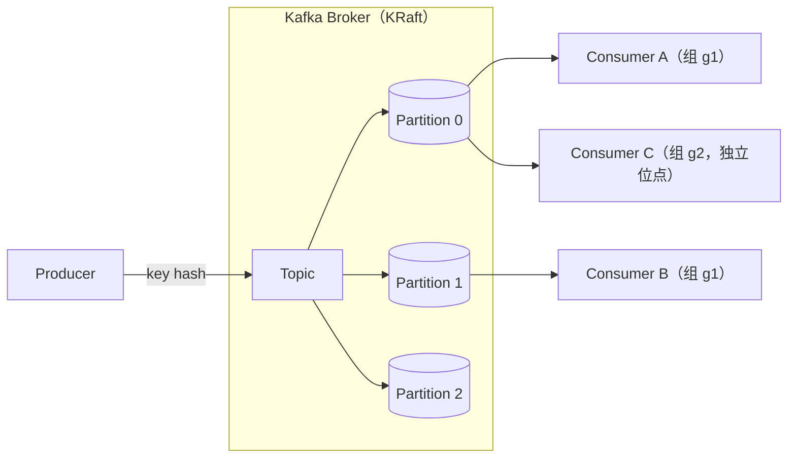

# Apache Kafka 总览

<VersionBadge logo="kafka" product="Apache Kafka" broker="4.3.1" client="kafka-clients 4.3.1" image="tag+digest@.env.versions" />

> 本页结论：Kafka 首先是一个分布式提交日志（commit log）：消息追加写入 Topic 的 Partition 并按 offset 编号，消费不删除日志，回放与多消费组是日志语义的自然结果。

## 定位与适用场景

Kafka 是日志型（Log-based）消息系统的代表：

- **事件流与回放**：消息按 retention 保留，多个消费组可各自从头重读（[实验](/playground/ordering)）。
- **高吞吐持久化管道**：顺序写盘 + 批量 + 零拷贝，适合大量事件的接入与分发。
- **同键有序的任务流**：同一 key 的消息进同一分区，分区内顺序消费。
- **不太适合**：单条消息级别的灵活路由（没有 Exchange/Binding 概念）、需要「消费即删除」的竞争队列语义——Kafka 的删除由 retention 决定，与消费进度无关（对比 RabbitMQ，见 [消息模型](/#mq-models)）。

## 架构速览

核心实体与关系（详见 [核心概念映射](/products/kafka/concepts)）：

| 实体 | 职责 |
| :--- | :--- |
| Broker | 承载分区与副本的服务进程；KRaft 模式下元数据也在集群内复制 |
| Topic | 逻辑分类，由一个或多个 Partition 组成 |
| Partition | 顺序追加的日志段，是并行度、顺序与复制的基本单位 |
| Offset | 分区内消息的单调递增编号，是回放位点 |
| Consumer Group | 组内消费者瓜分分区；组间各自独立位点 |

## 能力摘要

| 维度 | Kafka（本仓库覆盖范围） |
| :--- | :--- |
| 投递语义 | at-least-once（acks=all + 手动提交）；Kafka 内部（produce→consume 同一集群）可 exactly-once（EOS 事务），跨外部系统不成立 |
| 顺序 | 分区内有序；跨分区无全局顺序保证（常见错误认知） |
| 重试/DLQ | 无 Broker 内置消费重试；Retry Topic/DLQ 是应用或框架层模式 |
| 延迟消息 | 无内置延迟消息，需应用层实现 |
| 高可用 | 分区多副本 + ISR；KRaft 管理元数据，无需 ZooKeeper |
| 回放 | 原生支持：按 offset/时间戳重置消费位点（[实验](/playground/ordering)） |

## 学习路径

1. [快速开始](/products/kafka/quick-start)：最短闭环。
2. [核心概念映射](/products/kafka/concepts)：用 Kafka 术语回答统一知识模型。
3. [分区与分发](/products/kafka/routing)：key、分区分配与消费组。
4. [可靠性](/products/kafka/reliability)：acks、幂等生产、offset 提交窗口与事务边界。
5. [存储与高可用](/products/kafka/storage-ha)：日志、retention/compaction、副本与 KRaft。
6. [运维与观测](/products/kafka/operations)、[陷阱与检查表](/products/kafka/pitfalls)。
7. 动手实验：[basic](/products/kafka/quick-start)、[consumer-group](/playground/ordering)、[ordering-replay](/playground/ordering)、[idempotence-transaction](/products/kafka/reliability)、[cli-tools](/products/kafka/operations)。

## 版本基线

- Broker：Kafka 4.3.1（KRaft 单节点，镜像 tag+digest 双锁定，见 `.env.versions`）。
- Java 客户端：`org.apache.kafka:kafka-clients:4.3.1`。
- 官方文档：<https://kafka.apache.org/documentation/>（checkedAt: 2026-08-19）。
