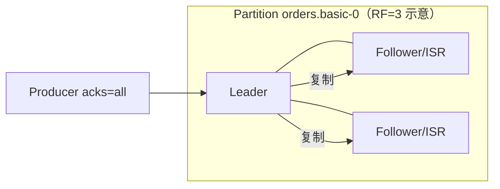

# Apache Kafka 存储与高可用

> 本页结论：Kafka 的存储是「分区日志 + 段文件 + 两种保留策略」，高可用是「分区副本 + ISR + KRaft 元数据复制」；消费永远不删除日志，删除只由 retention 或 compaction 触发。

## 存储模型

- 每个分区是一组**段文件（segment）**：`.log`（记录）+ `.index`/`.timeindex`（offset 与时间戳索引）。追加写 + 顺序读，配合页缓存与零拷贝（sendfile）。
- 记录写入后按 offset 编号；消费者只移动自己的位点，**日志不随消费删除**——这是与队列型 Broker 的根本区别（见 [消息模型](/concepts/models)）。
- 未刷盘的记录在页缓存中：`acks=all` 的「持久」含义是写入 ISR 各副本的页缓存/日志，fsync 时机由 OS 刷页决定（可配 `flush.messages`，但通常依赖副本而非强制 fsync）。

## 两种保留策略（互不等价）

| 策略 | 触发与行为 | 典型配置 |
| :--- | :--- | :--- |
| Retention（delete） | 按时间（`retention.ms`）或大小（`retention.bytes`）删除**整段**旧日志 | 事件流保留 7 天：`retention.ms=604800000` |
| Log Compaction | 后台压缩，每个 key 只保留**最新** value（旧版本可立即读到 tombstone 后消失） | changelog、配置表：`cleanup.policy=compact` |

- 两者可组合（`cleanup.policy=delete,compact`）。
- 注意：**retention 到期删除可能发生在消费者读到之前**——消费组 lag 过大时会真的「错过」消息。回放的前提是数据仍在保留期内。

## 副本与 ISR

- 读写都走 Leader；Follower 从 Leader 拉取复制。
- **ISR（In-Sync Replicas）**：与 Leader 差距在 `replica.lag.time.max.ms` 内的副本集合。`acks=all` 的确认要求写入 ISR 全体；`min.insync.replicas` 是「允许确认的最小 ISR 数」。
- Leader 崩溃：从 ISR 中选举新 Leader（`unclean.leader.election.enable=false` 为安全默认——宁停勿错）。
- 本仓库实验为单节点 RF=1：只演示协议行为，不演示副本故障（多副本故障注入属 L3，默认不执行）。

## KRaft：无 ZooKeeper 的元数据

- Kafka 4.x 已移除 ZooKeeper 依赖：集群元数据（Topic、分区 Leader、配置、ACL）存放在内部 Topic `__cluster_metadata`，由 controller quorum（Raft）复制。
- 单节点可以 broker+controller 合一（本仓库 compose 的 `PROCESS_ROLES=broker,controller`），生产集群应分离角色并保证 controller 奇数节点。
- 好处：元数据变更不再经外部系统、启动更快、运维面更小；升级路径上「ZooKeeper → KRaft 迁移」是旧集群的专项操作。

## 扩展与容量

- 扩 Broker 后新节点是空的：需要分区再分配（reassignment）才利用新容量。
- 分区数决定并行度上限，且 key 分布随分区数变化——**扩分区不可逆**，先想清楚（见 [分区与分发](/products/kafka/routing)）。
- 容量规划要点：保留期 × 每日写入量 × 副本数 = 磁盘需求下限；积压由 lag 表达，不占额外存储（日志本来就在）。

## 常见误区

- 「消费过的消息会被清理」——删除只看 retention/compaction，与消费进度无关。
- 「RF=3 就一定不丢」——`acks=1` 或 ISR 收缩时仍可能丢；确认语义看配置组合，不看副本数。
- 「Kafka 4.x 还要配 ZooKeeper」——4.x 只有 KRaft 模式。

## 官方资料

- Log Compaction：<https://kafka.apache.org/documentation/#compaction>（checkedAt: 2026-08-19）
- Replication：<https://kafka.apache.org/documentation/#replication>（checkedAt: 2026-08-19）
- KRaft：<https://kafka.apache.org/documentation/#kraft>（checkedAt: 2026-08-19）
