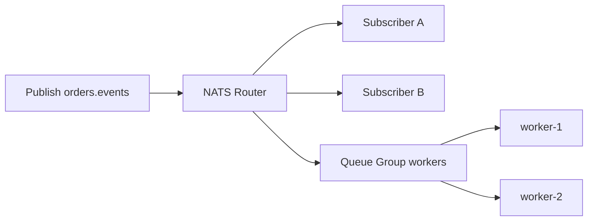
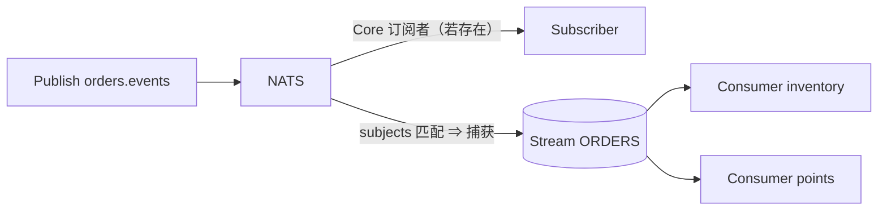

# NATS 路由与分发

> 本页结论：NATS 的路由是 Subject 层级匹配——发布到 `orders.created.eu` 的消息会被订阅 `orders.created.*`、`orders.>` 的订阅者同时收到。Core 层靠订阅关系即时分发，JetStream 层靠 Stream 的 subjects 过滤捕获入日志；Queue Group 提供竞争消费。

## Subject：层级化目的地

- Subject 是点分层级字符串：`orders.created.eu`。
- 通配符订阅：`*` 匹配一段，`>` 匹配剩余所有段。

| 发布 Subject | `orders.created.*` | `orders.>` | `orders.created.eu` |
| :--- | :---: | :---: | :---: |
| `orders.created.eu` | ✅ | ✅ | ✅ |
| `orders.created` | ❌ | ✅ | ❌ |
| `orders.paid.cn` | ❌ | ✅ | ❌ |

- 发布端不需要知道谁在订阅（也不知道有没有人订阅）——这正是 Core NATS 易失语义的来源：无匹配订阅者时消息被丢弃，见 [可靠性](/products/nats/reliability)。

## Core NATS 的三种分发形态



1. **广播**：多个普通订阅者各收一份（发布订阅）。
2. **竞争消费**：`queueSubscribe` 同一 Queue Group 内只投递给一个成员；成员增减时即时无再均衡协议，服务端逐条挑选。
3. **请求响应**：`request` 自动生成回复 Subject，实现一对一 RPC 语义。

> Queue Group 的分发没有任何持久性：组内所有成员离线时，消息直接丢弃。需要「离线也不丢」的竞争消费，用 JetStream。

## JetStream：subjects 捕获 + Consumer 分发

Stream 声明时给出 subjects 过滤器，匹配的消息**复制一份**进入 Stream 日志：



- 同一条消息可以同时服务 Core 订阅者（即时）与多个 Stream/Consumer（持久、可回放）——两层可以共存。
- 每个 Consumer 独立位点：广播 = 多个 Consumer；竞争消费 = 多客户端共享同一个 Consumer（Push 或 Pull 皆可）。
- 通配符同样可用：Stream 可以捕获 `orders.*`，Consumer 还可以用 Filter Subject 在 Stream 内再做一次过滤。

## 与其它产品对照

| 需求 | NATS 的做法 | 对比 |
| :--- | :--- | :--- |
| 按业务类型路由 | Subject 层级 + 通配符（服务端匹配） | RabbitMQ Topic Exchange 类似；RocketMQ 用 Tag |
| 广播 | 多订阅者 / 多 Consumer | 语义一致 |
| 可靠竞争消费 | JetStream 共享 Consumer | Kafka Consumer Group / Redis Consumer Group |
| 按 key 有序并行 | 不适用（无分区） | Kafka Partition Key |
| 请求响应 | Core `request` 原生支持 | RabbitMQ 需自建 reply-to |

## 实验复现

`core-pubsub` 实验演示「无订阅者即丢」与「先订阅再发布」的差异；`jetstream-replay` 演示同一 Stream 上两个独立 Consumer 的分发：

```bash
bash demos/nats/core-pubsub/run.sh
bash demos/nats/jetstream-replay/run.sh
```

## 不保证什么

- Core 层不保证发布时存在任何订阅者（无兴趣探测义务）。
- Queue Group 不保证离线成员补收消息。
- Subject 命名空间是扁平的：没有虚拟主机/租户级隔离（多租户靠 Account/JWT 体系，属平台层配置）。
