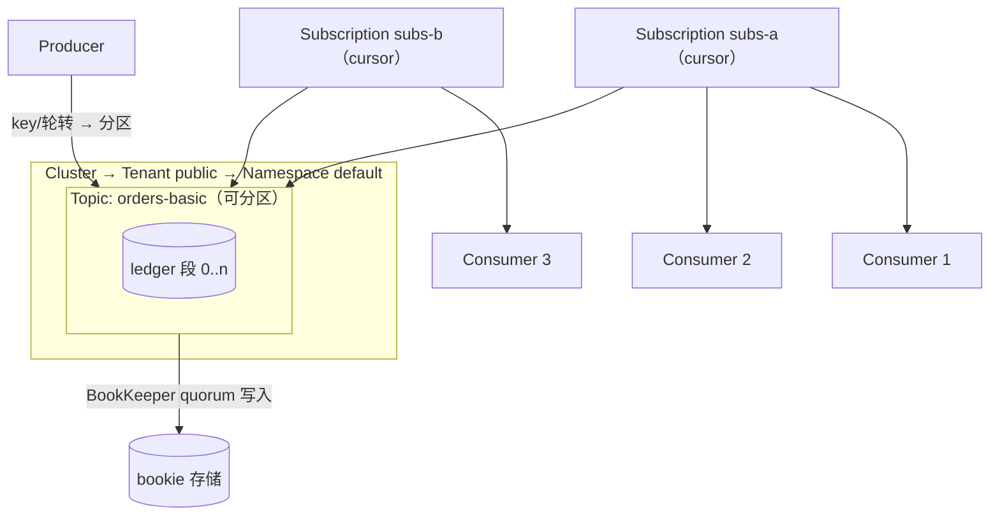

# Apache Pulsar 核心概念映射

> 本页结论：用 Pulsar 的术语逐一回答统一知识模型的十二个维度；关键区分是 Subscription 既是消费关系又是进度（cursor）的所有者，四种订阅类型决定分发语义，而消息日志存在 BookKeeper，不在 Broker 上。

## 实体关系

- **Cluster / Tenant / Namespace**：多租户层级。Topic 全限定名 `persistent://tenant/namespace/local`；retention、TTL、backlog 配额、权限都以 Namespace 为策略单位。standalone 默认提供 `public/default`。
- **Broker**：无状态服务进程，负责接入、Topic 归属（ownership）与订阅分发；不存消息日志，崩溃后 Topic 由其他 Broker 接管。
- **Bookie（BookKeeper）**：存储层。消息按 **managed ledger → ledger（段）→ entry** 追加写入，按 quorum 多副本持久化。
- **元数据服务**：集群成员、Topic 归属、订阅 cursor 等元数据（standalone 内嵌 ZooKeeper）。
- **Topic**：非分区 Topic 与分区 Topic（partitioned topic）两种形态；分区数决定并行度上限，顺序只在单分区内。
- **Subscription**：Topic 上的命名消费关系，四种类型（Exclusive/Shared/Failover/Key_Shared）。Durable 订阅持久保存 cursor；Non-durable（如 Reader）不保存、断开即失。
- **Cursor / MessageId**：cursor 是订阅的消费位点；MessageId 形如 `ledgerId:entryId:partitionIndex`，是 ack 与回放的最小单位。
- **消息**：payload + key + properties + event time；本仓库把 traceId/eventType/aggregateId 放入 properties。

## 十二维度映射

### 1. 定位与适用场景

云原生多租户消息与流：平台化接入、海量 Topic、弹性伸缩、回放。不适合按内容灵活路由（没有 Exchange/Binding 抽象）。

### 2. 核心实体

Producer、Topic、Subscription、Consumer、Broker、Bookie、元数据服务；消息由 MessageId 唯一标识。

### 3. 路由与分发

Pulsar 的「分发」= 订阅模型 + 分区 key 路由：广播靠多个订阅，竞争消费靠 Shared，见专页 [订阅与分发](/products/pulsar/routing)。

### 4. 存储与保留

消息写入 BookKeeper 的 ledger，消费不删除数据。两个互不等价的开关（详见 [存储与高可用](/products/pulsar/storage-ha)）：

| 策略 | 行为 | 典型用途 |
| :--- | :--- | :--- |
| TTL（message expiry） | 到期即删除，**不管是否消费** | 时效性消息：过期无价值 |
| Retention（时间/大小） | 额外保留已过期/已消费数据供回放 | 事件溯源、重放审计 |

两者默认值都是 0（TTL 0 = 永不过期；retention 0 = 不额外保留），策略以 Namespace 为单位设置。

### 5. 生产可靠性

`send()` 同步返回 MessageId 表示消息已按 ack quorum 持久化；异步发送必须处理失败回调。Producer 网络重试可能产生重复，Broker 侧消息去重（deduplication）默认关闭——本仓库以幂等消费兜底，见 [可靠性](/products/pulsar/reliability)。

### 6. 消费可靠性

ack 是逐条（individual）或累积（cumulative）的显式动作；`negativeAcknowledge` 主动触发重投，ack 超时（ackTimeout）兜底未确认消息。崩溃后未 ack 的消息重新投递——at-least-once 的直接来源。

### 7. 投递语义

- at-most-once：发送不等确认 + 先 ack 再处理。
- at-least-once：同步发送确认 + 业务处理完才 ack（标准姿势，basic 实验）。
- exactly-once：事务可实现 **Pulsar 内部**跨 Topic/分区的原子发布与原子 ack；跨外部系统仍需幂等消费（见 [可靠性](/products/pulsar/reliability)）。

### 8. 顺序语义

顺序只在**单分区**内成立。分区 Topic 中同 key 进同一分区；消费侧 Exclusive/Failover 保持单分区顺序，Key_Shared 保持同 key 顺序，**Shared 不保证任何顺序**（见 [陷阱](/products/pulsar/pitfalls)）。详见 [顺序语义](/#mq-ordering)。

### 9. 失败处理

客户端 DeadLetterPolicy：重投次数超过 `maxRedeliverCount` 的消息自动转入死信 Topic（`<topic>--DLQ`），可选重试 Topic。这是客户端内置能力，不是 Broker 自动行为（redelivery-replay 实验）。

### 10. 高可用与扩展

Broker 无状态水平扩展；ledger 按 quorum 复制容忍 bookie 故障；Namespace 可配置跨集群 geo-replication。扩容方式与容量约束见 [存储与高可用](/products/pulsar/storage-ha)。

### 11. 安全与可观测性

认证（TLS 证书、JWT、OAuth2）、授权（tenant/namespace/topic 层级）、传输加密。Broker 暴露 Prometheus 指标（`/metrics`），核心是订阅 backlog 与进出速率。traceId 经消息 properties 传播（本仓库 Demo 贯穿两端日志）。

### 12. 限制与反模式

见专页 [陷阱与检查表](/products/pulsar/pitfalls)。

## 三层语义示例：「消息不会丢」

| 层级 | Pulsar 的成立条件 |
| :--- | :--- |
| Broker/存储层 | 同步发送的确认表示消息已写入 ack quorum 的 bookie；本仓库 standalone 单 bookie，仅覆盖单节点存活场景 |
| Client 层 | Producer 处理发送失败并重试（重试可能重复，靠幂等兜底）；Consumer 业务处理完成才 ack，失败用 negativeAcknowledge |
| Business 层 | 业务写入与幂等记录同事务；**ack 不等于业务数据库已提交**——两者之间存在崩溃窗口，幂等表不可省略 |

## 官方资料

- Messaging Concepts（订阅/ack/重投/DLQ）：<https://pulsar.apache.org/docs/next/concepts-messaging>（checkedAt: 2026-08-19）
- Architecture Overview（Broker/BookKeeper/元数据）：<https://pulsar.apache.org/docs/next/concepts-architecture-overview>（checkedAt: 2026-08-19）
- Multi-tenancy：<https://pulsar.apache.org/docs/next/concepts-multi-tenancy>（checkedAt: 2026-08-19）
