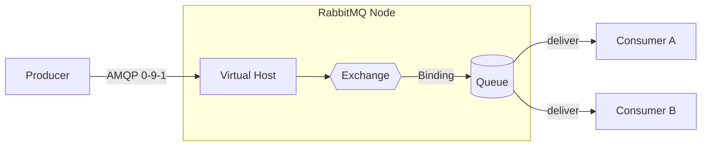

# RabbitMQ 总览

<DockerTooling product="rabbitmq" />

<VersionBadge logo="rabbitmq" product="RabbitMQ" broker="4.1.4" client="amqp-client 5.34.0" image="tag+digest@.env.versions" />

> 本页结论：RabbitMQ 首先是一个支持灵活路由与传统消息队列语义的 Broker；它用 Exchange/Binding 做路由、用 Queue 存消息、用两段独立确认（Publisher Confirms 与 Consumer ACK）构建可靠链路。

## 定位与适用场景

RabbitMQ 是消息队列（Message Queue）家族的典型代表：

- **任务分发**：把耗时任务放入队列，由多个 Worker 竞争消费（Work Queue）。
- **事件广播**：通过 Fanout/Topic Exchange 把一条事件复制给多个独立订阅者。
- **复杂路由**：Routing Key + 多种 Exchange 类型支持按模式分发。
- **不太适合**：超长保留期的日志回放、按任意位点重读历史——消息在 ACK 后即从队列移除，这是队列语义而非日志语义（对比 Kafka，见 [消息模型](/#mq-models)）。

## 架构速览

核心实体与关系（详见 [核心概念映射](/products/rabbitmq/concepts)）：

| 实体 | 职责 |
| :--- | :--- |
| Virtual Host | 隔离边界：Exchange、Queue、权限都在 vhost 内 |
| Connection / Channel | TCP 连接与复用其上的逻辑通道，几乎所有操作在 Channel 上进行 |
| Exchange | 接收消息并按类型 + Binding 路由，本身不存消息 |
| Binding | Exchange → Queue 的路由规则（routing key / headers） |
| Queue | 真正存消息的地方；消费者从队列取消息 |

## 能力摘要

| 维度 | RabbitMQ（本仓库覆盖范围） |
| :--- | :--- |
| 投递语义 | at-most-once（自动 ACK）/ at-least-once（手动 ACK + Confirms）；无跨系统 exactly-once |
| 顺序 | 单队列内 FIFO；重试、requeue 会打乱顺序 |
| 重试/DLQ | 无内置消费重试；TTL + DLX 组合模式（[实验](/playground/poison-message)） |
| 延迟消息 | 队列级/消息级 TTL + DLX 组合；per-message TTL 按队头计算 |
| 高可用 | Quorum Queue（Raft 多数派复制）；Classic Queue 镜像模式已弃用 |
| 回放 | 不适用（队列语义，ACK 后删除）；RabbitMQ Streams 是例外 |

## 学习路径

1. [快速开始](/products/rabbitmq/quick-start)：最短闭环。
2. [核心概念映射](/products/rabbitmq/concepts)：用 RabbitMQ 术语回答统一知识模型。
3. [路由与分发](/products/rabbitmq/routing)：Exchange 类型与绑定。
4. [可靠性](/products/rabbitmq/reliability)：两段确认与崩溃窗口。
5. [存储与高可用](/products/rabbitmq/storage-ha)：三种队列与 Quorum 权衡。
6. [运维与观测](/products/rabbitmq/operations)、[陷阱与检查表](/products/rabbitmq/pitfalls)。
7. 动手实验：[basic](/playground/basic-flow)、[consumer-crash](/playground/consumer-crash)、[routing 与 retry-dlq](/playground/poison-message)、[cli-tools](/products/rabbitmq/operations)。

## 版本基线

- Broker：RabbitMQ 4.1.4（镜像 tag+digest 双锁定，见 `.env.versions`）。
- Java 客户端：`com.rabbitmq:amqp-client:5.34.0`。
- 官方文档：<https://www.rabbitmq.com/docs/>（checkedAt: 2026-08-19）。
