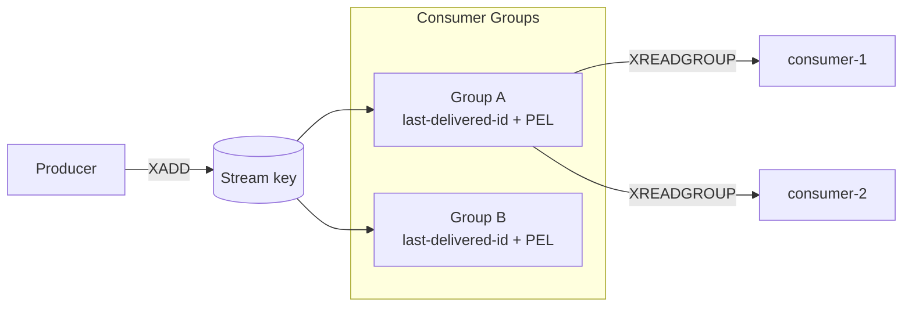

# Redis Streams 总览


<VersionBadge logo="redis" product="Redis Streams" broker="8.2.1" client="jedis 6.0.0" image="tag+digest@.env.versions" />

> 本页结论：Redis Streams 是 Redis 内的追加日志（append-only log）数据结构：条目写入后不随消费删除，Consumer Group 记录各自的消费位置，未确认条目通过 Pending Entries List 追踪重投。它是「轻量场景下的持久日志 + 竞争消费」，不是 Kafka 式多 Broker 分区日志。

## 定位与适用场景

Redis Streams（Redis 5.0 引入）在消息系统光谱中的位置：

- **追加日志语义**：`XADD` 写入的条目（Entry）带有自增 Entry ID，写入后常驻，消费不删除——与 Kafka 的分区日志同类，与 RabbitMQ 队列相反。
- **竞争消费**：Consumer Group 内多个消费者用 `XREADGROUP` 分摊条目，每组独立维护消费位置。
- **轻量可靠队列**：已有 Redis 且消息量不大时，省去额外部署 Broker；适合会话事件、轻量任务队列、活动流。
- **不太适合**：大规模长期保留与回放（受单机内存约束）、跨多 Broker 的水平分区日志、多租户平台——单个 Stream Key 不会自动分裂成分区（见 [存储与高可用](/products/redis-streams/storage-ha)）。

> 边界提示：本分卷只讨论 Streams。Redis Pub/Sub 是易失的广播通道，不是可靠队列，二者不可互相替代（对比 NATS Core 与 JetStream 的分层，见 [/products/nats/](/products/nats/)）。

## 架构速览



核心实体与关系（详见 [核心概念映射](/products/redis-streams/concepts)）：

| 实体 | 职责 |
| :--- | :--- |
| Stream | 某个 key 下的追加日志；条目 = Entry ID + 字段键值对 |
| Entry ID | `毫秒时间戳-序号`（如 `1755600000000-0`），天然有序，可用作时间轴 |
| Consumer Group | 独立消费位点（last-delivered-id）+ 该组的 PEL；多组互不影响 |
| Consumer | 组内的具名消费者实例，组内条目按竞争方式分发 |
| PEL（Pending Entries List） | 已投递但未 `XACK` 的条目清单，是重投递与故障接管的依据 |

## 能力摘要

| 维度 | Redis Streams（本仓库覆盖范围） |
| :--- | :--- |
| 投递语义 | at-most-once（NOACK）/ at-least-once（XREADGROUP + XACK）；无 exactly-once |
| 顺序 | 单个 Stream 内全局 FIFO；组内分发不保证多消费者间的全局处理顺序 |
| 重试/DLQ | 无内置重试/DLQ；PEL + XCLAIM/XAUTOCLAIM 自建（[实验](#动手实验)） |
| 延迟消息 | 不适用（无原生延迟投递；需业务用 ZSET 等自建） |
| 高可用 | Redis 主从复制（异步）/ Redis Sentinel / Redis Cluster；消息安全取决于持久化与复制配置 |
| 回放 | 支持：`XRANGE`/`XREAD` 按 Entry ID 或时间任意回读；消费位置可重置（`XGROUP SETID`） |

## 学习路径

1. [快速开始](/products/redis-streams/quick-start)：最短闭环。
2. [核心概念映射](/products/redis-streams/concepts)：用 Redis Streams 术语回答统一知识模型。
3. [路由与分发](/products/redis-streams/routing)：Stream key、多组广播与组内竞争。
4. [可靠性](/products/redis-streams/reliability)：XACK、PEL 与崩溃窗口。
5. [存储与高可用](/products/redis-streams/storage-ha)：保留策略、持久化与复制边界。
6. [运维与观测](/products/redis-streams/operations)、[陷阱与检查表](/products/redis-streams/pitfalls)。

## 动手实验

本仓库提供三个可重复实验：

- `redis-streams basic`（L1）：XADD + Consumer Group + XACK + 幂等落库，验证「消费后条目仍在 Stream」。
- `redis-streams consumer-crash`（L2）：XACK 前崩溃 → 条目滞留 PEL → XCLAIM 接管 → 幂等表拦截重复。
- `redis-streams cli-tools`：纯镜像自带 `redis-cli` 六件套完成 XADD/XREADGROUP/XACK 闭环（见 [运维与观测](/products/redis-streams/operations)）。

```bash
bash demos/redis-streams/basic/run.sh
bash demos/redis-streams/consumer-crash/run.sh
bash demos/redis-streams/docker/run.sh
```

## 版本基线

- Broker：Redis 8.2.1（镜像 tag+digest 双锁定，见 `.env.versions`）。
- Java 客户端：`redis.clients:jedis:6.0.0`。
- 官方文档：<https://redis.io/docs/latest/develop/data-types/streams/>（checkedAt: 2026-08-19）。
