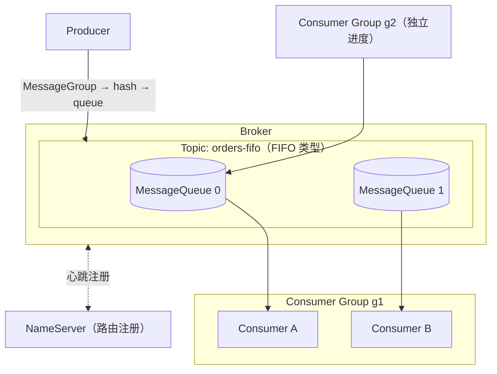

# Apache RocketMQ 核心概念映射

> 本页结论：用 RocketMQ 的术语逐一回答统一知识模型的十二个维度；关键区分是 Topic 的消息类型决定行为边界、MessageQueue 承担「顺序/并行/负载」三重角色、Tag 与 Key 各司「过滤」与「索引/业务关联」两职。

## 实体关系

- **NameServer**：无状态、可多节点的路由注册中心。Broker 周期性注册 Topic 与队列路由；Producer/Consumer 据此寻址 Broker。它不做存储、不参与消息转发。
- **Broker**：消息的存储与转发节点。所有消息追加进统一的 CommitLog，再派生 ConsumeQueue 与 IndexFile 索引（见 [存储与高可用](/products/rocketmq/storage-ha)）。
- **Proxy（5.x）**：无状态接入层，承接 gRPC 客户端、聚合收发与鉴权；本仓库客户端经 proxy `127.0.0.1:8081` 连接，不直连 Broker。
- **Topic**：逻辑分类，创建时声明消息类型。本仓库关闭了 `autoCreateTopicEnable`，由 `mqadmin updateTopic` 显式建 Topic 并带 `+message.type=...`。
- **MessageQueue**：Topic 的物理分片，类似 Kafka 分区——它同时是顺序保证、消费并行度与负载分担的基本单位。
- **Consumer Group**：消费与进度的归属单位。组内消费者分担队列；消费重试次数、重试策略与 DLQ 都挂在消费组上。
- **Tag / Key**：消息的两个正交属性——Tag 用于 Broker 侧过滤（订阅表达式），Key 用于索引检索与业务关联（详见 [路由与分发](/products/rocketmq/routing)）。

## 十二维度映射

### 1. 定位与适用场景

业务消息平台：订单流、事务消息、延迟/定时任务、同键有序任务流。不适合把 Broker 重试当限流/背压（见 [陷阱](/products/rocketmq/pitfalls)）。

### 2. 核心实体

NameServer、Broker、Proxy、Topic、MessageQueue、Producer、Consumer Group。消息本身带 Topic、Tag、Key、Body 与自定义属性（properties）。

### 3. 路由与分发

RocketMQ 的「路由」= Topic 寻址 + Tag 过滤 + MessageQueue 分担 + MessageGroup 顺序，见专页 [路由与分发](/products/rocketmq/routing)。无 Exchange/Binding 概念；分发到多个下游靠多个消费组。

### 4. 存储与保留

消息追加写 CommitLog，派生 ConsumeQueue/IndexFile。消费不删除消息，删除由保留期（`fileReservedTime`/`deleteWhen`）触发，与消费进度解耦（见 [存储与高可用](/products/rocketmq/storage-ha)）。

### 5. 生产可靠性

发送有同步/异步/单向三种模式。超时或失败**不代表 Broker 一定没收到**——网络重试下可能已写入，必须用幂等键（messageId/业务唯一键）在消费端去重（见 [可靠性](/products/rocketmq/reliability)）。

### 6. 消费可靠性

- **PushConsumer**：Broker/客户端框架驱动，监听器回调返回 `SUCCESS`/`FAILURE`；框架自动管理拉取与重试节奏。
- **SimpleConsumer**：主动 `receive` 拉取、逐条处理、处理完手动 `ack`；ack 时机由业务掌控（本仓库 basic 实验用此模式）。
两者差异详见 [可靠性](/products/rocketmq/reliability)。

### 7. 投递语义

at-least-once 是标准姿势（业务提交后才 ack）；崩溃窗口下的重投靠幂等表拦截。端到端 exactly-once 不成立（见 [投递语义](/concepts/delivery-semantics)）。

### 8. 顺序语义

同一 MessageGroup 的消息进同一队列并顺序消费 → 局部顺序；跨队列无全局顺序。FIFO Topic 中一个队列同一时刻只被一个消费者串行处理；失败消息会阻塞该队列后续消息（失败阻塞风险，见 [路由与分发](/products/rocketmq/routing)）。

### 9. 失败处理

Broker 内置消费重试与 DLQ：失败按消费组重试策略（次数 + 间隔）重投，达到上限进 `%DLQ%<消费组名>`。详见 [可靠性](/products/rocketmq/reliability) 与 [retry-dlq 实验](/matrix/experiment/poison-message)。

### 10. 高可用与扩展

Broker 主从复制（同步/异步）、DLedger（Raft）自动选主、5.x Controller 模式；5.x 引入无状态 Proxy 分离接入与存储。详见 [存储与高可用](/products/rocketmq/storage-ha)。

### 11. 安全与可观测性

ACL 鉴权、TLS、实例级隔离（云上）；指标经 Broker 统计与 Dashboard。traceId 经消息属性（properties）传播，本仓库 Demo 已贯穿 producer/consumer 日志。

### 12. 限制与反模式

见专页 [陷阱与检查表](/products/rocketmq/pitfalls)。

## 三层语义示例：「消息不会丢」

| 层级 | RocketMQ 的成立条件 |
| :--- | :--- |
| Broker 层 | 同步刷盘 + 同步复制时确认才表示多副本可读；本仓库 `ASYNC_FLUSH`/`ASYNC_MASTER` 单节点，确认仅表示该 Broker 已接受 |
| Client 层 | Producer 处理发送结果；SimpleConsumer 业务提交后才 ack，PushConsumer 处理完才返回 `SUCCESS` |
| Business 层 | 业务写入与幂等记录同事务；**ack 不等于业务数据库已提交**——两者之间存在崩溃窗口，靠幂等表兜底（见 [可靠性](/products/rocketmq/reliability)） |

## 官方资料

- 领域模型（Message）：<https://rocketmq.apache.org/docs/domainModel/04main>（checkedAt: 2026-08-19）
- Topic：<https://rocketmq.apache.org/docs/domainModel/02topic>（checkedAt: 2026-08-19）
- RocketMQ 文档首页：<https://rocketmq.apache.org/docs/>（checkedAt: 2026-08-19）
