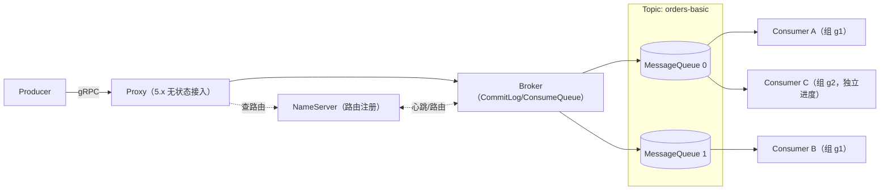

# Apache RocketMQ 总览

<VersionBadge logo="rocketmq" product="Apache RocketMQ" broker="5.5.0" client="rocketmq-client-java 5.2.0" image="tag+digest@.env.versions" />

> 本页结论：RocketMQ 是一体化消息平台——NameServer 管路由、Broker 存日志、（5.x 的）Proxy 提供 gRPC 接入；Topic 按 MessageQueue 分片、按消息类型（Normal/FIFO/Delay/Transaction）约束行为，消费组级重试与 DLQ 是内置的。

## 定位与适用场景

RocketMQ 介于日志型与队列型之间，偏「业务消息平台」：

- **业务事件与订单流**：内置事务消息、延迟/定时消息、消费重试与 DLQ，贴近电商类业务链路（[实验](/playground/index)）。
- **同键有序的任务流**：FIFO Topic + MessageGroup，同一业务键的消息按序消费。
- **多消费组广播/分担**：同一 Topic 可被多个消费组独立消费，组内按 MessageQueue 分担。
- **不太适合**：把 Broker 内消费重试当日常限流/背压手段（重试是失败恢复，不是流控，见 [陷阱](/products/rocketmq/pitfalls)）；「消费即删除」的纯竞争队列语义也不是它的主场——消息由保留期清理，与消费进度解耦（对比见 [消息模型](/#mq-models)）。

## 架构速览

核心实体与关系（详见 [核心概念映射](/products/rocketmq/concepts)）：

| 实体 | 职责 |
| :--- | :--- |
| NameServer | 轻量路由注册中心：Broker 心跳注册 Topic/队列路由，客户端据此寻址 |
| Broker | 存储与转发：消息追加进 CommitLog，派生 ConsumeQueue/IndexFile 索引 |
| Proxy（5.x） | 无状态接入层：承接 gRPC 客户端、聚合收发，本仓库经 `127.0.0.1:8081` 连接 |
| Topic | 逻辑分类，创建时声明消息类型（NORMAL/FIFO/TRANSACTION 等） |
| MessageQueue | Topic 的物理分片，类似分区：并行度、顺序与负载分担的基本单位 |
| Consumer Group | 消费与进度的归属单位：组内分担队列，重试与 DLQ 都挂在组上 |

## 能力摘要

| 维度 | RocketMQ（本仓库覆盖范围） |
| :--- | :--- |
| 投递语义 | at-least-once（业务提交后才 ack）；端到端 exactly-once 不成立，靠幂等消费兜底 |
| 顺序 | 同一 MessageGroup 在同一队列内有序；跨队列无全局顺序保证 |
| 重试/DLQ | Broker 内置：消费失败按组重试策略重投，达上限进 `%DLQ%<组名>`（[实验](/playground/poison-message)） |
| 延迟消息 | 内置定时/延迟消息（`setDeliveryTimestamp`），Broker 到点才投递 |
| 事务消息 | Half Message + 本地事务 + 回查（check-back）：保证「本地事务结果与消息投递一致」，不覆盖下游副作用 |
| 高可用 | 主从复制 / DLedger（Raft）/ 5.x Controller 模式（原理见 [存储与高可用](/products/rocketmq/storage-ha)） |

## 学习路径

1. [快速开始](/products/rocketmq/quick-start)：最短闭环（Normal Topic + SimpleConsumer 幂等落库）。
2. [核心概念映射](/products/rocketmq/concepts)：用 RocketMQ 术语回答统一知识模型。
3. [路由与分发](/products/rocketmq/routing)：Topic + Tag 过滤 + MessageQueue 分担 + MessageGroup 顺序。
4. [可靠性](/products/rocketmq/reliability)：发送确认、ack 时机、幂等消费与事务消息边界。
5. [存储与高可用](/products/rocketmq/storage-ha)：CommitLog/ConsumeQueue/IndexFile、复制与 Proxy。
6. [运维与观测](/products/rocketmq/operations)、[陷阱与检查表](/products/rocketmq/pitfalls)。
7. 动手实验：[basic](/products/rocketmq/quick-start)、[fifo-delay](/products/rocketmq/routing)、[transaction](/products/rocketmq/reliability)、[retry-dlq](/products/rocketmq/reliability)、[cli-tools](/products/rocketmq/operations)。

## 版本基线

- Broker / NameServer / Proxy：Apache RocketMQ 5.5.0（`apache/rocketmq:5.5.0`，镜像 tag+digest 双锁定，见 `.env.versions` 的 `ROCKETMQ_IMAGE`）。
- Java 客户端：`org.apache.rocketmq:rocketmq-client-java:5.2.0`（5.x gRPC 客户端，经 proxy `127.0.0.1:8081` 连接）。
- 官方文档：<https://rocketmq.apache.org/docs/>（checkedAt: 2026-08-19）。

## 官方资料

- RocketMQ 文档首页：<https://rocketmq.apache.org/docs/>（checkedAt: 2026-08-19）
- 领域模型（Message）：<https://rocketmq.apache.org/docs/domainModel/04main>（checkedAt: 2026-08-19）
- Topic：<https://rocketmq.apache.org/docs/domainModel/02topic>（checkedAt: 2026-08-19）
