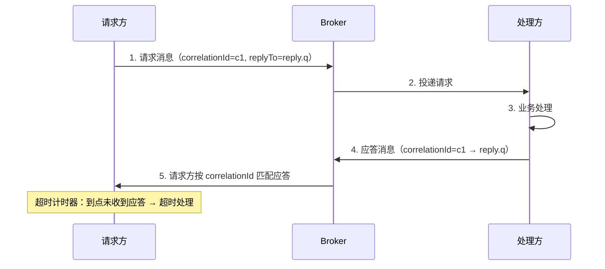

# 请求-应答（Request-Reply）

> 本页结论：请求-应答是用两条独立的单向消息模拟一次「调用」：请求消息带 `correlationId` 与回复目的地（reply-to 队列/topic），处理方把结果作为另一条消息发回。Broker 不保证「一定有回复」——超时、重复、回复丢失都必须由请求方处理；它是消息系统上的应用层协议，不是 Broker 内置能力。

## 适用场景

- 调用方需要结果，但希望双方解耦、可排队、可重试，而不是强耦合的同步 HTTP/RPC。
- 后端处理耗时不稳定，需要用队列缓冲请求（如风控审核、报表生成）。
- 跨语言/跨团队的异步接口，用统一信封承载请求与应答。

不适合：需要毫秒级响应的在线调用、需要事务性「调用即成功」的语义——消息系统给不了硬实时保证。

## 协议要素

三个不可省略的要素：

| 要素 | 作用 | 本仓库信封对应 |
| :--- | :--- | :--- |
| correlationId | 把应答匹配回请求；应答重复时去重 | `correlationId`（§5.2 必填） |
| reply-to 目的地 | 告诉处理方应答发到哪（临时队列、固定 topic、或请求中声明） | 放在消息头或 payload 约定字段 |
| 超时 | Broker 不产生「未应答」信号，只能由请求方计时 | 应用层实现 |

`messageId` 标识消息本身，`correlationId` 关联业务会话——一条请求超时后重试，会产生**新的 messageId、相同的 correlationId**。

## 超时与重复：两个必须设计的分支

- **超时 ≠ 失败**。超时时处理方可能仍在处理、可能已处理但应答丢失、也可能从未收到。盲目重发请求会造成重复处理——处理方必须按[幂等消费](/reference/patterns/idempotent-consumer)设计（用 correlationId 或业务键去重）。
- **应答也会重复与丢失**。请求方收到同 correlationId 的第二个应答应直接丢弃；等待窗口内收不到应答，要区分「重发请求」还是「转人工/降级」。
- **建议策略**：幂等键前置——处理方先登记 correlationId 再处理，重发请求到达时直接返回已有结果，而不是重复执行业务。

## 四产品实现要点

| 产品 | 回复通道 | 备注 |
| :--- | :--- | :--- |
| RabbitMQ | 每请求方一个 exclusive 回复队列，或 Direct Reply-to（伪队列 `amq.rabbitmq.reply-to`，免声明队列） | 最经典的 RPC 形态，官方 Tutorial 6 即此模式 |
| Kafka | 约定 reply topic + 请求头带 correlationId 与 reply topic | 请求方从 reply topic 消费并按 correlationId 匹配；注意 reply topic 的分区数与请求方数量 |
| RocketMQ | 同 Kafka 思路：reply topic + 消息属性带 correlationId | 也可用消息属性中的 reply 字段约定 |
| Pulsar | reply topic / 独立订阅 | 请求方用独立订阅消费应答 |

## 保证成立的条件 / 不保证什么

- 条件：请求与应答两侧都是 at-least-once 投递；两侧都做幂等；请求方持有超时与重试策略；correlationId 全链路透传。
- 不保证：应答时限（MQ 没有请求级 SLA）；处理方恰好处理一次；请求与应答之间的顺序（不同 correlationId 之间无顺序关系）。
- 警惕反模式：用请求-应答把消息队列「RPC 化」做同步调用链——这等于用异步组件拼同步系统，失去了削峰与解耦收益，还叠加了两套失败模式。真要同步调用就用 RPC 框架。

## 常见误区

- 「correlationId 可以省略，用 messageId 匹配」——请求重发后 messageId 变了，匹配会失效；必须用业务侧稳定的 correlationId。
- 「超时说明对方没收到」——三种可能都存在（未收到/处理中/应答丢失），处理方必须幂等才能安全重发。
- 「回复队列可以长期共用且不设 TTL」——无人消费的回复队列会积压甚至泄漏，临时回复队列应设过期或自动删除。

## 官方资料

- RabbitMQ Tutorial 6 – RPC：<https://www.rabbitmq.com/tutorials/tutorial-six-python>（checkedAt: 2026-08-19）
- RabbitMQ Direct Reply-to：<https://www.rabbitmq.com/docs/direct-reply-to>（checkedAt: 2026-08-19）
- Kafka Message Headers（Producer/Consumer API）：<https://kafka.apache.org/documentation/#producerapi>（checkedAt: 2026-08-19）
