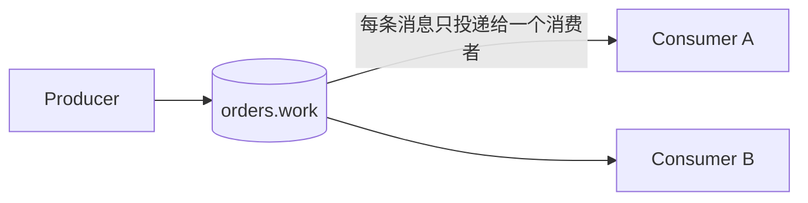

# 工作队列（竞争消费）

> 本页结论：工作队列（Work Queue）里每条消息只会被同组中的一个消费者处理，横向扩容靠「加消费者」而不是「加队列」。分发形状由 prefetch / 分区分配决定，失败边界由 ACK / offset 提交时机决定：未被确认的消息会被重投，因此消费端必须按[幂等消费](/reference/patterns/idempotent-consumer)设计。

## 适用场景

- 任务分发：同类任务（扣库存、发通知、生成报表）由一组消费者实例分摊处理。
- 削峰：生产速率瞬时高于消费能力时，消息在 Broker 排队，消费者按自己的能力领取（见[背压与积压](/#mq-backpressure)）。
- 弹性伸缩：高峰期加消费者实例，低谷期缩容，无需改动生产者。

## 核心模型

竞争边界是「同一个队列 / 同一个消费组」：

- 队列/消费组**内部**是竞争消费——一条消息只到一个消费者；
- 不同队列/不同订阅之间是复制分发——那是[发布订阅](/reference/patterns/pub-sub)的语义。

这是[消息模型](/#mq-models)中「点对点」的统一抽象，四个产品只是实现机制不同。

## 四产品实现对照

| 产品 | 竞争边界 | 分配机制 | 并行度上限 |
| :--- | :--- | :--- | :--- |
| RabbitMQ | 同一队列的多个消费者 | Broker 按 prefetch 与消费者状态推送 | 消费者数（受 prefetch 影响） |
| Kafka | 同一 consumer group | 分区在组内分配，一个分区只归一个消费者 | 分区数（多余消费者空闲） |
| RocketMQ | 同一 consumer group（集群模式 Clustering） | message queue 在组内均分 | message queue 数 |
| Pulsar | 同一 Shared 订阅 | Broker 轮询/按 key 分发给订阅内消费者 | 消费者数（分区 topic 还受分区数影响） |

## 分发形状：prefetch 与分区

- **RabbitMQ**：`basic.qos(prefetch=N)` 决定每个消费者最多同时持有 N 条未确认消息。prefetch 过大（如默认 250 以上）会把消息压在少数「快连接」的消费者上，出现忙闲不均；任务处理时间差异大时建议小 prefetch（如 1～10），让 Broker 按完成节奏补发。
- **Kafka / RocketMQ**：并行度上限是分区 / message queue 数。消费者数超过分区数，多出来的实例分不到分区，完全空闲。扩容消费者前要先确认分区数够不够（见[容量规划](/reference/operations/capacity-planning)）。
- **顺序约束**：同一分区/队列内按写入顺序投递。需要「同一 orderId 有序」时，竞争消费与顺序语义要一起设计——用 `aggregateId` 作分区/路由键（见[顺序语义](/#mq-ordering)）。

## 失败边界与重投

竞争消费不改变投递语义：

- RabbitMQ 消费者崩溃，未 ACK 的消息重新入队并投给其他消费者——本仓库实验可复现（见[消费者崩溃与重投](/playground/consumer-crash)）。
- Kafka 消费者崩溃，从上次已提交 offset 起重读，重投单位是「一批」而不是一条（见 [Kafka 可靠性](/products/kafka/reliability)）。

结论：at-least-once 下业务**必须预期重复**，竞争消费越容易崩溃重启，越需要[幂等消费](/reference/patterns/idempotent-consumer)兜底。

## 保证成立的条件 / 不保证什么

- 条件：手动确认（ACK / 手动提交 offset）+ 合理 prefetch/分区数 + 消费者处理失败有明确的 nack/重试路径（见[重试与 DLQ](/reference/patterns/retry-and-dlq)）。
- 不保证：消息恰好被处理一次；消费者间负载均衡绝对均匀；队列中消息的持久性（取决于 Broker 持久化配置，见各产品可靠性页）。

## 常见误区

- 「消费者越多吞吐越高」——Kafka/RocketMQ 受分区数限制，超过后加消费者无效；RabbitMQ 加到争抢大于收益后吞吐反而下降。
- 「工作队列就是发布订阅」——工作队列一条消息只到一个消费者；要每个下游都收到同一事件，用[发布订阅](/reference/patterns/pub-sub)。
- 「消费者拿到消息就算成功」——成功以「业务提交 + 确认」为准，见[投递语义](/#mq-delivery-semantics)。

## 官方资料

- RabbitMQ Tutorial 2 – Work Queues：<https://www.rabbitmq.com/tutorials/tutorial-two-python>（checkedAt: 2026-08-19）
- RabbitMQ Consumer Prefetch：<https://www.rabbitmq.com/docs/consumer-prefetch>（checkedAt: 2026-08-19）
- Kafka Consumer Configs（group.id 等）：<https://kafka.apache.org/documentation/#consumerconfigs>（checkedAt: 2026-08-19）
- Pulsar Subscriptions：<https://pulsar.apache.org/docs/concepts-messaging/>（checkedAt: 2026-08-19）
