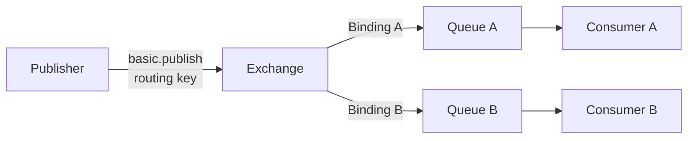

# AMQP 0-9-1：Exchange、Binding 与 Queue

> 本页结论：AMQP 0-9-1 是 RabbitMQ 的经典二进制消息协议与拓扑模型。发布者把消息发给 Exchange，Exchange 按 Binding 规则路由到一个或多个 Queue，消费者再从 Queue 接收并确认。它与 AMQP 1.0 名称相近，但不是线兼容的同一协议版本。

## 核心拓扑



| 实体 | 职责 |
| --- | --- |
| Exchange | 接收发布消息，根据类型和 Binding 计算路由 |
| Queue | 保存等待投递的消息，为消费者提供竞争消费 |
| Binding | 描述 Exchange 到 Queue 的路由关系，可包含 Binding Key |
| Routing Key | 发布时携带的路由字符串，由 Exchange 类型解释 |
| Consumer | 订阅 Queue，处理消息并发送 ACK/NACK |

## 四种经典 Exchange

| 类型 | 路由规则 | 常见用途 |
| --- | --- | --- |
| Direct | Routing Key 与 Binding Key 精确相等 | 命令、按类型分流 |
| Fanout | 忽略 Routing Key，复制到所有绑定 Queue | 广播 |
| Topic | 按点分层模式匹配，`*` 单层、`#` 多层 | 事件分类订阅 |
| Headers | 根据消息 Header 匹配 | 多字段路由 |

发布者通常不能“直接发送到 Queue”。空名称的 Default Exchange 会自动以 Queue 名作为 Binding Key，因此看起来像直接发送。

## Connection 与 Channel

AMQP 0-9-1 通常使用长连接。一个 TCP Connection 内可以复用多个 Channel，每个 Channel 是独立的轻量逻辑连接。应用常复用 Connection、按线程或执行上下文创建 Channel；不要默认把同一个 Channel 并发共享给任意线程。

```text
TCP Connection
├── Channel 1：发布
├── Channel 2：消费 Queue A
└── Channel 3：消费 Queue B
```

## 两类确认不要混淆

- **Consumer ACK/NACK**：消费者告诉 Broker 某次投递是否已经处理，可以删除、重投或拒绝。
- **Publisher Confirm**：Broker 告诉发布者消息已经被本节点接受。Publisher Confirm 是 RabbitMQ 对 AMQP 0-9-1 的扩展，不等于消费者已经完成业务。

端到端可靠性仍需同时配置持久 Queue、持久消息、发布确认、消费确认和业务幂等。

## AMQP 0-9-1 与 AMQP 1.0

| AMQP 0-9-1 | AMQP 1.0 |
| --- | --- |
| 协议定义 Exchange、Queue、Binding 等 Broker 拓扑 | 协议聚焦消息传输、Link 和 Settlement，不强制 Broker 拓扑 |
| 客户端可以声明 Exchange/Queue/Binding | 客户端附着 Source/Target Node，地址含义由节点实现解释 |
| RabbitMQ 的经典主协议 | 跨厂商企业消息互操作标准 |
| 不能与 AMQP 1.0 客户端直接对话 | 需要 Broker 的 AMQP 1.0 接入实现 |

## 适用边界

适合 RabbitMQ 的灵活路由、工作队列、发布订阅和请求响应。若目标是跨不同厂商 Broker 的统一线协议，优先评估 [AMQP 1.0](/reference/protocols/amqp-10)；若是设备弱网通信，参考 [MQTT](/reference/protocols/mqtt)。

官方资料：[RabbitMQ AMQP 0-9-1 协议](https://www.rabbitmq.com/amqp-0-9-1-protocol) · [AMQP 0-9-1 模型](https://www.rabbitmq.com/tutorials/amqp-concepts)
