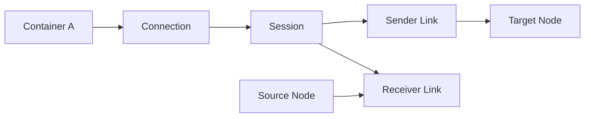

# AMQP 1.0：跨产品消息传输标准

> 本页结论：AMQP 1.0 是 OASIS 标准化的二进制线协议，定义类型编码、传输、消息格式、事务与安全层。它通过 Link 在 Source 与 Target Node 之间传递消息，并用 Delivery State/Settlement 表达确认结果；它不规定所有 Broker 都必须采用 Exchange/Queue/Binding 拓扑。

## 分层结构

| 层 | 解决的问题 |
| --- | --- |
| Types | 基础类型、复合类型与二进制编码 |
| Transport | Connection、Session、Link、Flow、Transfer、Disposition |
| Messaging | 标准消息段、Source/Target、Distribution Mode、过滤器 |
| Transactions | 声明事务、事务性传输与结果 |
| Security | SASL 与 TLS 等安全协商 |

## Container、Connection、Session、Link

- **Container**：承载 AMQP 节点与连接的进程或应用身份。
- **Connection**：两个 Container 之间的网络连接。
- **Session**：Connection 内双向有序的协议上下文。
- **Link**：单向消息传输通道，角色为 Sender 或 Receiver。
- **Source / Target**：Link 两端附着的消息节点，地址和具体语义由实现映射。

一个 Connection 可以承载多个 Session，一个 Session 又可以挂多个 Link。Link Credit 提供接收方驱动的流量控制，避免发送者无限推送。

## Settlement 与消息结果

发送方传输 Delivery，接收方通过 Disposition 报告状态：

| 结果 | 含义 |
| --- | --- |
| `accepted` | 接收方接受该 Delivery |
| `rejected` | 明确拒绝，可附错误信息 |
| `released` | 未处理并释放，可能再次分发 |
| `modified` | 释放并附加投递状态修改建议 |

Settlement 解决协议双方何时不再跟踪 Delivery，不自动代表数据库事务已提交。Broker、客户端和业务层仍要分别讨论持久化、重投与幂等。

## 标准消息格式

AMQP 1.0 消息由若干标准段组成：Header、Delivery Annotations、Message Annotations、Properties、Application Properties、Body、Footer。Body 可以是二进制数据、值或序列；Application Properties 适合业务键值元数据。

## 互操作不等于语义完全相同

AMQP 1.0 客户端可以连接不同厂商实现，但以下内容仍可能由 Broker 定义：

- 地址字符串怎样映射到 Queue、Topic、Address 或 Subscription。
- 自动创建节点的规则与权限。
- 持久化、过期、死信、延迟和事务能力。
- 过滤器、动态节点与扩展 Annotation 的支持程度。

迁移前要以同一组发送、确认、断线恢复和地址映射用例做互操作测试。

## 与本站产品的关系

- [ActiveMQ Artemis](/products/artemis/)：AMQP 1.0 是其重要跨语言接入协议之一。
- [ActiveMQ Classic](/products/activemq-classic/)：可通过 AMQP 1.0 接入，同时保留 OpenWire 原生路径。
- [RabbitMQ](/products/rabbitmq/)：同时支持 AMQP 0-9-1 与 AMQP 1.0，两种客户端模型不同。

官方标准：[OASIS AMQP 1.0 Overview](https://docs.oasis-open.org/amqp/core/v1.0/amqp-core-overview-v1.0.html)
