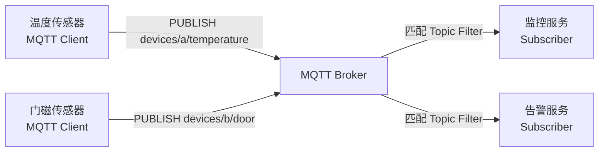

# MQTT：轻量发布订阅协议

> 本页结论：MQTT 是面向受限设备、低带宽和不稳定网络设计的 Client/Server 发布订阅传输协议。它定义 Topic、订阅、QoS、会话、Retained Message 与 Will Message，但不等于某个具体 Broker，也不自动提供事件日志回放、业务事务或端到端 Exactly Once。

标准基线：MQTT 3.1.1 与 MQTT 5.0，核对日期 2026-08-23。规范入口见[官方资料基线](/reference/sources)。

## MQTT 与 Broker 的关系



- **MQTT Client**：发布消息、创建订阅，或者同时扮演两种角色。
- **MQTT Server/Broker**：接受连接与发布，维护订阅和会话，并把消息转发给匹配的订阅者。
- **协议实现**：Mosquitto、EMQX、HiveMQ，以及支持 MQTT 接入的 Artemis、ActiveMQ Classic 等。

MQTT 规定线上交互语义；不同 Broker 在集群复制、持久化容量、ACL、管理界面、规则引擎和桥接能力上差异很大。

## Topic 与订阅过滤器

发布者向一个具体 Topic Name 发送消息：

```text
factory/line-1/device-42/temperature
```

订阅者使用 Topic Filter 匹配一个或多个 Topic：

| 过滤器 | 含义 | 可匹配示例 |
| --- | --- | --- |
| `factory/line-1/+/temperature` | `+` 匹配一个层级 | `factory/line-1/device-42/temperature` |
| `factory/line-1/#` | `#` 匹配后续全部层级，必须位于过滤器末尾 | `factory/line-1/device-42/status` |
| `alerts/critical` | 无通配符，精确匹配 | `alerts/critical` |

Topic 是 UTF-8 字符串形成的层级命名空间，不是由协议预先创建的“队列”。命名规范、租户边界、权限粒度和 Topic 数量上限需要由 Broker 与平台治理。

## QoS 0 / 1 / 2

QoS 描述的是一条 MQTT 消息在**单个发送端与接收端之间**的协议交付流程：

| QoS | 协议目标 | 代价 | 应用仍需处理 |
| --- | --- | --- | --- |
| 0 | At most once：最多一次，不重传 | 最低时延与网络开销 | 断线或丢包时消息可能丢失 |
| 1 | At least once：至少一次，等待 `PUBACK` | 需要确认与重传 | 接收方可能看到重复消息，必须幂等 |
| 2 | Exactly once：通过 `PUBLISH/PUBREC/PUBREL/PUBCOMP` 完成一次协议交付 | 状态与往返次数最多 | 只覆盖 MQTT 协议跳，不覆盖数据库提交或下游副作用 |

发布 QoS 与订阅端获准的最大 QoS 共同决定实际向订阅者发送的等级。QoS 2 不能替代业务幂等、Outbox 或事务设计；进程在“写数据库成功、发送确认之前”崩溃，仍然可能造成业务重复。

## 三种容易混淆的状态

### Retained Message

发布时设置 Retain 标志，Broker 会保存该 Topic 的最新 Retained Message，新订阅者建立匹配订阅时可立即获得它。它适合保存“设备当前状态”，不是完整历史日志，也不是每个订阅者一条独立队列。

### Session

会话以 Client Identifier 为关键标识，可包含订阅以及未完成的 QoS 1/2 交付状态。MQTT 5.0 使用 `Clean Start` 与 `Session Expiry Interval` 分别控制是否复用旧会话、断线后保留多久。

持久会话解决短暂断线后的连续订阅与待交付状态，不代表 Broker 会无限保存消息；容量和过期策略仍由实现与配置限制。

### Will Message

客户端在 `CONNECT` 时登记 Will Message。如果连接异常终止，Broker 按协议条件代客户端发布该消息。它常用于设备离线通知，但不能替代严格的故障检测：网络抖动、Keep Alive 和 Will Delay 都会影响观察到离线的时间。

## MQTT 3.1.1 与 MQTT 5.0

| 能力 | MQTT 3.1.1 | MQTT 5.0 |
| --- | --- | --- |
| 基础发布订阅与 QoS | 支持 | 支持 |
| 会话控制 | `Clean Session` | `Clean Start` + Session Expiry |
| 错误信息 | 返回码有限 | ACK、断开等包含更细 Reason Code，可附 Reason String |
| 消息生命周期 | 主要依赖 Broker 配置 | Message Expiry Interval |
| 扩展元数据 | 需放进 Payload/Topic | User Property 等属性机制 |
| 流量控制 | 能力有限 | Receive Maximum、Maximum Packet Size |
| 请求/响应模式 | 应用自行约定 | Response Topic 与 Correlation Data |
| 共享订阅 | 不属于 3.1.1 标准 | 标准化 `$share/{group}/{filter}` |

MQTT 5.0 保持核心发布订阅模型，同时强化大规模系统、错误诊断、能力协商和扩展元数据。客户端与 Broker 必须明确协商协议版本，不能假设 3.1.1 客户端理解 5.0 属性。

## 共享订阅

普通订阅会给每个订阅会话各发送一份匹配消息。MQTT 5.0 的共享订阅允许一组客户端竞争处理：

```text
$share/telemetry-workers/devices/+/telemetry
```

同一个共享订阅组中，每条匹配消息只选择一个会话接收，适合横向扩展处理者。共享订阅没有定义跨多个消费者的全局处理顺序，失败重投和会话终止时的行为也要结合 QoS 与 Broker 实现验证。

## 安全边界

- MQTT 控制报文可以携带用户名和密码，但是否验证、如何授权由 Broker 决定。
- 敏感数据应使用 TLS；常见端口约定为明文 `1883`、TLS `8883`。
- ACL 应至少约束 Client ID、可发布 Topic 与可订阅 Topic，避免设备任意读写整棵 Topic 树。
- 浏览器通常通过 MQTT over WebSocket 接入，仍需 TLS、Origin 检查、身份认证和 Topic ACL。
- 不要在 Topic 名中放密码、令牌或个人敏感信息；Topic 会进入日志、指标和管理界面。

## 什么时候选择 MQTT

适合：

- 设备遥测、状态上报、命令下发与移动弱网连接。
- 终端资源有限，需要较小协议头和长连接。
- 需要 Topic 层级通配、QoS、会话恢复、Retained 或 Will 语义。

不应只靠 MQTT 解决：

- 多年事件保留、任意位点回放和流处理生态：优先评估 Kafka/Pulsar 等日志系统。
- 跨数据库与消息的原子事务：使用 Outbox、幂等消费或明确的事务方案。
- 大规模设备平台的完整能力：还要评估设备身份、证书生命周期、限流、规则引擎、存储和多租户，而不只是协议兼容。

## 最小命令示意

以 Mosquitto CLI 为例，先启动订阅者：

```bash
mosquitto_sub -h localhost -p 1883 \
  -t 'devices/+/temperature' -q 1 -v
```

再发布一条 QoS 1 消息：

```bash
mosquitto_pub -h localhost -p 1883 \
  -t 'devices/device-42/temperature' \
  -m '{"value":23.5}' -q 1
```

生产环境不要直接照搬匿名明文连接；应换成 TLS、受控凭据和最小权限 ACL。

## 与本站产品的映射

- [ActiveMQ Artemis](/products/artemis/)：同一 Broker 可接受 JMS、AMQP、STOMP、MQTT 与 CORE 客户端，适合企业多协议接入。
- [ActiveMQ Classic](/products/activemq-classic/)：提供 MQTT Connector，适合存量 JMS Broker 的协议兼容场景。
- [选型指南](/matrix/selection-guide)：从设备规模、弱网、回放、事务与运维约束选择 MQTT Broker 或其他消息系统。

## 官方规范

- [OASIS MQTT Version 5.0](https://docs.oasis-open.org/mqtt/mqtt/v5.0/mqtt-v5.0.html)
- [OASIS MQTT Version 3.1.1](https://docs.oasis-open.org/mqtt/mqtt/v3.1.1/mqtt-v3.1.1.html)
